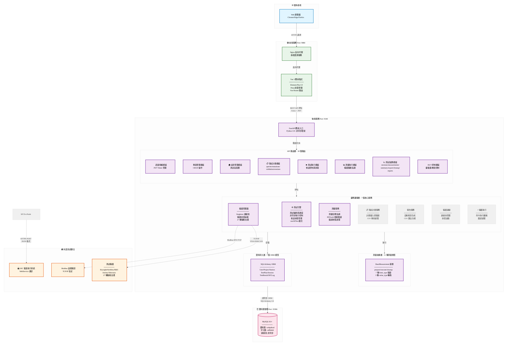
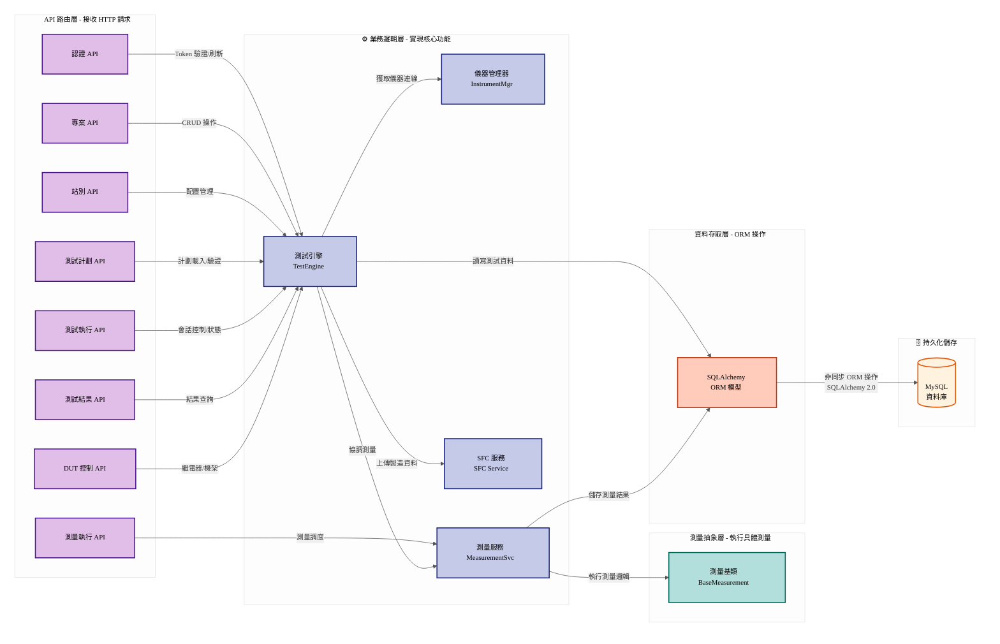
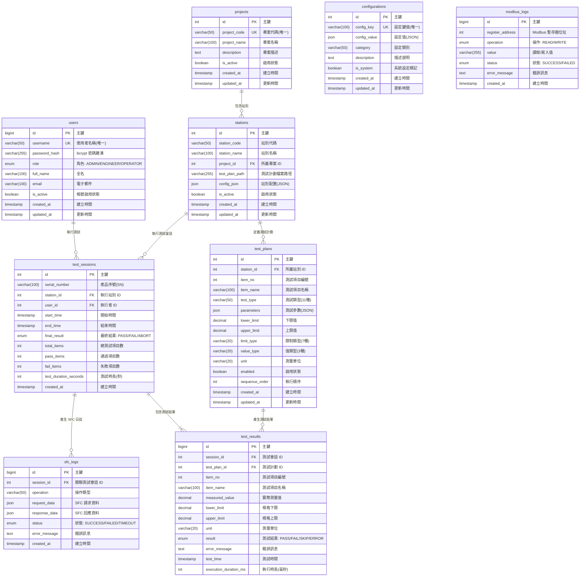

# WebPDTool - Web-based Testing System

> 基於 Vue 3 + FastAPI 的現代化測試系統，從桌面應用程式 PDTool4 重構而來。

---

## 📋 目錄

- [專案概述](#專案概述)
- [技術堆疊](#技術堆疊)
- [系統架構](#系統架構)
- [專案結構](#專案結構)
- [快速開始](#快速開始)
- [API 端點](#api-端點列表)
- [開發進度](#開發進度)
- [技術特色](#技術特色)
- [測試](#測試)
- [部署](#部署)
- [故障排除](#故障排除)
- [更新日誌](#更新日誌)

---

## 📖 專案概述

WebPDTool 是一個 Web 化的產品測試系統，用於執行自動化測試、記錄測試結果。系統採用前後端分離架構，提供完整的測試管理、執行和結果查詢功能。

### 專案狀態

| 項目 | 內容 |
|------|------|
| **版本** | v0.1.0 |
| **完成度** | ~95% (核心功能完成，測量服務完整，27 種儀器驅動實現，Command 測量遷移完成) |
| **最新更新** | 2026-02-24 - Command 測量遷移完成 (ComPort/ConSole/TCPIP)，lowsheen_lib 遷移 70% |
| **狀態** | 核心功能完整，儀器驅動完善，測試執行穩定 |

### ✨ 主要特色

- ✅ **完整 PDTool4 相容性** - 支援所有 7 種 limit_type 和 3 種 value_type
- ✅ **runAllTest 模式** - 遇到錯誤時繼續執行測試，與 PDTool4 完全一致
- ✅ **14 種測量類型** - PowerSet/Read, ComPort/ConSole/TCPIP Command, SFC, GetSN, OPJudge, Wait, Relay, ChassisRotation, RF_Measurements, L6MPU 等
- ✅ **27 種儀器驅動** - 完成！Keysight, Keithley, ITECH, GW Instek, R&S, Anritsu, Tektronix 等完整實作
- ✅ **18 個 API 路由** - 模組化設計 (testplan/, results/ 子目錄)
- ✅ **現代化前端** - Vue 3 Composition API + Element Plus UI，完整業務邏輯實現
- ✅ **動態參數表單** - 根據測量類型動態生成測試參數表單
- ✅ **完整 DUT 控制** - 繼電器控制、機架旋轉、二進位協定支援
- ✅ **Async 架構遷移** - 70% lowsheen_lib 遷移完成 (Strangler Fig 模式)

---

## 🛠️ 技術堆疊

### 前端技術

| 技術 | 版本 | 用途 |
|------|------|------|
| **框架** | Vue 3.4.0+ | 核心前端框架 (Composition API) |
| **UI 庫** | Element Plus 2.5.0+ | UI 組件庫 |
| **狀態管理** | Pinia 2.1.0+ | 應用狀態管理 |
| **路由** | Vue Router 4.2.0+ | 頁面路由 |
| **HTTP 客戶端** | Axios 1.6.0+ | API 請求 |
| **建置工具** | Vite 5.0.0+ | 開發與建置工具 |
| **圖標** | @element-plus/icons-vue 2.3.0+ | 圖標支援 |
| **開發端口** | 9080 | 前端服務端口 |

### 後端技術

| 技術 | 版本 | 用途 |
|------|------|------|
| **框架** | FastAPI 0.104.0+ | 核心後端框架 |
| **語言** | Python 3.9+ | 程式語言 |
| **ORM** | SQLAlchemy 2.0.0+ | 資料庫 ORM |
| **資料驗證** | Pydantic 2.0.0+ | 資料驗證 |
| **認證** | python-jose 3.3.0+ | JWT 身份認證 |
| **密碼加密** | passlib + bcrypt | 密碼安全處理 |
| **非同步支援** | asyncio/async-await | 非同步處理 |
| **API 文件** | Swagger UI | API 文檔 (/docs) |
| **服務端口** | 9100 | 後端 API 端口 |

### 資料庫

| 項目 | 版本/配置 |
|------|----------|
| **主資料庫** | MySQL 8.0+ |
| **資料庫端口** | 33306 (Docker 容器映射) |
| **連線池** | SQLAlchemy async engine |
| **字元集** | utf8mb4 |
| **資料表** | 9 個核心表 |

### 部署與容器化

| 項目 | 技術 |
|------|------|
| **容器化** | Docker & Docker Compose |
| **反向代理** | Nginx (內建於前端容器) |
| **健康檢查** | Docker healthcheck 機制 |

---

## 🏗️ 系統架構

### 整體系統架構圖



> **📖 架構說明**: 主圖展示系統整體分層結構，API→Services→Models/Measurements 的詳細連線關係見下圖。

### API 層與服務層連線關係

此圖展示 API 端點如何調用業務邏輯服務，以及服務之間的協作關係。



### 測試執行完整流程

此流程圖展示從使用者登入到測試完成的完整生命週期，包含 runAllTest 模式的錯誤處理邏輯。

```mermaid
%%{init: {
  "theme": "base",
  "themeVariables": {
    "fontSize": "14px",
    "fontFamily": "Arial, Helvetica, sans-serif",
    "primaryTextColor": "#333333",
    "lineColor": "#555555",
    "primaryColor": "#f0f0f0"
  },
  "flowchart": {
    "padding": 20,
    "nodeSpacing": 60,
    "rankSpacing": 80,
    "curve": "basis",
    "diagramPadding": 30
  }
}}%%
flowchart TD
    %% 此圖展示測試執行的完整生命週期，包含 runAllTest 模式的錯誤容錯處理

    Start([🟢 流程開始])
    Login[使用者登入<br/>輸入帳號密碼]
    ValidateUser{{身分驗證<br/>通過?}}
    GetToken[取得 JWT Token<br/>儲存至 localStorage]

    SelectProject[選擇測試專案<br/>與站別]
    LoadConfig[載入站別配置<br/>儀器連線設定]
    LoadTestPlan[載入測試計劃<br/>CSV 項目清單]

    InputSN[輸入產品序號<br/>掃描條碼]
    ValidateSN{{SN 格式<br/>有效?}}
    CreateSession[創建測試會話<br/>記錄至 test_sessions]

    StartTest[啟動測試執行<br/>POST /api/tests/sessions/start]
    GetNextItem[獲取下一測試項目<br/>依 sequence_order 排序]

    HasItem{{還有未執行<br/>測試項目?}}
    CalcResult[計算最終結果<br/>PASS/FAIL 統計]
    LoadMeasure[載入測量配置<br/>MEASUREMENT_REGISTRY]

    Execute[執行測量<br/>prepare → execute → cleanup]
    GetValue[獲取測量值<br/>儀器讀取/命令執行]
    Validate[驗證測試點<br/>validate_result 方法]

    SaveResult[儲存測試結果<br/>記錄至 test_results]
    UpdateUI[更新前端 UI<br/>顯示即時狀態]

    TestFailed{{測試項目<br/>失敗?}}
    CheckRunAllTest{{runAllTest<br/>模式?}}
    CollectError[收集錯誤資訊<br/>繼續執行下一項]

    UpdateSession[更新會話狀態<br/>final_result, 統計資料]

    NeedSFC{{站別配置<br/>需上傳 SFC?}}
    UploadSFC[上傳至 SFC 系統<br/>MES 製造資料]
    LogSFC[記錄 SFC 日誌<br/>sfc_logs 表]
    ShowReport[顯示測試報告<br/>PASS/FAIL 摘要]

    ContinueTest{{繼續測試<br/>下一個產品?}}
    End([🔴 流程結束])

    %% 流程連接
    Start --> Login
    Login --> ValidateUser
    ValidateUser -->|❌ 驗證失敗| Login
    ValidateUser -->|✅ 驗證成功| GetToken

    GetToken --> SelectProject
    SelectProject --> LoadConfig
    LoadConfig --> LoadTestPlan

    LoadTestPlan --> InputSN
    InputSN --> ValidateSN
    ValidateSN -->|❌ 無效格式| InputSN
    ValidateSN -->|✅ 格式正確| CreateSession

    CreateSession --> StartTest
    StartTest --> GetNextItem

    GetNextItem --> HasItem
    HasItem -->|❌ 無更多項目| CalcResult
    HasItem -->|✅ 有下一項目| LoadMeasure

    LoadMeasure --> Execute
    Execute --> GetValue
    GetValue --> Validate

    Validate --> SaveResult
    SaveResult --> UpdateUI

    UpdateUI --> TestFailed
    TestFailed -->|❌ PASS| GetNextItem
    TestFailed -->|✅ FAIL/ERROR| CheckRunAllTest

    CheckRunAllTest -->|✅ 啟用| CollectError
    CheckRunAllTest -->|❌ 停用| CalcResult

    CollectError --> GetNextItem

    CalcResult --> UpdateSession

    UpdateSession --> NeedSFC
    NeedSFC -->|✅ 需要上傳| UploadSFC
    UploadSFC --> LogSFC
    LogSFC --> ShowReport
    NeedSFC -->|❌ 不需上傳| ShowReport

    ShowReport --> ContinueTest
    ContinueTest -->|✅ 繼續| InputSN
    ContinueTest -->|❌ 結束| End

    %% 樣式定義
    classDef dbOp fill:#bbdefb,stroke:#1565c0,stroke-width:2px,color:#000
    classDef decision fill:#fff9c4,stroke:#f57f17,stroke-width:2px,color:#000
    classDef startN fill:#c8e6c9,stroke:#2e7d32,stroke-width:2px,color:#000
    classDef endN fill:#ffcdd2,stroke:#c62828,stroke-width:2px,color:#000
    classDef act fill:#e1f5fe,stroke:#01579b,stroke-width:2px,color:#000
    classDef error fill:#ffebee,stroke:#c62828,stroke-width:2px,color:#000

    %% 應用樣式
    class CreateSession,SaveResult,UpdateSession,LogSFC dbOp
    class ValidateUser,ValidateSN,HasItem,TestFailed,CheckRunAllTest,NeedSFC,ContinueTest decision
    class Login,GetToken,SelectProject,LoadConfig,LoadTestPlan,InputSN,StartTest,GetNextItem,LoadMeasure,Execute,GetValue,Validate,UpdateUI,CalcResult,UploadSFC,ShowReport act
    class CollectError error
    class Start startN
    class End endN
```



### 資料庫關係圖

展示系統中 9 個核心資料表之間的關聯性與資料流向。



---

## 📁 專案結構

```
WebPDTool/
├── backend/                    # FastAPI 後端應用 (110+ 個 Python 檔案, ~25K 行代碼)
│   ├── app/
│   │   ├── api/               # RESTful API 路由 (18 個路由)
│   │   │   ├── auth.py        # 認證 API
│   │   │   ├── projects.py    # 專案管理 API
│   │   │   ├── stations.py    # 站別管理 API
│   │   │   ├── tests.py       # 測試執行 API
│   │   │   ├── measurements.py           # 測量執行 API
│   │   │   ├── dut_control.py            # DUT 控制 API
│   │   │   ├── testplan/                 # 測試計劃子模組 (4 個檔案)
│   │   │   │   ├── queries.py
│   │   │   │   ├── mutations.py
│   │   │   │   ├── sessions.py
│   │   │   │   └── validation.py
│   │   │   ├── results/                  # 測試結果子模組 (6 個檔案)
│   │   │   │   ├── sessions.py
│   │   │   │   ├── measurements.py
│   │   │   │   ├── summary.py
│   │   │   │   ├── export.py
│   │   │   │   ├── cleanup.py
│   │   │   │   └── reports.py
│   │   │   └── __init__.py
│   │   ├── models/            # SQLAlchemy 資料模型 (7 個 ORM 模型)
│   │   │   ├── user.py        # 使用者模型
│   │   │   ├── project.py     # 專案模型
│   │   │   ├── station.py     # 站別模型
│   │   │   ├── testplan.py    # 測試計劃模型
│   │   │   ├── test_session.py    # 測試會話模型
│   │   │   ├── test_result.py     # 測試結果模型
│   │   │   └── sfc_log.py         # SFC 日誌模型
│   │   ├── services/          # 業務邏輯層 (7 個核心服務)
│   │   │   ├── auth.py        # 認證服務
│   │   │   ├── test_engine.py         # 測試引擎
│   │   │   ├── measurement_service.py  # 測量服務 (runAllTest 模式)
│   │   │   ├── instrument_manager.py  # 儀器管理器 (Singleton 連線池)
│   │   │   ├── instrument_connection.py  # 儀器連線管理
│   │   │   ├── instrument_executor.py    # 儀器指令執行
│   │   │   ├── test_plan_service.py   # 測試計劃服務
│   │   │   ├── report_service.py      # 報告服務
│   │   │   ├── dut_comms/             # DUT 通訊子模組
│   │   │   │   ├── relay_control.py
│   │   │   │   ├── binary_protocol.py
│   │   │   │   └── chassis_rotation.py
│   │   │   └── instruments/           # 27 種儀器驅動實現
│   │   │       ├── __init__.py
│   │   │       ├── base.py            # BaseInstrumentDriver 基類
│   │   │       ├── a2260b.py          # Keysight 多功能儀器
│   │   │       ├── a34970a.py         # 高頻測試儀
│   │   │       ├── cmw100.py          # 通訊測試系統
│   │   │       ├── mt8872a.py         # RF 測試系統
│   │   │       ├── peak_can.py        # CAN 匯流排分析
│   │   │       ├── l6mpu_ssh.py       # L6MPU SSH 控制
│   │   │       ├── daq6510.py         # Keithley 資料採集
│   │   │       ├── keithley2015.py    # Keithley 數位萬用表
│   │   │       ├── mdo34.py           # Tektronix 示波器
│   │   │       ├── it6723c.py         # ITECH 電源
│   │   │       ├── model2303.py       # GW Instek 直流電源
│   │   │       ├── aps7050.py         # RF 電源放大器
│   │   │       ├── comport_command.py # 串口通訊 (async class)
│   │   │       ├── tcpip_command.py   # TCP/IP 通訊 (async class)
│   │   │       ├── console_command.py # 主控台命令 (async class)
│   │   │       ├── wait_test.py       # 延遲測試
│   │   │       ├── ftm_on.py          # FTM 控制
│   │   │       ├── n5182a.py          # N5182A 信號產生器
│   │   │       ├── analog_discovery_2.py  # Digilent 示波器
│   │   │       ├── smcv100b.py        # RF 功率監測
│   │   │       ├── psw3072.py         # R&S 電源
│   │   │       ├── daq973a.py         # DAQ 資料採集
│   │   │       ├── l6mpu_ssh_comport.py  # L6MPU 混合模式
│   │   │       ├── l6mpu_pos_ssh.py   # L6MPU 位置控制
│   │   │       └── model2306.py       # GW Instek 數位負載
│   │   ├── measurements/      # 測量抽象層 (14 種測量類型)
│   │   │   ├── base.py        # BaseMeasurement 基類 (PDTool4 驗證邏輯)
│   │   │   ├── implementations.py  # 14 種測量實作
│   │   │   └── __init__.py
│   │   ├── config/            # 配置管理
│   │   │   ├── instruments.py # 儀器配置 (InstrumentConfig)
│   │   │   └── instrument_config.py
│   │   ├── core/              # 核心功能模組
│   │   │   ├── database.py    # 資料庫配置
│   │   │   ├── logging.py     # 日誌配置
│   │   │   ├── security.py    # 安全性配置
│   │   │   ├── exceptions.py  # 自訂異常
│   │   │   └── __init__.py
│   │   ├── utils/             # 工具函數
│   │   │   ├── csv_parser.py  # CSV 解析工具
│   │   │   └── __init__.py
│   │   ├── schemas/           # Pydantic 資料驗證模型
│   │   ├── config.py          # 應用配置 (Pydantic Settings)
│   │   ├── dependencies.py    # FastAPI 依賴注入
│   │   ├── main.py            # 應用入口點
│   │   └── __init__.py
│   ├── src/
│   │   └── lowsheen_lib/      # Legacy 腳本 (遷移中，70% 完成)
│   │       ├── ComPortCommand.py
│   │       ├── ConSoleCommand.py
│   │       ├── TCPIPCommand.py
│   │       ├── remote_instrument.py
│   │       └── ... (其他 20+ 腳本)
│   ├── scripts/               # 工具腳本
│   │   ├── import_testplan.py # 測試計劃匯入工具
│   │   ├── batch_import.sh    # 批量匯入腳本
│   │   ├── test_refactoring.py # 重構測試套件
│   │   └── add_testplan_fields.sql # 資料庫遷移
│   ├── tests/                 # 測試套件
│   │   ├── test_api/
│   │   ├── test_services/
│   │   └── conftest.py
│   ├── alembic/               # 資料庫遷移
│   │   ├── versions/          # 遷移版本
│   │   └── env.py             # Alembic 配置
│   ├── logs/                  # 應用日誌
│   ├── testplans/             # 測試計劃範例
│   ├── instruments.example.json  # 儀器配置範例
│   ├── pyproject.toml         # Python 專案配置
│   ├── uv.lock                # uv 依賴鎖定檔案
│   ├── Dockerfile             # 後端 Docker 映像
│   ├── .env                   # 環境變數 (本地開發)
│   ├── .env.example           # 環境變數範本
│   ├── .dockerignore          # Docker 忽略檔案
│   └── alembic.ini            # Alembic 初始化檔案
├── frontend/                  # Vue 3 前端應用 (25+ 個檔案, ~6.5K 行代碼)
│   ├── src/
│   │   ├── views/             # 頁面組件 (6 個視圖)
│   │   │   ├── Login.vue      # 登入頁面
│   │   │   ├── TestMain.vue   # 測試執行主介面 (runAllTest 模式支援)
│   │   │   ├── TestExecution.vue  # 測試執行監控
│   │   │   ├── TestHistory.vue    # 測試歷史查詢
│   │   │   ├── TestPlanManage.vue  # 測試計劃管理
│   │   │   ├── ProjectManage.vue   # 專案站別管理
│   │   │   └── SystemConfig.vue    # 系統配置管理
│   │   ├── components/        # 可複用組件
│   │   │   ├── ProjectStationSelector.vue  # 專案站別選擇器
│   │   │   └── DynamicParamForm.vue        # 動態參數表單
│   │   ├── composables/       # 組合式函數
│   │   │   └── useMeasurementParams.js  # 測量參數管理
│   │   ├── api/               # API 客戶端 (7 個模組)
│   │   │   ├── client.js      # Axios 客戶端配置 (JWT 攔截器)
│   │   │   ├── auth.js        # 認證 API 客戶端
│   │   │   ├── projects.js    # 專案 API 客戶端
│   │   │   ├── testplans.js   # 測試計劃 API 客戶端
│   │   │   ├── tests.js       # 測試執行 API 客戶端
│   │   │   ├── measurements.js # 測量 API 客戶端
│   │   │   └── __init__.js
│   │   ├── stores/            # Pinia 狀態管理
│   │   │   ├── auth.js        # 認證狀態
│   │   │   └── project.js     # 專案狀態
│   │   ├── router/            # Vue Router 配置
│   │   │   └── index.js
│   │   ├── App.vue            # 根組件
│   │   ├── main.js            # 應用入口點
│   │   └── public/            # 靜態資源
│   │       ├── index.html
│   │       └── favicon.svg
│   ├── dist/                  # 建置輸出目錄
│   ├── Dockerfile             # 前端 Docker 映像
│   ├── nginx.conf             # Nginx 配置
│   ├── package.json           # NPM 專案配置
│   ├── package-lock.json      # NPM 鎖定檔案
│   ├── vite.config.js         # Vite 配置
│   ├── .env.development       # 開發環境變數
│   ├── .dockerignore          # Docker 忽略檔案
│   └── README.md
├── database/                  # 資料庫設計 (9 張資料表)
│   ├── schema.sql             # 資料庫 Schema (完整定義)
│   ├── seed_data.sql          # 初始資料 (測試用戶與專案)
│   └── README.md
├── docs/                      # 技術文檔
│   ├── index.md               # 文檔索引
│   ├── REFACTORING_SUMMARY.md          # 重構完成報告
│   ├── PDTool4_Measurement_Module_Analysis.md  # PDTool4 分析
│   ├── README_import_testplan.md        # 測試計劃匯入指南
│   ├── analysis/                         # 代碼分析
│   │   ├── lowsheen_lib_migration_validation_2026_02_24.md
│   │   └── field-usage-analysis.md
│   ├── bugfix/                          # 修復記錄 (15+ issues)
│   │   ├── README.md                    # Bug fix 索引
│   │   ├── ISSUE9_console_comport_tcpip_measurement_chain.md
│   │   └── ...
│   ├── code_review/                     # 代碼審查
│   │   ├── SUMMARY.md                   # 審查摘要
│   │   ├── LOWSHEEN_LIB_DEPRECATION_ANALYSIS_2026_02_23.md
│   │   ├── ENV_CONFIGURATION_ANALYSIS_2026_02_11.md
│   │   └── ...
│   ├── lowsheen_lib/                    # lowsheen_lib 遷移文檔
│   │   ├── MIGRATION_SUMMARY.md
│   │   ├── INSTRUMENT_MIGRATION.md
│   │   └── README.md
│   ├── features/                        # 功能文檔
│   │   ├── command-measurement-migration.md
│   │   └── automatic-report-generation.md
│   ├── plans/                           # 實施計劃
│   │   ├── 2026-02-24-command-measurement-migration.md
│   │   └── ...
│   └── architecture/          # 架構文檔
├── docker-compose.yml         # Docker Compose 配置 (生產環境)
├── docker-compose.dev.yml     # Docker Compose 開發環境配置
├── docker-start.sh            # Docker 啟動腳本
├── .env.example               # 環境變數範本
├── .gitignore                 # Git 忽略檔案
├── README.md                  # 本檔案
└── CLAUDE.md                  # Claude Code 開發指南
```

---

## 🚀 快速開始

### Docker 環境 (推薦)

```bash
# 啟動所有服務
docker-compose up -d

# 查看日誌
docker-compose logs -f backend  # 後端日誌
docker-compose logs -f frontend # 前端日誌

# 停止服務
docker-compose down

# 重建服務
docker-compose build --no-cache
docker-compose up -d

# 資料庫初始化 (首次運行)
docker-compose exec db mysql -uroot -p${MYSQL_ROOT_PASSWORD} webpdtool < database/schema.sql
docker-compose exec db mysql -uroot -p${MYSQL_ROOT_PASSWORD} webpdtool < database/seed_data.sql
```

### 本機開發

```bash
# 後端 (需要 Python 3.9+)
cd backend
uv venv
uv sync
uvicorn app.main:app --reload --host 0.0.0.0 --port 9100

# 前端 (需要 Node.js 16+)
cd frontend
npm install
npm run dev  # 執行於 http://localhost:5173

# 資料庫連線
mysql -h localhost -P 33306 -u pdtool -p webpdtool
# 預設密碼: pdtool123
```

### 測試

```bash
cd backend

# 執行所有測試
uv run pytest

# 執行特定測試檔案
uv run pytest tests/test_api/test_auth.py

# 執行並生成覆蓋率報告
uv run pytest --cov=app tests/
```

### 測試計劃匯入

```bash
cd backend

# 匯入單個 CSV 檔案
uv run python scripts/import_testplan.py \
  --project "PROJECT_CODE" \
  --station "STATION_CODE" \
  --csv-file "/path/to/testplan.csv"

# 批量匯入所有測試計劃
bash scripts/batch_import.sh
```

---

## 📋 API 端點列表

**總路由數**: 18 個 (模組化架構: testplan/ 4 個, results/ 6 個子路由)

### 認證模組 (Authentication)

| 方法 | 端點 | 說明 |
|------|------|------|
| `POST` | `/api/auth/login` | 使用者登入 |
| `POST` | `/api/auth/logout` | 使用者登出 |
| `POST` | `/api/auth/refresh` | 刷新 JWT Token |
| `GET` | `/api/auth/me` | 獲取當前使用者資訊 |

### 專案管理 (Projects)

| 方法 | 端點 | 說明 |
|------|------|------|
| `GET` | `/api/projects` | 列出所有專案 |
| `POST` | `/api/projects` | 建立新專案 |
| `GET` | `/api/projects/{project_id}` | 獲取專案詳情 |
| `PUT` | `/api/projects/{project_id}` | 更新專案 |
| `DELETE` | `/api/projects/{project_id}` | 刪除專案 |

### 站別管理 (Stations)

| 方法 | 端點 | 說明 |
|------|------|------|
| `GET` | `/api/stations` | 列出所有站別 |
| `POST` | `/api/stations` | 建立新站別 |
| `GET` | `/api/stations/{station_id}` | 獲取站別詳情 |
| `PUT` | `/api/stations/{station_id}` | 更新站別 |
| `DELETE` | `/api/stations/{station_id}` | 刪除站別 |

### 測試計劃 (Test Plans)

| 方法 | 端點 | 說明 |
|------|------|------|
| `GET` | `/api/testplan/queries` | 查詢測試計劃 |
| `POST` | `/api/testplan/mutations` | 建立/更新測試計劃 |
| `POST` | `/api/testplan/validation` | 驗證測試計劃 |
| `GET` | `/api/testplan/sessions` | 查詢測試會話 |

### 測試執行 (Tests)

| 方法 | 端點 | 說明 |
|------|------|------|
| `POST` | `/api/tests/sessions/start` | 啟動測試會話 |
| `GET` | `/api/tests/sessions/{session_id}` | 獲取會話狀態 |
| `POST` | `/api/tests/sessions/{session_id}/stop` | 停止測試會話 |
| `GET` | `/api/tests/sessions/{session_id}/results` | 獲取測試結果 |

### 測量執行 (Measurements)

| 方法 | 端點 | 說明 |
|------|------|------|
| `GET` | `/api/measurements/types` | 列出測量類型 |
| `GET` | `/api/measurements/instruments` | 列出儀器狀態 |
| `POST` | `/api/measurements/validate` | 驗證測量參數 |

### 測試結果 (Results)

| 方法 | 端點 | 說明 |
|------|------|------|
| `GET` | `/api/results/sessions` | 查詢測試會話歷史 |
| `GET` | `/api/results/sessions/{session_id}` | 獲取會話詳細結果 |
| `GET` | `/api/results/summary` | 獲取測試統計摘要 |
| `GET` | `/api/results/export` | 匯出測試結果 |
| `POST` | `/api/results/cleanup` | 清理舊記錄 |
| `GET` | `/api/results/reports` | 生成報告 |

### DUT 控制 (DUT Control)

| 方法 | 端點 | 說明 |
|------|------|------|
| `POST` | `/api/dut/relay/set` | 設定繼電器狀態 |
| `POST` | `/api/dut/chassis/rotate` | 旋轉機架 |
| `POST` | `/api/dut/binary/send` | 發送二進位指令 |

---

## 📊 開發進度

### 核心功能完成度

| 功能模組 | 完成度 | 說明 |
|---------|--------|------|
| **資料庫設計** | 100% | 9 個資料表完整設計與實現 |
| **後端 API** | 100% | 18 個路由完整實現 |
| **前端 UI** | 95% | 7 個視圖，功能完整，細節優化中 |
| **測量服務** | 100% | 14 種測量類型，BaseMeasurement 基類完整 |
| **儀器驅動** | 100% | 27 種儀器驅動完整實現 |
| **Command 測量遷移** | 100% | ComPort/ConSole/TCPIP 完整遷移至 async class |
| **lowsheen_lib 遷移** | 70% | 執行路徑遷移完成，清理路徑待遷移 |
| **runAllTest 模式** | 100% | 完整支援，邏輯與 PDTool4 一致 |
| **測試執行引擎** | 100% | 非同步架構，會話管理完整 |
| **認證授權** | 100% | JWT Token，RBAC 角色管理 |
| **CSV 匯入** | 100% | 自動化測試計劃匯入 |
| **結果報告** | 100% | 統計匯總、CSV 匯出、PDF 報告 |
| **DUT 通訊** | 100% | 繼電器、機架、協定控制完整 |
| **代碼品質** | 95% | 經完整 code review，關鍵問題已修正 |
| **文檔** | 95% | 架構文檔、API 文檔完整，使用指南持續更新 |

### 代碼統計

| 指標 | 數值 |
|------|------|
| **後端 Python 檔案** | 110+ 個 |
| **後端代碼行數** | ~25,000 行 |
| **前端檔案 (Vue/JS)** | 25+ 個 |
| **前端代碼行數** | ~6,500 行 |
| **資料庫表** | 9 個 |
| **API 路由** | 18 個 |
| **ORM 模型** | 7 個 |
| **測量類型** | 14 種 |
| **儀器驅動** | 27 個 |
| **Bug 修正** | 15+ |
| **Code Review 文檔** | 8+ |

### 最近完成

- ✅ 2026-02-24: Command 測量遷移完成 (ComPort/ConSole/TCPIP → async class)
- ✅ 2026-02-24: Issue #9 修正 - console/comport/tcpip 測量執行鏈
- ✅ 2026-02-23: lowsheen_lib 遷移驗證分析 (70% 完成度)
- ✅ 2026-02-11: 環境配置分析報告 (雙層配置架構驗證)
- ✅ 2026-02-10: 動態參數表單實現與前端優化
- ✅ 2026-02-06: 測量服務架構重構，代碼縮減 66.6%
- ✅ 2026-02-05: 27 種儀器驅動全部實現
- ✅ 2026-01-30: DUT 控制系統整合 (繼電器、機架、協定)
- ✅ 2026-01-28: 高優先級遷移完成，11 種測量類型實現

### 下一步計劃

- [ ] 完成 lowsheen_lib 清理路徑遷移 (Phase 2-4)
- [ ] 新增 MDO34Measurement class (implementations.py gap)
- [ ] WebSocket 實時更新支援
- [ ] 性能優化與壓力測試
- [ ] 國際化 (i18n) 支援
- [ ] 行動應用版本 (React Native)

---

## 遷移狀態追蹤

### lowsheen_lib 遷移進度

**整體完成度: 70%** (更新於 2026-02-24)

使用 **Strangler Fig 模式** 進行遷移 - 新系統逐步取代舊系統，保持向後兼容。

| 遷移階段 | 狀態 | 說明 |
|---------|------|------|
| **Phase 1: 主執行路徑** | ✅ 完成 | `execute_single_measurement()` 完全委託給 `implementations.py` |
| **Phase 2: 清理路徑** | ❌ 待辦 | `_cleanup_used_instruments()` 仍使用 subprocess |
| **Phase 3: 重置路徑** | ❌ 待辦 | `reset_instrument()` 仍使用 subprocess |
| **Phase 4: script_map** | ⚠️ 繞過 | `instrument_executor.py` script_map 被 Phase 1 繞過 |

### 已遷移測量類型 (14 種)

| 測量類型 | 原始腳本 | 現代實作 | 狀態 |
|---------|---------|---------|------|
| PowerRead | DAQ973A_test.py, etc. | `PowerReadMeasurement` | ✅ |
| PowerSet | 2303_test.py, etc. | `PowerSetMeasurement` | ✅ |
| ComPort | ComPortCommand.py | `ComPortMeasurement` | ✅ |
| ConSole | ConSoleCommand.py | `ConSoleMeasurement` | ✅ |
| TCPIP | TCPIPCommand.py | `TCPIPMeasurement` | ✅ |
| SFC | sfc_test.py | `SFCMeasurement` | ✅ |
| GetSN | get_sn.py | `GetSNMeasurement` | ✅ |
| OPJudge | OPjudge_*.py | `OPJudgeMeasurement` | ✅ |
| Wait | Wait_test.py | `WaitMeasurement` | ✅ |
| Relay | relay_control.py | `RelayMeasurement` | ✅ |
| ChassisRotation | chassis_rotation.py | `ChassisRotationMeasurement` | ✅ |
| RF_Measurements | RF_tool/ | `RF_Measurement` | ✅ |
| L6MPU | l6mpu_*.py | `L6MPUMeasurement` | ✅ |
| Other | other.py | `OtherMeasurement` | ✅ |

### 已遷移儀器驅動 (27 種)

詳見 `docs/lowsheen_lib/MIGRATION_SUMMARY.md`

| 儀器類型 | 驅動器檔案 | 狀態 |
|---------|-----------|------|
| DAQ973A | `daq973a.py` | ✅ |
| MODEL2303/2306 | `model2303.py`, `model2306.py` | ✅ |
| IT6723C | `it6723c.py` | ✅ |
| 2260B | `a2260b.py` | ✅ |
| APS7050 | `aps7050.py` | ✅ |
| 34970A | `a34970a.py` | ✅ |
| DAQ6510 | `daq6510.py` | ✅ |
| PSW3072 | `psw3072.py` | ✅ |
| KEITHLEY2015 | `keithley2015.py` | ✅ |
| MDO34 | `mdo34.py` | ✅ (驅動器) / ❌ (implementations.py gap) |
| ComPort | `comport_command.py` | ✅ |
| ConSole | `console_command.py` | ✅ |
| TCPIP | `tcpip_command.py` | ✅ |
| RF_Tools | `smcv100b.py`, `n5182a.py`, etc. | ✅ |
| L6MPU 系列 | `l6mpu_ssh.py`, etc. | ✅ |
| ... (更多詳見 docs) | | |

### 已知遷移缺口

| 缺口 | 嚴重性 | 說明 |
|------|-------|------|
| MDO34 implementations.py 缺失 | 中等 | `PowerReadMeasurement` 無 MDO34 分支，返回 ERROR |
| `_cleanup_used_instruments()` subprocess | 高 | 依賴 CWD=`backend/`，Docker 容器變更會破壞 |
| `ComPortCommand.py` WindowsError | 高 | Linux/Docker 環境會拋出 NameError |

---

## Code Review 摘要

**評估日期**: 2026-01-30
**範圍**: 完整後端 API (16 檔案，18 路由)

### 問題統計

| 嚴重性 | 數量 | 狀態 |
|-------|------|------|
| Critical | 7 | ✅ 已修正 |
| High | 6 | ✅ 已修正 |
| Medium | 7 | ✅ 大部分已修正 |
| Low | 6 | 📝 待處理 |

### 關鍵發現

1. **架構優勢**
   - 模組化路由架構 (testplan/, results/ 子目錄)
   - Service 層模式 (逐步取代直接 DB 查詢)
   - 一致的錯誤處理 (HTTPException)
   - Pydantic schema 驗證

2. **已修正問題**
   - 死代碼移除 (`tests.py:411`)
   - 認證一致性 (統一使用 `get_current_active_user`)
   - 參數傳遞問題 (wait_msec, 動態表單)
   - 資料庫架構匹配

3. **技術債**
   - 部分中文註釋待轉英文
   - 部分硬編碼設定待提取
   - print 語句待改為 logger

詳見 `docs/code_review/SUMMARY.md`

---

---

## 🔧 技術特色

### 完整 PDTool4 相容性

系統實現了 PDTool4 的所有驗證邏輯，包括：
- **7 種 limit_type**: lower, upper, both, equality, inequality, partial, none
- **3 種 value_type**: string, integer, float
- **完全相同的驗證規則**: 無縮放、浮點精度處理

```python
# PDTool4 驗證邏輯的完整實現
def validate_result(self, measured_value, lower_limit, upper_limit,
                   limit_type='both', value_type='float') -> Tuple[bool, str]:
    # 詳見 backend/app/measurements/base.py
```

### runAllTest 模式

支援 PDTool4 的完整 runAllTest 邏輯：
- 遇到失敗時繼續執行所有測試項目
- 收集所有錯誤資訊
- 最後一次性報告所有失敗

```javascript
// 前端 TestMain.vue 中的 runAllTest 模式控制
const runAllTest = ref(true);  // UI 切換開關
```

### 非同步架構

使用 Python asyncio 實現完整的非同步操作：
- 資料庫查詢: SQLAlchemy async ORM
- 儀器通訊: 非同步 TCP/Serial
- API 處理: FastAPI 的非同步路由

### 儀器驅動抽象

通過 MEASUREMENT_REGISTRY 實現的可擴展驅動系統：
```python
MEASUREMENT_REGISTRY = {
    'PowerSet': PowerSetMeasurement,
    'PowerRead': PowerReadMeasurement,
    'CommandTest': CommandTestMeasurement,
    # ... 等 11 種測量類型
}
```

---

## 🧪 測試

### 單元測試

```bash
cd backend
uv run pytest tests/test_api/ -v
uv run pytest tests/test_services/ -v
```

### 整合測試

```bash
cd backend
uv run pytest tests/test_integration/ -v
```

### 覆蓋率報告

```bash
cd backend
uv run pytest --cov=app --cov-report=html tests/
# 報告位置: htmlcov/index.html
```

### 重構測試套件

```bash
cd backend
uv run python scripts/test_refactoring.py
```

---

## 🐳 部署

### 生產環境部署

```bash
# 使用 Docker Compose (推薦)
docker-compose up -d

# 檢查服務狀態
docker-compose ps

# 查看日誌
docker-compose logs -f

# 停止服務
docker-compose down
```

### 環境配置

在 `.env` 中設置以下變數：

```bash
# 資料庫
DATABASE_URL=mysql+asyncmy://pdtool:pdtool123@db:3306/webpdtool
MYSQL_ROOT_PASSWORD=rootpassword
MYSQL_USER=pdtool
MYSQL_PASSWORD=pdtool123

# 安全性
SECRET_KEY=your-secret-key-minimum-32-characters

# JWT Token
ACCESS_TOKEN_EXPIRE_MINUTES=480  # 8 小時

# 除錯模式
DEBUG=false  # 生產環境務必設為 false
```

### 資料庫初始化

```bash
# 首次部署時執行
docker-compose exec db mysql -uroot -p${MYSQL_ROOT_PASSWORD} webpdtool < database/schema.sql
docker-compose exec db mysql -uroot -p${MYSQL_ROOT_PASSWORD} webpdtool < database/seed_data.sql
```

---

## 🔍 故障排除

### 後端問題

```bash
# 檢查後端日誌
docker-compose logs -f backend | grep ERROR

# 驗證資料庫連線
docker-compose exec backend uv run python -c "from app.core.database import engine; print('DB OK')"

# 檢查 API 健康狀態
curl http://localhost:9100/docs
```

### 前端問題

```bash
# 檢查前端建置
cd frontend && npm run build

# 驗證 API 連線
curl http://localhost:9100/docs
```

### 資料庫問題

```bash
# 連線至資料庫
docker-compose exec db mysql -uroot -p${MYSQL_ROOT_PASSWORD} webpdtool

# 檢查資料表
SHOW TABLES;
SELECT COUNT(*) FROM test_plans;
```

### 測試執行問題

- 檢查儀器狀態: `GET /api/measurements/instruments`
- 查看會話狀態: `GET /api/tests/sessions/{session_id}/status`
- 檢查測試結果: `GET /api/tests/sessions/{session_id}/results`

---

## 📚 文檔

詳細文檔位於 `/docs` 目錄：
- `CLAUDE.md` - Claude Code 開發指南
- `REFACTORING_SUMMARY.md` - 重構完成報告
- `PDTool4_Measurement_Module_Analysis.md` - PDTool4 分析
- `README_import_testplan.md` - 測試計劃匯入指南

---

## 📝 更新日誌

### v0.1.0 (2026-02-24)

**新增功能**
- Command 測量類型完整遷移 (ComPort/ConSole/TCPIP → async class)
- 14 種測量類型全部實現
- 動態參數表單實現，根據測量類型動態生成表單項目
- lowsheen_lib 遷移驗證文檔

**修復**
- Issue #9: console/comport/tcpip 測量執行鏈多重修正
- smcv100b.py 預存在縮排 SyntaxError
- 前端非數值 measured_value 觸發 DB DECIMAL 欄位 500 錯誤
- Code review 關鍵問題修正

**重構**
- 測量服務架構重構，代碼縮減 66.6%
- 文檔結構調整與完善
- 雙層配置架構驗證 (root .env vs backend .env)

---

## 📄 許可證

本專案采用 MIT 許可證。

---

**最後更新**: 2026-02-24 | **版本**: v0.1.0 | **狀態**: 核心功能完整，Command 測量遷移完成，穩定版本
