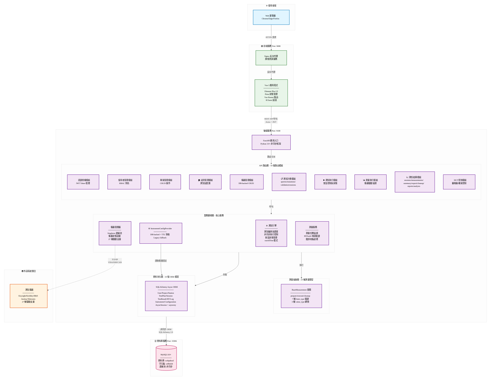

# WebPDTool - Web-based Testing System

> 基於 Vue 3 + FastAPI 的現代化測試系統，從桌面應用程式 PDTool4 重構而來。

---

## 目錄

- [專案概述](#專案概述)
- [技術堆疊](#技術堆疊)
- [系統架構](#系統架構)
- [專案結構](#專案結構)
- [快速開始](#快速開始)
- [API 端點](#api-端點列表)
- [開發進度](#開發進度)
- [技術特色](#技術特色)
- [測試](#測試)
- [部署](#部署)
- [故障排除](#故障排除)
- [更新日誌](#更新日誌)

---

## 專案概述

WebPDTool 是一個 Web 化的產品測試系統，用於執行自動化測試、記錄測試結果。系統採用前後端分離架構，提供完整的測試管理、執行和結果查詢功能。

### 專案狀態

| 項目 | 內容 |
|------|------|
| **版本** | v0.5.0 |
| **完成度** | ~100% (核心功能完成，測量服務完整，27 種儀器驅動實現，儀器管理 CRUD 完成，使用者管理完成，統計分析功能完成，測試歷史視圖完成，Async SQLAlchemy 遷移完成) |
| **最新更新** | 2026-03-13 - Async SQLAlchemy 遷移完成（Wave 1-4），全端非同步架構，TestHistory.vue 視圖，儀器管理 UI 完善 |
| **狀態** | 核心功能完整，儀器驅動完善，測試執行穩定，儀器/使用者管理完整，統計分析可用，非同步資料庫架構完成 |

### 主要特色

- ✅ **完整 PDTool4 相容性** - 支援所有 7 種 limit_type 和 3 種 value_type
- ✅ **runAllTest 模式** - 遇到錯誤時繼續執行測試，與 PDTool4 完全一致
- ✅ **23 種測量類型** - PowerSet/Read, ComPort/ConSole/TCPIP Command, SFC, GetSN, OPJudge, Wait, Relay, ChassisRotation, RF_Tool, CMW100, L6MPU, SMCV100B, PEAK_CAN, MDO34, Other, Dummy 等
- ✅ **27 種儀器驅動** - Keysight, Keithley, ITECH, GW Instek, R&S, Anritsu, Tektronix 等完整實作
- ✅ **DB-backed 儀器設定** - 透過 `InstrumentConfigProvider` 從資料庫讀取儀器設定，支援 TTL 快取
- ✅ **儀器管理 CRUD** - 管理員可透過 Web UI 新增、編輯、刪除儀器設定
- ✅ **10 個路由模組** - 模組化設計（auth/users/projects/stations/instruments/tests/measurements/results/testplan/dut_control）
- ✅ **現代化前端** - Vue 3 Composition API + Element Plus UI，11 個視圖完整實現
- ✅ **Async SQLAlchemy 架構** - 完整非同步資料庫操作，提升並發效能（Wave 1-4 遷移完成）
- ✅ **動態參數表單** - 根據測量類型動態生成測試參數表單
- ✅ **完整使用者管理** - 管理員可建立、編輯、刪除使用者，RBAC 角色控制
- ✅ **完整 DUT 控制** - 繼電器控制、機架旋轉、二進位協定支援
- ✅ **統計分析功能** - 報表分析頁面，包含平均值、中位數、標準差、MAD 統計與 ECharts 圖表

---

## 技術堆疊

### 前端技術

| 技術 | 版本 | 用途 |
|------|------|------|
| **框架** | Vue 3.4+ | 核心前端框架 (Composition API) |
| **UI 庫** | Element Plus 2.5+ | UI 組件庫 |
| **狀態管理** | Pinia 2.1+ | 應用狀態管理 |
| **路由** | Vue Router 4.2+ | 頁面路由 |
| **HTTP 客戶端** | Axios 1.6+ | API 請求（response interceptor 自動解包 data） |
| **圖表庫** | ECharts 6.0+ / vue-echarts 8.0+ | 數據視覺化 |
| **建置工具** | Vite 5.0+ | 開發與建置工具 |
| **圖標** | @element-plus/icons-vue 2.3+ | 圖標支援 |
| **開發端口** | 9080 | 前端服務端口 |

### 後端技術

| 技術 | 版本 | 用途 |
|------|------|------|
| **框架** | FastAPI 0.104+ | 核心後端框架 |
| **語言** | Python 3.9+ | 程式語言 |
| **ORM** | SQLAlchemy 2.0+ (AsyncSession) | 資料庫 ORM（完全非同步） |
| **資料驗證** | Pydantic 2.0+ | 資料驗證 |
| **認證** | python-jose 3.3+ | JWT 身份認證 |
| **密碼加密** | passlib + bcrypt | 密碼安全處理 |
| **非同步支援** | asyncio/async-await + asyncmy | 完整非同步處理 |
| **資料庫遷移** | Alembic 1.12+ | 資料庫版本控制 |
| **API 文件** | Swagger UI | API 文檔 (/docs) |
| **服務端口** | 9100 | 後端 API 端口 |

### 資料庫

| 項目 | 版本/配置 |
|------|----------|
| **主資料庫** | MySQL 8.0+ |
| **資料庫端口** | 33306 (Docker 容器映射) |
| **連線池** | SQLAlchemy AsyncSession + asyncmy |
| **字元集** | utf8mb4 |
| **資料表** | 10 個核心表 |
| **非同步狀態** | 完全遷移（Wave 1-4 完成） |

### 部署與容器化

| 項目 | 技術 |
|------|------|
| **容器化** | Docker & Docker Compose |
| **反向代理** | Nginx (內建於前端容器) |
| **健康檢查** | Docker healthcheck 機制 |

---

## 系統架構

### 整體系統架構圖


```mermaid
%%{init: {
  "theme": "base",
  "themeVariables": {
    "fontSize": "14px",
    "fontFamily": "Arial, Helvetica, sans-serif",
    "primaryTextColor": "#333333",
    "lineColor": "#555555",
    "primaryColor": "#f0f0f0"
  },
  "flowchart": {
    "padding": 30,
    "nodeSpacing": 60,
    "rankSpacing": 80,
    "curve": "basis",
    "diagramPadding": 30
  }
}}%%
graph TD
    %% 此圖展示系統整體分層結構與主要資料流向

    %% 客戶端層
    subgraph ClientLayer["🌐 使用者端"]
        BrowserNode[Web 瀏覽器<br/>Chrome/Edge/Firefox]
    end

    %% 前端層
    subgraph FrontendLayer["🟢 前端服務 Port: 9080"]
        NginxNode[Nginx 反向代理<br/>靜態資源服務]
        VueNode[Vue 3 應用程式<br/>───────────<br/>Element Plus UI<br/>Pinia 狀態管理<br/>Vue Router 路由<br/>ECharts 圖表]
    end

    %% 後端層
    subgraph BackendLayer["🚀 後端服務 Port: 9100"]
        FastAPINode[FastAPI 應用入口<br/>Python 3.9+ 非同步框架]

        subgraph APILayer["API 路由層 - 10 個路由模組"]
            direction TB
            AuthAPINode[🔐 認證授權模組<br/>JWT Token 管理]
            UsersAPINode[👤 使用者管理模組<br/>RBAC 角色]
            ProjectsAPINode[📁 專案管理模組<br/>CRUD 操作]
            StationsAPINode[🏠 站別管理模組<br/>測試站配置]
            InstrumentsAPINode[🔬 儀器管理模組<br/>DB-backed CRUD]
            TestPlanAPINode[📋 測試計劃模組<br/>queries/mutations/<br/>validation/sessions]
            TestsAPINode[▶️ 測試執行模組<br/>會話控制與狀態]
            MeasurementsAPINode[📊 測量執行模組<br/>儀器驅動協調]
            ResultsAPINode[📈 測試結果模組<br/>sessions/measurements/<br/>summary/export/cleanup/<br/>reports/analysis]
            DUTControlAPINode[🔧 DUT 控制模組<br/>繼電器/機架控制]
        end

        subgraph ServicesLayer["業務邏輯層 - 核心服務"]
            TestEngineNode[⚙️ 測試引擎<br/>─────────<br/>測試編排與調度<br/>非同步執行控制<br/>會話狀態管理<br/>runAllTest 模式]
            InstrumentMgrNode[🔌 儀器管理器<br/>─────────<br/>Singleton 連線池<br/>儀器狀態追蹤<br/>27 種驅動支援]
            InstrumentConfigNode[⚙️ InstrumentConfigProvider<br/>─────────<br/>DB-backed + TTL 快取<br/>Legacy fallback]
            MeasurementSvcNode[📏 測量服務<br/>─────────<br/>測量任務協調<br/>PDTool4 相容驗證<br/>錯誤收集處理]
        end

        subgraph MeasurementsLayer["測量抽象層 - 23 種測量類型"]
            BaseMeasureNode[📐 BaseMeasurement 基類<br/>──────────────<br/>prepare/execute/cleanup<br/>7 種 limit_type 驗證<br/>3 種 value_type 轉換]
        end

        subgraph ModelsLayer["資料持久層 - 10 個 ORM 模型"]
            ORMNode[💾 SQLAlchemy Async ORM<br/>───────────<br/>User/Project/Station<br/>TestPlan/Session<br/>TestResult/SFCLog<br/>Instrument/Configuration<br/>AsyncSession + asyncmy]
        end
    end

    %% 資料庫層
    subgraph DatabaseLayer["🗄️ 資料庫服務 Port: 33306"]
        MySQLNode[(MySQL 8.0+<br/>────────<br/>資料庫: webpdtool<br/>字元集: utf8mb4<br/>連線池: 非同步)]
    end

    %% 外部系統
    subgraph ExternalLayer["🌍 外部系統整合"]
        InstrumentsNode[🔬 測試儀器<br/>────────<br/>Keysight/Keithley/R&S<br/>Anritsu/Tektronix<br/>27 種驅動支援]
    end

    %% 主要資料流向
    BrowserNode -->|HTTPS 請求| NginxNode
    NginxNode -->|反向代理| VueNode
    VueNode -->|REST API 呼叫<br/>Axios + JWT| FastAPINode

    FastAPINode -->|路由分派| APILayer
    APILayer -->|呼叫| ServicesLayer
    ServicesLayer -->|執行| MeasurementsLayer
    ServicesLayer -->|存取| ModelsLayer
    InstrumentConfigNode -->|讀取儀器設定| ModelsLayer

    ModelsLayer -->|非同步 ORM<br/>SQLAlchemy 2.0| MySQLNode
    InstrumentMgrNode -.->|TCP/IP<br/>VISA/SSH/CAN| InstrumentsNode

    %% 樣式定義
    classDef clientStyle fill:#e1f5ff,stroke:#0277bd,stroke-width:2px,color:#000
    classDef frontendStyle fill:#e8f5e9,stroke:#2e7d32,stroke-width:2px,color:#000
    classDef backendStyle fill:#f3e5f5,stroke:#6a1b9a,stroke-width:2px,color:#000
    classDef dbStyle fill:#fce4ec,stroke:#c2185b,stroke-width:2px,color:#000
    classDef externalStyle fill:#fff3e0,stroke:#e65100,stroke-width:2px,color:#000

    class BrowserNode clientStyle
    class NginxNode,VueNode frontendStyle
    class FastAPINode,AuthAPINode,UsersAPINode,ProjectsAPINode,StationsAPINode,InstrumentsAPINode,TestPlanAPINode,TestsAPINode,MeasurementsAPINode,ResultsAPINode,DUTControlAPINode,TestEngineNode,InstrumentMgrNode,InstrumentConfigNode,MeasurementSvcNode,BaseMeasureNode,ORMNode backendStyle
    class MySQLNode dbStyle
    class InstrumentsNode externalStyle
```

### API 路由結構

| 路由模組 | 端點數 | 說明 |
|---------|-------|------|
| 認證模組 | 4 | 登入、登出、Token 刷新、取得當前使用者 |
| 使用者管理 | 6 | 使用者 CRUD、密碼管理 |
| 專案管理 | 5 | 專案 CRUD 操作 |
| 站別管理 | 5 | 站別配置管理 |
| **儀器管理** | **5** | **儀器 CRUD（DB-backed）** |
| 測試計劃 | 12 | queries/mutations/validation/sessions |
| 測試執行 | 14 | 會話控制、狀態查詢 |
| 測量執行 | 13 | 測量調度、儀器控制 |
| 測試結果 | 12 | sessions/measurements/summary/export/cleanup/reports/analysis |
| DUT 控制 | 9 | 繼電器、機架控制 |

### 前端視圖結構

| 路由 | 視圖元件 | 功能 |
|------|---------|------|
| `/login` | Login.vue | 登入頁面 |
| `/main` | TestMain.vue | 測試執行主介面 |
| `/test` | TestExecution.vue | 測試執行監控 |
| `/results` | TestResults.vue | 測試結果查看 |
| `/analysis` | ReportAnalysis.vue | 統計分析與圖表 |
| `/testplan` | TestPlanManage.vue | 測試計劃管理 |
| `/projects` | ProjectManage.vue | 專案站別管理 |
| `/users` | UserManage.vue | 使用者管理 |
| `/instruments` | InstrumentManage.vue | **儀器設定管理** |
| `/config` | SystemConfig.vue | 系統配置 |
| `/history` | TestHistory.vue | 測試歷史記錄 |

---

## 專案結構

```
WebPDTool/
├── backend/                    # FastAPI 後端應用 (117 個 Python 檔案, ~25,460 行代碼)
│   ├── app/
│   │   ├── api/               # RESTful API 路由 (10 個路由模組)
│   │   │   ├── auth.py        # 認證 API
│   │   │   ├── users.py       # 使用者管理 API
│   │   │   ├── projects.py    # 專案管理 API
│   │   │   ├── stations.py    # 站別管理 API
│   │   │   ├── instruments.py # 儀器管理 API (DB-backed CRUD)
│   │   │   ├── tests.py       # 測試執行 API
│   │   │   ├── measurements.py           # 測量執行 API
│   │   │   ├── dut_control.py            # DUT 控制 API
│   │   │   ├── testplan/                 # 測試計劃子模組
│   │   │   │   ├── queries.py
│   │   │   │   ├── mutations.py
│   │   │   │   ├── sessions.py
│   │   │   │   └── validation.py
│   │   │   └── results/                  # 測試結果子模組
│   │   │       ├── sessions.py
│   │   │       ├── measurements.py
│   │   │       ├── summary.py
│   │   │       ├── export.py
│   │   │       ├── cleanup.py
│   │   │       ├── reports.py
│   │   │       └── analysis.py
│   │   ├── models/            # SQLAlchemy 資料模型 (8 個 ORM 模型)
│   │   │   ├── instrument.py  # 儀器設定模型
│   │   │   └── ...
│   │   ├── repositories/      # 資料存取層
│   │   │   └── instrument_repository.py
│   │   ├── services/          # 業務邏輯層
│   │   │   ├── instruments/   # 27 種儀器驅動實現
│   │   │   └── dut_comms/     # DUT 通訊模組
│   │   ├── measurements/      # 測量抽象層 (23 種測量類型)
│   │   ├── core/              # 核心功能模組
│   │   │   ├── instrument_config.py  # InstrumentConfigProvider (DB-backed + TTL cache)
│   │   │   └── ...
│   │   ├── schemas/           # Pydantic 資料驗證模型
│   │   └── main.py            # 應用入口點
│   ├── alembic/               # 資料庫遷移
│   │   └── versions/          # 遷移版本檔案
│   ├── scripts/               # 工具腳本
│   └── tests/                 # 測試套件
├── frontend/                  # Vue 3 前端應用 (32 個 Vue/JS 檔案)
│   ├── src/
│   │   ├── views/             # 頁面組件 (11 個視圖)
│   │   │   ├── InstrumentManage.vue    # 儀器管理 CRUD 介面
│   │   │   ├── TestHistory.vue         # 測試歷史記錄視圖
│   │   │   └── ...
│   │   ├── components/        # 可複用組件 (3 個)
│   │   │   ├── AppNavBar.vue
│   │   │   ├── ProjectStationSelector.vue
│   │   │   └── DynamicParamForm.vue
│   │   ├── api/               # API 客戶端 (10 個模組)
│   │   │   ├── instruments.js          # 儀器 API 客戶端
│   │   │   └── ...
│   │   ├── stores/            # Pinia 狀態管理 (4 個: auth, project, users, instruments)
│   │   └── router/            # Vue Router 配置
│   └── package.json
├── database/                  # 資料庫設計
│   ├── schema.sql             # 資料庫 Schema (10 個資料表)
│   ├── seed_data.sql          # 初始資料
│   └── seed_instruments.sql   # 儀器設定初始資料
├── docs/                      # 技術文檔
├── docker-compose.yml         # Docker Compose 配置
├── README.md                  # 本檔案
└── CLAUDE.md                  # Claude Code 開發指南
```

---

## 快速開始

### Docker 環境 (推薦)

```bash
# 啟動所有服務
docker-compose up -d

# 查看日誌
docker-compose logs -f backend  # 後端日誌
docker-compose logs -f frontend # 前端日誌

# 停止服務
docker-compose down

# 重建服務
docker-compose build --no-cache
docker-compose up -d

# 資料庫初始化 (首次運行)
docker-compose exec db mysql -uroot -p${MYSQL_ROOT_PASSWORD} webpdtool < database/schema.sql
docker-compose exec db mysql -uroot -p${MYSQL_ROOT_PASSWORD} webpdtool < database/seed_data.sql
docker-compose exec db mysql -uroot -p${MYSQL_ROOT_PASSWORD} webpdtool < database/seed_instruments.sql
```

### 本機開發

```bash
# 後端 (需要 Python 3.9+)
cd backend
uv run uvicorn app.main:app --reload --host 0.0.0.0 --port 9100
# 或使用 venv:
python -m venv venv && source venv/bin/activate && pip install -e .
uvicorn app.main:app --reload --host 0.0.0.0 --port 9100

# 前端 (需要 Node.js 16+)
cd frontend
npm install
npm run dev  # 執行於 http://localhost:5173

# 資料庫連線
mysql -h localhost -P 33306 -u pdtool -p webpdtool
# 預設密碼: pdtool123
```

### 測試

```bash
cd backend

# 使用 uv (推薦)
uv run pytest

# 執行特定測試
pytest tests/test_api/test_auth.py

# 執行並生成覆蓋率報告
pytest --cov=app tests/

# 依標記篩選
pytest -m unit           # 僅快速單元測試
pytest -m "not hardware" # 跳過需要實體硬體的測試
```

### 測試計劃匯入

```bash
cd backend

# 匯入單個 CSV 檔案
python scripts/import_testplan.py \
  --project "PROJECT_CODE" \
  --station "STATION_CODE" \
  --csv-file "/path/to/testplan.csv"

# 批量匯入所有測試計劃
bash scripts/batch_import.sh
```

---

## API 端點列表

### 認證模組 (Authentication)

| 方法 | 端點 | 說明 |
|------|------|------|
| `POST` | `/api/auth/login` | 使用者登入 |
| `POST` | `/api/auth/logout` | 使用者登出 |
| `POST` | `/api/auth/refresh` | 刷新 JWT Token |
| `GET` | `/api/auth/me` | 獲取當前使用者資訊 |

### 使用者管理 (Users) - Admin Only

| 方法 | 端點 | 說明 |
|------|------|------|
| `GET` | `/api/users` | 列出使用者 (支援分頁、搜尋、篩選) |
| `GET` | `/api/users/{id}` | 獲取特定使用者 |
| `POST` | `/api/users` | 建立新使用者 (admin only) |
| `PUT` | `/api/users/{id}` | 更新使用者 (admin only) |
| `PUT` | `/api/users/{id}/password` | 修改密碼 (admin or self) |
| `DELETE` | `/api/users/{id}` | 刪除使用者 (admin only) |

### 專案管理 (Projects)

| 方法 | 端點 | 說明 |
|------|------|------|
| `GET` | `/api/projects` | 列出所有專案 |
| `POST` | `/api/projects` | 建立新專案 |
| `GET` | `/api/projects/{project_id}` | 獲取專案詳情 |
| `PUT` | `/api/projects/{project_id}` | 更新專案 |
| `DELETE` | `/api/projects/{project_id}` | 刪除專案 |

### 站別管理 (Stations)

| 方法 | 端點 | 說明 |
|------|------|------|
| `GET` | `/api/stations/{station_id}` | 獲取站別詳情 |
| `POST` | `/api/stations` | 建立新站別 |
| `PUT` | `/api/stations/{station_id}` | 更新站別 |
| `DELETE` | `/api/stations/{station_id}` | 刪除站別 |
| `GET` | `/api/stations/{station_id}/testplan` | 查詢測試計劃 |

### 儀器管理 (Instruments)

| 方法 | 端點 | 說明 |
|------|------|------|
| `GET` | `/api/instruments` | 列出儀器 (支援 enabled_only 篩選) |
| `GET` | `/api/instruments/{instrument_id}` | 獲取特定儀器 |
| `POST` | `/api/instruments` | 建立新儀器 (admin only) |
| `PATCH` | `/api/instruments/{instrument_id}` | 更新儀器 (admin only; instrument_id 不可修改) |
| `DELETE` | `/api/instruments/{instrument_id}` | 刪除儀器 (admin only) |

### 測試計劃 (Test Plans)

| 方法 | 端點 | 說明 |
|------|------|------|
| `GET` | `/api/testplan/queries` | 查詢測試計劃 (3 端點) |
| `POST` | `/api/testplan/mutations` | 建立/更新測試計劃 (7 端點) |
| `POST` | `/api/testplan/validation` | 驗證測試計劃 |
| `GET` | `/api/testplan/sessions` | 查詢測試會話 |

### 測試執行 (Tests)

| 方法 | 端點 | 說明 |
|------|------|------|
| `POST` | `/api/tests/sessions` | 建立測試會話 |
| `POST` | `/api/tests/sessions/{session_id}/start` | 啟動測試執行 |
| `POST` | `/api/tests/sessions/{session_id}/stop` | 停止測試執行 |
| `POST` | `/api/tests/sessions/{session_id}/complete` | 完成測試會話 |
| `GET` | `/api/tests/sessions` | 列出測試會話 |
| `GET` | `/api/tests/sessions/{session_id}` | 獲取會話詳情 |
| `GET` | `/api/tests/sessions/{session_id}/status` | 獲取即時狀態 |
| `GET` | `/api/tests/sessions/{session_id}/results` | 獲取測試結果 |
| `POST` | `/api/tests/sessions/{session_id}/results` | 上傳單筆結果 |
| `GET` | `/api/tests/instruments/status` | 獲取儀器狀態 |
| `POST` | `/api/tests/instruments/{id}/reset` | 重置儀器 |

### 測量執行 (Measurements)

| 方法 | 端點 | 說明 |
|------|------|------|
| `GET` | `/api/measurements/types` | 列出測量類型 |
| `GET` | `/api/measurements/instruments` | 列出儀器狀態 |
| `POST` | `/api/measurements/execute` | 執行測量 |
| `POST` | `/api/measurements/validate-params` | 驗證測量參數 |

### 測試結果與分析 (Results)

| 方法 | 端點 | 說明 |
|------|------|------|
| `GET` | `/api/measurement-results/sessions` | 查詢測試會話歷史 |
| `GET` | `/api/measurement-results/sessions/{session_id}` | 獲取會話詳細結果 |
| `GET` | `/api/measurement-results/measurements` | 查詢測量記錄 |
| `GET` | `/api/measurement-results/summary` | 獲取測試統計摘要 |
| `GET` | `/api/measurement-results/export` | 匯出測試結果 |
| `GET` | `/api/measurement-results/analysis` | 統計分析 |
| `POST` | `/api/measurement-results/cleanup` | 清理舊記錄 |
| `GET` | `/api/measurement-results/reports/list` | 查詢已儲存報告 |
| `POST` | `/api/measurement-results/reports` | 建立報告 |

### DUT 控制 (DUT Control)

| 方法 | 端點 | 說明 |
|------|------|------|
| `POST` | `/api/dut/relay/set` | 設定繼電器狀態 |
| `GET` | `/api/dut/relay/status` | 查詢繼電器狀態 |
| `POST` | `/api/dut/chassis/rotate` | 旋轉機架 |
| `GET` | `/api/dut/chassis/status` | 查詢機架狀態 |

---

## 開發進度

### 核心功能完成度

| 功能模組 | 完成度 | 說明 |
|---------|--------|------|
| **資料庫設計** | 100% | 10 個資料表完整設計與實現 |
| **後端 API** | 100% | 10 個路由模組完整實現 |
| **前端 UI** | 100% | 11 個視圖 + 3 個組件，功能完整 |
| **測量服務** | 100% | 23 種測量類型，BaseMeasurement 基類完整 |
| **儀器驅動** | 100% | 27 種儀器驅動，完整實現 |
| **儀器管理** | 100% | DB-backed CRUD，Web UI 完整，driver registry 別名完善 |
| **使用者管理** | 100% | Admin CRUD 操作完成，RBAC 角色控制 |
| **統計分析** | 100% | 報表分析頁面完成，ECharts 圖表整合 |

### 代碼統計

| 指標 | 數值 |
|------|------|
| **後端 Python 檔案** | 117 個 (app 目錄) |
| **後端代碼行數** | ~25,460 行 (app 目錄) |
| **前端檔案 (Vue/JS)** | 32 個 (11 視圖 + 3 組件 + 10 API + 4 stores) |
| **API 路由模組** | 10 個主模組 (19 個路由檔案含子模組) |
| **測量類型** | 23 種 |
| **儀器驅動** | 27 種驅動器 |
| **資料庫資料表** | 10 個 |

### 已實現測量類型 (23 種)

| 測量類型 | 說明 |
|---------|------|
| Dummy | 測試用隨機值測量 |
| Other | 自定义腳本執行 |
| ComPort | 串口通訊測量 |
| ConSole | 控制台命令測量 |
| TCPIP | TCP/IP 通訊測量 |
| PowerRead | 電源讀取測量 |
| PowerSet | 電源設定測量 |
| SFC | SFC 系統測量 |
| GetSN | 序號讀取測量 |
| OPJudge | 操作判斷測量 |
| Wait | 延遲測量 |
| Relay | 繼電器控制測量 |
| ChassisRotation | 機架旋轉測量 |
| RF_Tool_LTE_TX | RF LTE 發射測量 |
| RF_Tool_LTE_RX | RF LTE 接收測量 |
| CMW100_BLE | CMW100 BLE 測量 |
| CMW100_WiFi | CMW100 WiFi 測量 |
| L6MPU_LTE_Check | L6MPU LTE 檢查 |
| L6MPU_PLC_Test | L6MPU PLC 測試 |
| MDO34 | MDO34 示波器測量 |
| SMCV100B_RF | SMCV100B RF 輸出測量 |
| PEAK_CAN | PEAK CAN 匯流排測量 |
| CommandTest | 命令測試（對應 ConSole 實作，向下相容） |

### 已實現儀器驅動 (27 種)

| 儀器類型 | 驅動器檔案 | UI 儀器類型名稱 |
|---------|-----------|--------------|
| DAQ973A | `daq973a.py` | DAQ973A |
| MODEL2303 | `model2303.py` | Model2303 |
| MODEL2306 | `model2306.py` | Model2306 |
| IT6723C | `it6723c.py` | IT6723C |
| 2260B | `a2260b.py` | 2260B |
| APS7050 | `aps7050.py` | APS7050 |
| 34970A | `a34970a.py` | 34970A |
| DAQ6510 | `daq6510.py` | DAQ6510 |
| PSW3072 | `psw3072.py` | PSW3072 |
| KEITHLEY2015 | `keithley2015.py` | Keithley2015 |
| MDO34 | `mdo34.py` | MDO34 |
| ConSole | `console_command.py` | ConsoleCommand |
| ComPort | `comport_command.py` | ComPortCommand |
| TCPIP | `tcpip_command.py` | TCPIPCommand |
| Wait | `wait_test.py` | WaitTest |
| CMW100 | `cmw100.py` | CMW100 |
| MT8872A | `mt8872a.py` | MT8872A |
| N5182A | `n5182a.py` | N5182A |
| SMCV100B | `smcv100b.py` | SMCV100B |
| FTM_On | `ftm_on.py` | - |
| Analog_Discovery_2 | `analog_discovery_2.py` | AnalogDiscovery2 |
| PEAK_CAN | `peak_can.py` | PeakCAN |
| L6MPU_SSH | `l6mpu_ssh.py` | - |
| L6MPU_SSH_ComPort | `l6mpu_ssh_comport.py` | - |
| L6MPU_POS_SSH | `l6mpu_pos_ssh.py` | - |

> **注意：** `instrument_type` 欄位（UI 選項）與 driver registry key 不同。`ConsoleCommand`/`ComPortCommand`/`TCPIPCommand` 和 `console`/`comport`/`tcpip` 均已在 `INSTRUMENT_DRIVERS` 中建立別名對應。

---

## 技術特色

### 完整 PDTool4 相容性

系統實現了 PDTool4 的所有驗證邏輯，包括：
- **7 種 limit_type**: lower, upper, both, equality, inequality, partial, none
- **3 種 value_type**: string, integer, float
- **完全相同的驗證規則**: 無縮放、浮點精度處理

### runAllTest 模式

支援 PDTool4 的完整 runAllTest 邏輯：
- 遇到失敗時繼續執行所有測試項目
- 收集所有錯誤資訊
- 最後一次性報告所有失敗

### DB-backed 儀器管理

- `InstrumentConfigProvider`（`backend/app/core/instrument_config.py`）在應用啟動時注入，從 MySQL `instruments` 資料表讀取設定
- 30 秒 TTL 快取，執行緒安全
- 降級策略：若 DB 初始化失敗，自動 fallback 至 hardcoded 預設設定

### 統計分析功能

**後端端點**: `GET /api/measurement-results/analysis`

提供描述統計：平均數、中位數、標準差（樣本）、MAD

統計對象：
1. 各測試項目的 `execution_duration_ms`（毫秒）
2. 每個 Session 的 `test_duration_seconds`（秒）

**前端頁面**: `/analysis` → `ReportAnalysis.vue`（ECharts 圖表整合）

### 非同步架構

使用 Python asyncio 實現完整的非同步操作：
- **資料庫查詢**: SQLAlchemy async ORM（AsyncSession + asyncmy，完成 Wave 1-4 遷移）
- **儀器通訊**: 非同步 TCP/Serial
- **API 處理**: FastAPI 的非同步路由
- **遷移狀態**: 認證、使用者、專案、站別、測試計劃、儀器模組已全面遷移至 AsyncSession

---

## 測試

```bash
cd backend

# 執行所有測試
uv run pytest

# 依類型篩選
pytest tests/test_api/ -v
pytest tests/test_services/ -v

# 覆蓋率報告
pytest --cov=app --cov-report=html tests/
# 報告位置: htmlcov/index.html

# 依 marker 篩選
pytest -m unit                       # 快速單元測試
pytest -m "not hardware"             # 跳過需要硬體的測試
pytest -m instrument_34970a          # 特定儀器測試
```

---

## 部署

### 生產環境部署

```bash
docker-compose up -d
docker-compose ps     # 確認服務狀態
docker-compose logs -f
```

### 環境配置

在 `.env` 中設置以下變數：

```bash
DATABASE_URL=mysql+asyncmy://pdtool:pdtool123@db:3306/webpdtool
MYSQL_ROOT_PASSWORD=rootpassword
MYSQL_USER=pdtool
MYSQL_PASSWORD=pdtool123
SECRET_KEY=your-secret-key-minimum-32-characters
ACCESS_TOKEN_EXPIRE_MINUTES=480
DEBUG=false
```

### 資料庫初始化

```bash
docker-compose exec db mysql -uroot -p${MYSQL_ROOT_PASSWORD} webpdtool < database/schema.sql
docker-compose exec db mysql -uroot -p${MYSQL_ROOT_PASSWORD} webpdtool < database/seed_data.sql
docker-compose exec db mysql -uroot -p${MYSQL_ROOT_PASSWORD} webpdtool < database/seed_instruments.sql
```

---

## 故障排除

### 後端問題

```bash
docker-compose logs -f backend | grep ERROR
docker-compose exec backend python -c "from app.core.database import engine; print('DB OK')"
curl http://localhost:9100/health
```

### 前端問題

```bash
cd frontend && npm run build
curl http://localhost:9100/docs
```

### 資料庫問題

```bash
docker-compose exec db mysql -uroot -p${MYSQL_ROOT_PASSWORD} webpdtool
# SHOW TABLES;
# SELECT COUNT(*) FROM instruments;
```

### 儀器驅動問題

錯誤訊息 `No driver for instrument type 'X'` 表示 `INSTRUMENT_DRIVERS` registry 缺少對應 key。
確認 `backend/app/services/instruments/__init__.py` 中同時存在大寫（UI 儲存值）和小寫（內部 key）別名。

---

## 更新日誌

### v0.4.0 (2026-03-12)

**新增功能**
- 儀器管理 Web UI（`InstrumentManage.vue`）— 管理員可透過瀏覽器進行儀器 CRUD
- DB-backed `InstrumentConfigProvider`：儀器設定從 MySQL 讀取，含 TTL 快取與 legacy fallback
- `instruments` 資料表與 Alembic 遷移（`20260312_add_instruments_table.py`）
- `InstrumentRepository`（`backend/app/repositories/`）資料存取層
- Docker entrypoint 自動執行 Alembic 遷移
- Driver registry 別名修正（`ConsoleCommand`/`ComPortCommand`/`TCPIPCommand`）

### v0.3.0 (2026-03-11)

**重構與文件**
- 重構測試套件，新增完整文檔
- 統計分析功能（ReportAnalysis 頁面）
- ECharts 圖表整合（執行時間趨勢圖）
- 描述統計 API（mean, median, stdev, MAD）

### v0.2.1 (2026-03-06)

**新增功能**
- lowsheen_lib 遷移 Phase 2 & Phase 3 完成
- TestResults.vue 測試結果視圖
- AppNavBar.vue 導航欄組件

## 更新日誌

### v0.5.0 (2026-03-13)

**重大架構升級**
- **Async SQLAlchemy 遷移完成**（Wave 1-4）- 全面非同步資料庫架構
  - Wave 1: 認證服務與 API 遷移至 AsyncSession
  - Wave 2: 專案與站別 API 遷移
  - Wave 3: 儀器模組與 InstrumentConfigProvider 遷移，新增 AsyncInstrumentRepository
  - Wave 4: 測試計劃路由與服務遷移
- 新增 `asyncmy` 與 SQLAlchemy `session_factory` 支援
- 修復 MultipleResultsFound 錯誤於測試會話列表端點

**新增功能**
- TestHistory.vue 測試歷史記錄視圖（2026-03-12）
- 儀器管理 Web UI 完整功能

### v0.4.0 (2026-03-12)

**新增功能**
- 儀器管理 Web UI（`InstrumentManage.vue`）— 管理員可透過瀏覽器進行儀器 CRUD
- DB-backed `InstrumentConfigProvider`：儀器設定從 MySQL 讀取，含 TTL 快取與 legacy fallback
- `instruments` 資料表與 Alembic 遷移（`20260312_add_instruments_table.py`）
- `InstrumentRepository`（`backend/app/repositories/`）資料存取層
- Docker entrypoint 自動執行 Alembic 遷移
- Driver registry 別名修正（`ConsoleCommand`/`ComPortCommand`/`TCPIPCommand`）

### v0.3.0 (2026-03-11)

**重構與文件**
- 重構測試套件，新增完整文檔
- 統計分析功能（ReportAnalysis 頁面）
- ECharts 圖表整合（執行時間趨勢圖）
- 描述統計 API（mean, median, stdev, MAD）

### v0.2.1 (2026-03-06)

**新增功能**
- lowsheen_lib 遷移 Phase 2 & Phase 3 完成
- TestResults.vue 測試結果視圖
- AppNavBar.vue 導航欄組件

---

**最後更新**: 2026-03-13 | **版本**: v0.5.0 | **狀態**: 核心功能完整，Async SQLAlchemy 遷移完成，27 種儀器驅動，23 種測量類型，11 個視圖，生產就緒版本
