# WebPDTool - Web-based Testing System

> 基於 Vue 3 + FastAPI 的現代化測試系統，從桌面應用程式 PDTool4 重構而來。

---

## 目錄

- [專案概述](#專案概述)
- [技術堆疊](#技術堆疊)
- [系統架構](#系統架構)
- [操作介面截圖](#操作介面截圖)
- [專案結構](#專案結構)
- [快速開始](#快速開始)
- [API 端點](#api-端點列表)
- [開發進度](#開發進度)
- [技術特色](#技術特色)
- [測試](#測試)
- [部署](#部署)
- [故障排除](#故障排除)
- [更新日誌](#更新日誌)

---

## 專案概述

WebPDTool 是一個 Web 化的產品測試系統，用於執行自動化測試、記錄測試結果。系統採用前後端分離架構，提供完整的測試管理、執行和結果查詢功能。

### 專案狀態

| 項目 | 內容 |
|------|------|
| **版本** | v0.8.0 |
| **完成度** | ~95% (核心功能完成，測量服務完整，27 種儀器驅動實現，儀器管理 CRUD 完成，使用者管理完成，統計分析功能完成，Async SQLAlchemy 遷移完成，Modbus 整合完成，Modbus 自動觸發測試完成；TestHistory 時間軸視圖完成；SystemConfig 為預留 stub) |
| **最新更新** | 2026-03-25 - Modbus 自動觸發測試（`sn_received` → 自動填入序號並啟動測試）、stale socket guard 防重複觸發 |
| **狀態** | 核心功能完整，儀器驅動完善，測試執行穩定，儀器/使用者管理完整，統計分析可用，非同步資料庫架構完成，Modbus 自動化測試流程完整支援 |

### 主要特色

- ✅ **完整 PDTool4 相容性** - 支援所有 7 種 limit_type 和 3 種 value_type
- ✅ **runAllTest 模式** - 遇到錯誤時繼續執行測試，與 PDTool4 完全一致
- ✅ **13 種測量模板類型** - PowerSet/Read, ComPort/ConSole/TCPIP, SFC, getSN, OPjudge, Wait, Relay, android_adb, PEAK, Other 等，由 `MEASUREMENT_TEMPLATES` 統一管理
- ✅ **27 種儀器驅動** - Keysight, Keithley, ITECH, GW Instek, R&S, Anritsu, Tektronix 等完整實作
- ✅ **DB-backed 儀器設定** - 透過 `InstrumentConfigProvider` 從資料庫讀取儀器設定，支援 30 秒 TTL 快取
- ✅ **儀器管理 CRUD** - 管理員可透過 Web UI 新增、編輯、刪除儀器設定
- ✅ **12 個主路由模組** - 模組化設計（auth/users/projects/stations/instruments/tests/measurements/modbus/modbus_ws/results/testplan/dut_control）
- ✅ **現代化前端** - Vue 3 Composition API + Element Plus UI，12 個視圖 + 4 個組件（10 個視圖功能完整，2 個 stub）
- ✅ **Async SQLAlchemy 架構** - 完整非同步資料庫操作，提升並發效能（Wave 1-4 遷移完成）
- ✅ **動態參數表單** - 根據測量類型動態生成測試參數表單（DynamicParamForm.vue）
- ✅ **完整使用者管理** - 管理員可建立、編輯、刪除使用者，RBAC 角色控制
- ✅ **Redis 日誌串流** - 分散式請求 context 追蹤（request_id, user_id）
- ✅ **Modbus 整合** - REST API、WebSocket 即時事件、E2E 測試套件、TCP 模擬器
- ✅ **Modbus 自動觸發測試** - `sn_received` 事件自動填入序號並啟動測試，stale socket guard 防重複觸發
- ✅ **時區統一** - 所有時間戳記使用 Asia/Taipei（Python 端注入，DB 端使用 CURRENT_TIMESTAMP fallback）
- ✅ **wall_time_ms 追蹤** - 前端端到端時間記錄（含網路 + DB overhead），與 execution_duration_ms 互補

---

## 技術堆疊

### 前端技術

| 技術 | 版本 | 用途 |
|------|------|------|
| **框架** | Vue 3.4+ | 核心前端框架 (Composition API) |
| **UI 庫** | Element Plus 2.5+ | UI 組件庫 |
| **狀態管理** | Pinia 2.1+ | 應用狀態管理 |
| **路由** | Vue Router 4.2+ | 頁面路由（12 條路由） |
| **HTTP 客戶端** | Axios 1.6+ | API 請求（response interceptor 自動解包 data） |
| **WebSocket** | Native WebSocket | 即時 Modbus 事件推播 |
| **圖表庫** | ECharts 6.0+ / vue-echarts 8.0+ | 數據視覺化 |
| **建置工具** | Vite 5.0+ | 開發與建置工具 |
| **圖標** | @element-plus/icons-vue 2.3+ | 圖標支援 |
| **開發端口** | 5678 | Vite dev server 端口 |
| **生產端口** | 9080 | Docker Nginx 端口 |

### 後端技術

| 技術 | 版本 | 用途 |
|------|------|------|
| **框架** | FastAPI 0.104+ | 核心後端框架 |
| **語言** | Python 3.9+ | 程式語言 |
| **ORM** | SQLAlchemy 2.0+ (AsyncSession) | 資料庫 ORM（完全非同步） |
| **資料驗證** | Pydantic 2.0+ | 資料驗證 |
| **認證** | python-jose 3.3+ | JWT 身份認證 |
| **密碼加密** | passlib + bcrypt | 密碼安全處理 |
| **非同步支援** | asyncio/async-await + asyncmy 0.2.7+ | 完整非同步處理 |
| **資料庫遷移** | Alembic 1.12+ | 資料庫版本控制 |
| **日誌快取** | Redis 5.0+ | 分散式請求日誌 |
| **API 文件** | Swagger UI | API 文檔 (/docs) |
| **服務端口** | 9100 | 後端 API 端口 |

### 資料庫

| 項目 | 版本/配置 |
|------|----------|
| **主資料庫** | MySQL 8.0+ |
| **資料庫端口** | 33306 (Docker 容器映射) |
| **連線池** | SQLAlchemy AsyncSession + asyncmy |
| **字元集** | utf8mb4 |
| **資料表** | 11 個表（users, projects, stations, test_plans, test_sessions, test_results, configurations, sfc_logs, modbus_logs, instruments, modbus_config） |
| **ORM 模型** | 9 個（configurations / modbus_logs 為純 SQL，無對應 Model） |
| **Alembic 遷移** | 7 個遷移版本 |
| **非同步狀態** | 完全遷移（Wave 1-4 完成） |

### 部署與容器化

| 服務 | 技術 | 說明 |
|------|------|------|
| **容器化** | Docker & Docker Compose | 4 個服務：redis, db, backend, frontend |
| **反向代理** | Nginx (內建於前端容器) | 生產環境靜態檔案服務 |
| **健康檢查** | Docker healthcheck 機制 | 服務可用性監控 |
| **DB 遷移** | Alembic（啟動自動執行） | SKIP_MIGRATIONS=false 時自動遷移 |

---

## 系統架構

### 整體系統架構圖

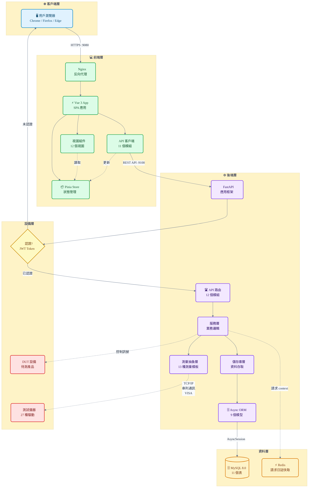
```mermaid
%%{init: {"theme":"base","themeVariables":{"fontFamily":"Segoe UI, Microsoft YaHei, PingFang TC, Arial, sans-serif","fontSize":"15px","primaryTextColor":"#1e293b","lineColor":"#64748b","edgeLabelBackground":"#f8fafc","primaryColor":"#eff6ff","secondaryColor":"#f0fdf4","tertiaryColor":"#fef3c7","background":"#ffffff"},"flowchart":{"useMaxWidth":true,"nodeSpacing":60,"rankSpacing":70,"curve":"basis","padding":20}}}%%
flowchart TB
    subgraph Client_Layer["🌐 客戶端層"]
        Client["🖥️ 用戶瀏覽器<br/>Chrome / Firefox / Edge"]
    end

    subgraph Frontend_Layer["💻 前端層"]
        FE_Nginx["🔄 Nginx<br/>反向代理"]
        FE_App["⚡ Vue 3 App<br/>SPA 應用"]
        FE_View["📄 視圖組件<br/>12 個視圖"]
        FE_API["🔌 API 客戶端<br/>11 個模組"]
        FE_Store["📦 Pinia Store<br/>狀態管理"]
    end

    subgraph Backend_Layer["⚙️ 後端層"]
        BE_Fast["🚀 FastAPI<br/>應用框架"]
        BE_API["🛣️ API 路由<br/>12 個模組"]
        BE_SVC["🔧 服務層<br/>業務邏輯"]
        BE_MEAS["📏 測量抽象層<br/>13 種測量模板"]
        BE_REPO["📁 儲存庫層<br/>資料存取"]
        BE_MODEL["🗄️ Async ORM<br/>9 個模型"]
    end

    subgraph Data_Layer["💾 資料層"]
        DB[("🗄️ MySQL 8.0<br/>11 個表")]
        Cache["⚡ Redis<br/>請求日誌快取"]
    end

    subgraph Device_Layer["🔌 設備層"]
        Auth_Decision{"🔐 認證?<br/>JWT Token"}
        EXT["📡 測試儀器<br/>27 種驅動"]
        DUT["🧪 DUT 設備<br/>待測產品"]
    end

    Client -->|HTTPS :9080| FE_Nginx
    FE_Nginx --> FE_App
    FE_App --> FE_View
    FE_App --> FE_API
    FE_App --> FE_Store
    FE_View -.->|讀取| FE_Store
    FE_API -.->|更新| FE_Store

    FE_API -->|REST API :9100| BE_Fast
    BE_Fast --> Auth_Decision
    Auth_Decision -->|已認證| BE_API
    Auth_Decision -->|未認證| Client

    BE_API --> BE_SVC
    BE_SVC --> BE_MEAS
    BE_SVC --> BE_REPO
    BE_REPO --> BE_MODEL

    BE_MODEL -->|AsyncSession| DB
    BE_SVC -.->|請求 context| Cache

    BE_MEAS -.->|TCP/IP<br/>串列通訊<br/>VISA| EXT
    BE_SVC -.->|控制訊號| DUT

    classDef clientStyle fill:#e0f2fe,stroke:#0284c7,stroke-width:2px,color:#0c4a6e,rx:8,ry:8;
    classDef frontendStyle fill:#dcfce7,stroke:#16a34a,stroke-width:2px,color:#14532d,rx:6,ry:6;
    classDef backendStyle fill:#f3e8ff,stroke:#7c3aed,stroke-width:2px,color:#2e1065,rx:6,ry:6;
    classDef dataStyle fill:#fef3c7,stroke:#d97706,stroke-width:2px,color:#78350f,rx:8,ry:8;
    classDef deviceStyle fill:#fee2e2,stroke:#dc2626,stroke-width:2px,color:#7f1d1d,rx:6,ry:6;
    classDef decisionStyle fill:#fef9c3,stroke:#ca8a04,stroke-width:2px,color:#713f12,rx:0,ry:0;

    class Client clientStyle;
    class FE_Nginx,FE_App,FE_View,FE_API,FE_Store frontendStyle;
    class BE_Fast,BE_API,BE_SVC,BE_MEAS,BE_REPO,BE_MODEL backendStyle;
    class DB,Cache dataStyle;
    class EXT,DUT deviceStyle;
    class Auth_Decision decisionStyle;
```

#### 圖例說明

| 圖示 | 顏色 | 說明 |
|:----:|:----:|------|
| 🌐 | 🔵 藍色 | 客戶端瀏覽器層 |
| 💻 | 🟢 綠色 | 前端 Vue 3 應用層 |
| ⚙️ | 🟣 紫色 | 後端 FastAPI 服務層 |
| 💾 | 🟡 黃色 | 資料庫與快取層 |
| 🔌 | 🔴 紅色 | 外部儀器與設備層 |
| ◆ | 🟠 橘色 | 決策/判斷節點 |

**實線箭頭 (→)**：主要資料流 / 直接調用
**虛線箭頭 (-.)**：間接交互 / 異步操作 / 協議通訊

### API 路由結構

| 路由模組 | 端點前綴 | 說明 |
|---------|---------|------|
| 認證模組 | `/api/auth` | 登入、登出、刷新 token、取得當前使用者 |
| 使用者管理 | `/api/users` | 使用者 CRUD、密碼管理 |
| 專案管理 | `/api/projects` | 專案 CRUD 操作 |
| 站別管理 | `/api/stations` | 站別配置管理 |
| **儀器管理** | `/api/instruments` | **儀器 CRUD（DB-backed）** |
| 測試執行 | `/api/tests` | 會話控制、狀態查詢、儀器重置 |
| 測量執行 | `/api/measurements` | 測量調度、儀器控制、參數驗證 |
| **Modbus 管理** | `/api/modbus` | **配置 CRUD、狀態查詢** |
| **Modbus WebSocket** | `/api/modbus-ws` | **即時事件推播** |
| **測試結果** | `/api/measurement-results` | **sessions/measurements/summary/export/cleanup/reports/analysis** |
| 測試計劃 | `/api/testplan` | queries / mutations / validation / sessions |
| DUT 控制 | `/api/dut` | 繼電器、機架控制 |

**模組化子路由：**
- `testplan/` - 4 個檔案（queries.py, mutations.py, validation.py, sessions.py）
- `results/` - 7 個檔案（sessions.py, measurements.py, summary.py, export.py, cleanup.py, reports.py, analysis.py）
- `services/modbus/` - 3 個檔案（modbus_manager.py, modbus_listener.py, modbus_config.py）
- **子路由總計**: 14 個檔案

### 前端視圖結構

| 路由 | 視圖元件 | 功能 | 狀態 |
|------|---------|------|------|
| `/login` | Login.vue | 登入頁面 | ✅ 完整 |
| `/main` | TestMain.vue | 測試執行主介面（含 SFC/runAllTest/OPjudge 設定，Modbus 快捷入口） | ✅ 完整 |
| `/test` | TestExecution.vue | 測試執行監控（進度/中止/重試） | ✅ 完整 |
| `/results` | TestResults.vue | 測試結果查看、批量刪除（Admin）、CSV 匯出 | ✅ 完整 |
| `/analysis` | ReportAnalysis.vue | 統計分析與 ECharts 圖表 | ✅ 完整 |
| `/testplan` | TestPlanManage.vue | 測試計劃管理（CSV 匯入/CRUD） | ✅ 完整 |
| `/projects` | ProjectManage.vue | 專案站別管理 | ✅ 完整 |
| `/users` | UserManage.vue | 使用者管理 | ✅ 完整 |
| `/instruments` | InstrumentManage.vue | **儀器設定管理** | ✅ 完整 |
| `/modbus-config` | ModbusConfig.vue | **Modbus 配置管理** | ✅ 完整 |
| `/config` | SystemConfig.vue | 系統配置 | 🚧 Stub |
| `/history` | TestHistory.vue | 測試歷史記錄（時間軸視圖） | ✅ 完整 |

### 操作介面截圖

#### 登入頁面 (Login)

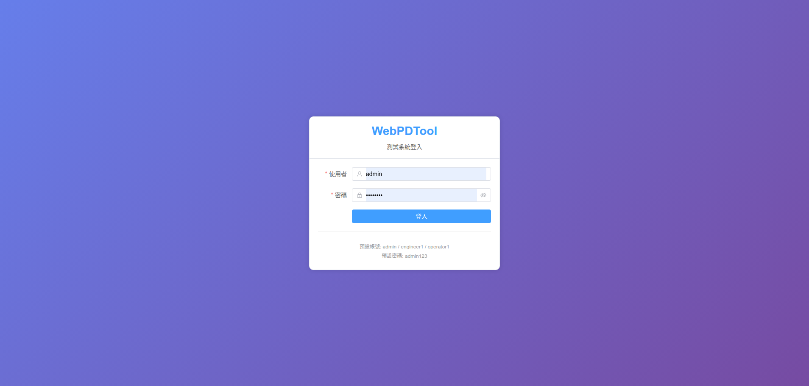

#### 登入後選擇專案與站別

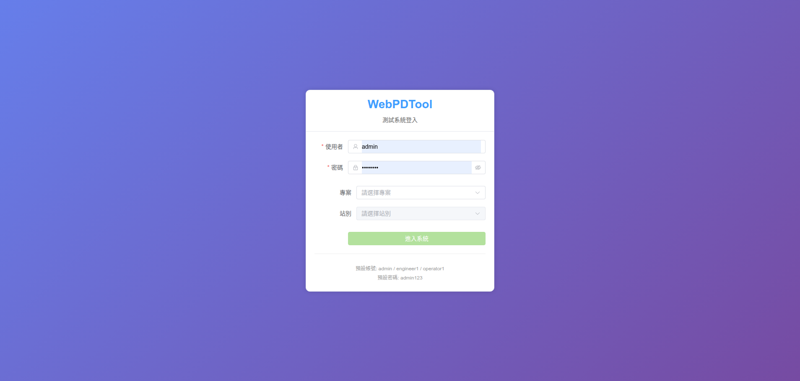

#### 測試主畫面 (TestMain)

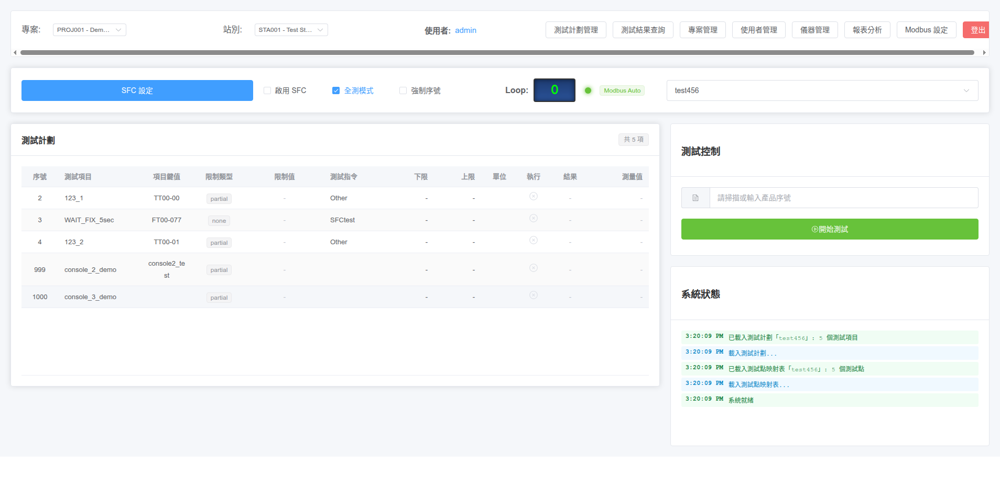

#### 測試執行 (TestExecution)

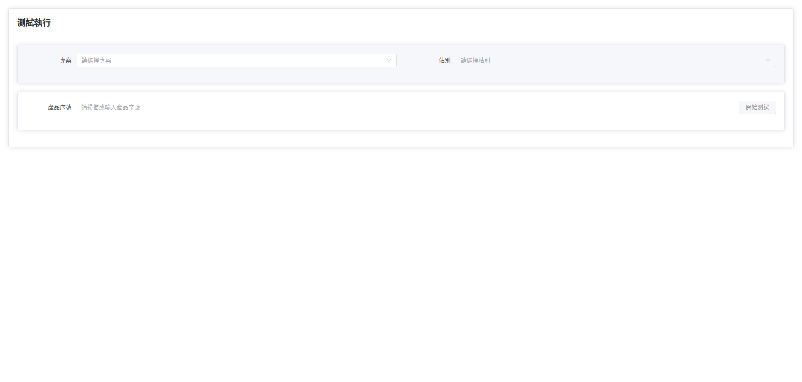

#### 測試計劃管理 (TestPlanManage)

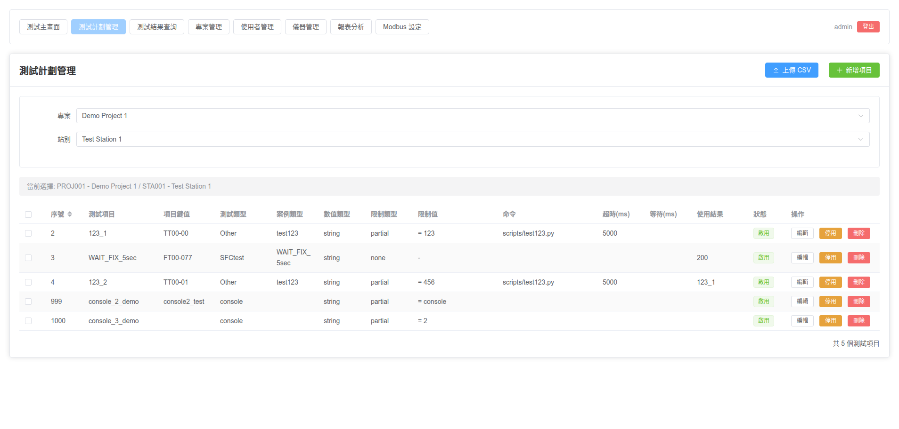

#### 測試結果查詢 (TestResults)

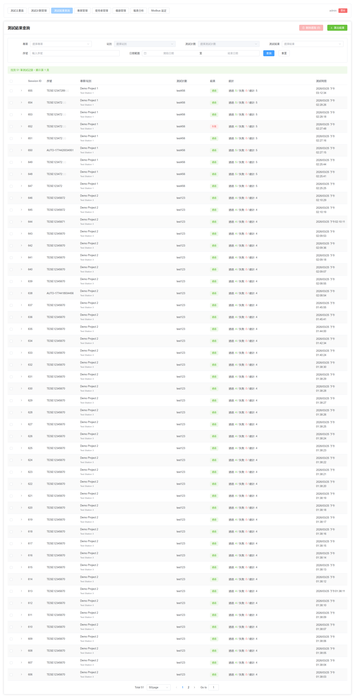

#### 報表分析 (ReportAnalysis)

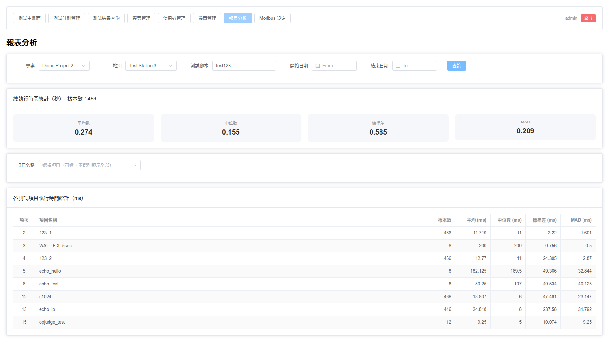

#### 專案管理 (ProjectManage)

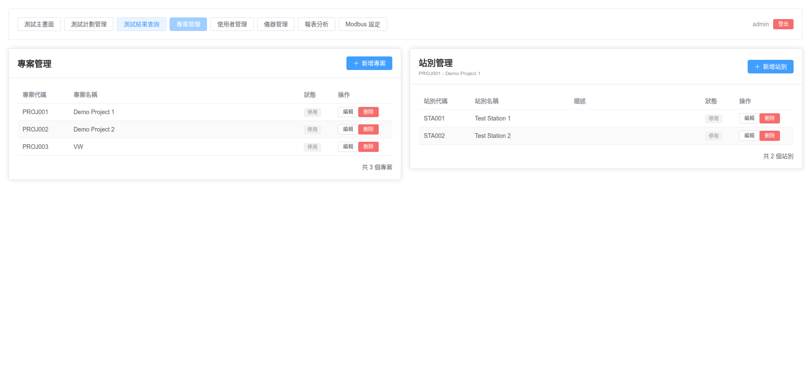

#### 使用者管理 (UserManage)

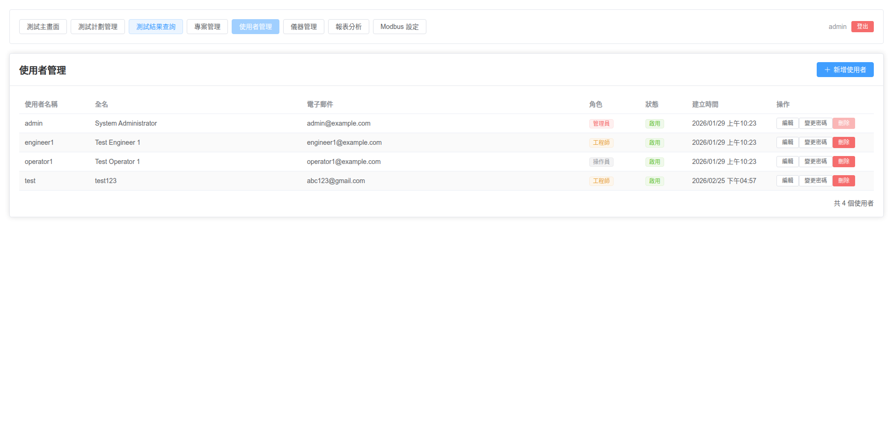

#### 儀器管理 (InstrumentManage)

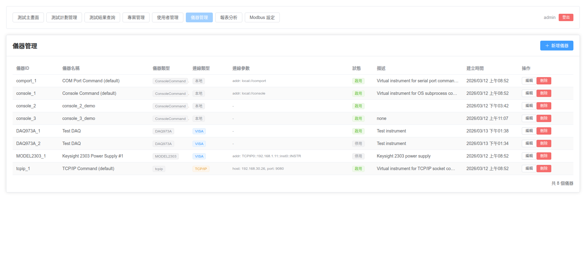

#### Modbus 設定 (ModbusConfig)

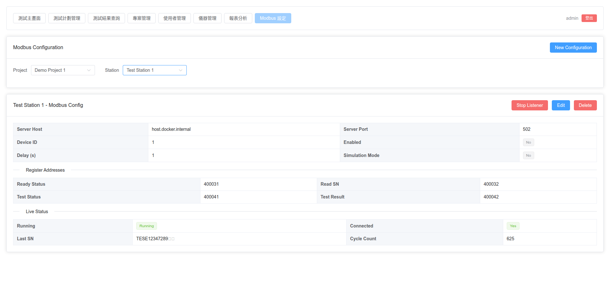

#### 系統設定 (SystemConfig) — 預留功能

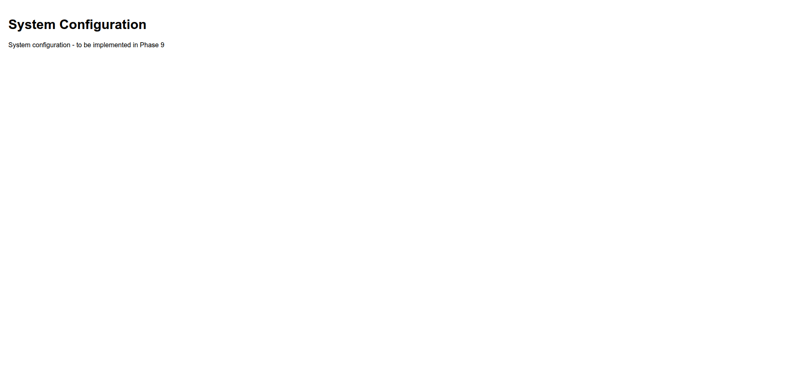

---

## 專案結構

```
WebPDTool/
├── backend/                    # FastAPI 後端應用
│   ├── app/
│   │   ├── api/               # RESTful API 路由 (12 個主模組 + 14 子模組)
│   │   │   ├── auth.py        # 認證 API
│   │   │   ├── users.py       # 使用者管理 API
│   │   │   ├── projects.py    # 專案管理 API
│   │   │   ├── stations.py    # 站別管理 API
│   │   │   ├── instruments.py # 儀器管理 API (DB-backed CRUD)
│   │   │   ├── tests.py       # 測試執行 API
│   │   │   ├── measurements.py # 測量執行 API
│   │   │   ├── dut_control.py # DUT 控制 API
│   │   │   ├── modbus.py      # Modbus REST API
│   │   │   ├── modbus_ws.py   # Modbus WebSocket API
│   │   │   ├── testplan/      # 測試計劃子模組 (4 個檔案)
│   │   │   │   ├── queries.py
│   │   │   │   ├── mutations.py
│   │   │   │   ├── sessions.py
│   │   │   │   └── validation.py
│   │   │   └── results/       # 測試結果子模組 (7 個檔案)
│   │   │       ├── sessions.py
│   │   │       ├── measurements.py
│   │   │       ├── summary.py
│   │   │       ├── export.py
│   │   │       ├── cleanup.py
│   │   │       ├── reports.py
│   │   │       └── analysis.py
│   │   ├── config/            # 配置模組
│   │   │   └── instruments.py # MEASUREMENT_TEMPLATES, AVAILABLE_INSTRUMENTS
│   │   ├── core/              # 核心功能模組
│   │   │   ├── database.py    # AsyncSession 與連線池
│   │   │   ├── security.py    # JWT 與密碼處理
│   │   │   ├── instrument_config.py  # InstrumentConfigProvider (30s TTL)
│   │   │   ├── logging_v2.py  # Redis 分散式請求日誌
│   │   │   └── constants.py   # 系統常數
│   │   ├── models/            # SQLAlchemy 資料模型 (9 個 ORM 模型)
│   │   │   ├── user.py
│   │   │   ├── project.py
│   │   │   ├── station.py
│   │   │   ├── testplan.py
│   │   │   ├── test_session.py
│   │   │   ├── test_result.py
│   │   │   ├── sfc_log.py
│   │   │   ├── instrument.py
│   │   │   └── modbus_config.py
│   │   ├── repositories/      # 資料存取層
│   │   │   └── instrument_repository.py
│   │   ├── schemas/           # Pydantic 資料驗證模型 (8 個)
│   │   │   ├── user.py
│   │   │   ├── project.py
│   │   │   ├── testplan.py
│   │   │   ├── test_session.py
│   │   │   ├── test_result.py  # 含 wall_time_ms 欄位
│   │   │   ├── measurement.py
│   │   │   ├── instrument.py
│   │   │   └── modbus.py
│   │   ├── services/          # 業務邏輯層
│   │   │   ├── instruments/   # 27 種儀器驅動實現
│   │   │   │   ├── base.py    # BaseInstrumentDriver 基類
│   │   │   │   ├── dwf_constants.py  # DWF 常數
│   │   │   │   ├── daq973a.py, model2303.py, model2306.py
│   │   │   │   ├── it6723c.py, a2260b.py, aps7050.py
│   │   │   │   ├── a34970a.py, daq6510.py, psw3072.py
│   │   │   │   ├── keithley2015.py, mdo34.py
│   │   │   │   ├── cmw100.py, mt8872a.py, n5182a.py
│   │   │   │   ├── smcv100b.py, peak_can.py
│   │   │   │   ├── l6mpu_ssh.py, l6mpu_ssh_comport.py
│   │   │   │   ├── l6mpu_pos_ssh.py
│   │   │   │   ├── analog_discovery_2.py, ftm_on.py
│   │   │   │   ├── console_command.py  # ConSole 驅動
│   │   │   │   ├── comport_command.py  # ComPort 驅動
│   │   │   │   ├── tcpip_command.py    # TCPIP 驅動
│   │   │   │   └── wait_test.py        # Wait 驅動
│   │   │   ├── modbus/        # Modbus 服務 (3 個檔案)
│   │   │   │   ├── modbus_manager.py    # ModbusManager 單例
│   │   │   │   ├── modbus_listener.py   # ModbusListenerService
│   │   │   │   └── modbus_config.py     # Modbus 配置
│   │   │   ├── dut_comms/     # DUT 通訊模組 (4 個子模組)
│   │   │   │   ├── common/    # 通用結構訊息
│   │   │   │   ├── ls_comms/  # L 系列通訊
│   │   │   │   ├── vcu_ether_comms/  # VCU 以太網通訊
│   │   │   │   └── ltl_chassis_fixt_comms/  # Chassis 控制器
│   │   │   ├── chassis_controller.py   # 機架控制器
│   │   │   ├── relay_controller.py     # 繼電器控制器
│   │   │   ├── test_engine.py  # 測試執行引擎 (asyncio, Asia/Taipei 時區)
│   │   │   ├── measurement_service.py  # 測量服務 (runAllTest)
│   │   │   ├── test_plan_service.py
│   │   │   ├── instrument_manager.py
│   │   │   ├── instrument_connection.py
│   │   │   ├── instrument_executor.py
│   │   │   ├── report_service.py
│   │   │   └── auth.py
│   │   ├── measurements/      # 測量抽象層
│   │   │   ├── base.py        # BaseMeasurement 基類 (PDTool4 驗證邏輯, Asia/Taipei 時區)
│   │   │   ├── registry.py    # 測量類型註冊表
│   │   │   └── implementations.py  # 具體測量類別實作
│   │   ├── utils/             # 工具函數
│   │   │   └── csv_parser.py  # CSV 測試計劃解析
│   │   ├── dependencies.py    # FastAPI 依賴注入 (JWT, DB)
│   │   └── main.py            # 應用入口點
│   ├── alembic/               # 資料庫遷移
│   │   └── versions/          # 7 個遷移版本檔案
│   ├── tests/                 # 測試套件 (40+ 個測試檔案)
│   │   ├── test_api/          # API 測試
│   │   ├── test_services/     # 服務測試
│   │   ├── test_models/       # 模型測試
│   │   ├── test_schemas/      # Schema 測試
│   │   ├── test_repositories/ # Repository 測試
│   │   ├── test_config/       # 配置驗證測試
│   │   ├── test_measurements/ # 測量測試
│   │   ├── services/          # 整合測試
│   │   └── integration/       # E2E 測試
│   └── pyproject.toml         # Python 專案配置
├── frontend/                  # Vue 3 前端應用
│   ├── src/
│   │   ├── views/             # 頁面組件 (12 個視圖，10 個功能完整)
│   │   │   ├── Login.vue
│   │   │   ├── TestMain.vue           # 測試執行主介面
│   │   │   ├── TestExecution.vue      # 測試執行監控
│   │   │   ├── TestResults.vue        # 測試結果查看（含批量刪除）
│   │   │   ├── ReportAnalysis.vue     # 統計分析與圖表
│   │   │   ├── TestPlanManage.vue     # 測試計劃管理
│   │   │   ├── ProjectManage.vue      # 專案站別管理
│   │   │   ├── UserManage.vue         # 使用者管理
│   │   │   ├── InstrumentManage.vue   # 儀器管理 CRUD
│   │   │   ├── ModbusConfig.vue       # Modbus 配置管理
│   │   │   ├── SystemConfig.vue       # 系統配置（🚧 Stub）
│   │   │   └── TestHistory.vue        # 測試歷史記錄（時間軸視圖，✅ 完整）
│   │   ├── components/        # 可複用組件 (4 個)
│   │   │   ├── AppNavBar.vue          # 導航欄
│   │   │   ├── ProjectStationSelector.vue  # 專案站別選擇器
│   │   │   ├── DynamicParamForm.vue   # 動態參數表單
│   │   │   └── ModbusStatusIndicator.vue  # Modbus 狀態指示器
│   │   ├── api/               # API 客戶端 (11 個模組)
│   │   │   ├── client.js              # Axios 客戶端（unwrap response.data）
│   │   │   ├── auth.js
│   │   │   ├── users.js
│   │   │   ├── projects.js
│   │   │   ├── testplans.js
│   │   │   ├── tests.js
│   │   │   ├── measurements.js
│   │   │   ├── testResults.js
│   │   │   ├── analysis.js
│   │   │   ├── instruments.js
│   │   │   └── modbus.js              # Modbus API 客戶端
│   │   ├── stores/            # Pinia 狀態管理 (4 個)
│   │   │   ├── auth.js
│   │   │   ├── project.js
│   │   │   ├── users.js
│   │   │   └── instruments.js
│   │   ├── composables/       # Composition API 可組合函數 (1 個)
│   │   │   └── useMeasurementParams.js
│   │   ├── router/            # Vue Router 配置 (12 條路由)
│   │   ├── App.vue            # 根組件
│   │   └── main.js            # 應用入口
│   └── package.json
├── database/                  # 資料庫設計
│   ├── schema.sql             # 資料庫 Schema（11 個表）
│   ├── seed_data.sql          # 初始資料
│   └── seed_instruments.sql   # 儀器設定初始資料
├── docker-compose.yml         # Docker Compose 配置（4 個服務）
├── pytest.ini                 # Pytest 配置
└── README.md                  # 本檔案
```

---

## 快速開始

### Docker 環境 (推薦)

```bash
# 啟動所有服務
docker-compose up -d

# 查看日誌
docker-compose logs -f backend  # 後端日誌
docker-compose logs -f frontend # 前端日誌

# 停止服務
docker-compose down

# 重建服務
docker-compose build --no-cache
docker-compose up -d

# 資料庫初始化 (首次運行)
docker-compose exec db mysql -uroot -p${MYSQL_ROOT_PASSWORD} webpdtool < database/schema.sql
docker-compose exec db mysql -uroot -p${MYSQL_ROOT_PASSWORD} webpdtool < database/seed_data.sql
docker-compose exec db mysql -uroot -p${MYSQL_ROOT_PASSWORD} webpdtool < database/seed_instruments.sql
```

### 本機開發

```bash
# 後端 (需要 Python 3.9+，推薦使用 uv)
cd backend
uv run uvicorn app.main:app --reload --host 0.0.0.0 --port 9100

# 前端 (需要 Node.js 16+)
cd frontend
npm install
npm run dev  # 執行於 http://localhost:5678 (API proxy → http://localhost:8765)

# 資料庫連線
mysql -h localhost -P 33306 -u pdtool -p webpdtool
# 預設密碼: pdtool123
```

### 服務端口一覽

| 服務 | 端口 | 說明 |
|------|------|------|
| Frontend (Docker) | 9080 | Nginx 靜態服務 |
| Frontend (dev) | 5678 | Vite dev server |
| Backend | 9100 | uvicorn FastAPI |
| Database | 33306 | MySQL 容器 (內部 3306) |
| API Docs | 9100/docs | Swagger UI |
| Redis | 6379 | 請求日誌（內部使用） |

### 測試

```bash
cd backend

# 使用 uv (推薦)
uv run pytest

# 執行特定測試
uv run pytest tests/test_api/test_auth.py

# 執行並生成覆蓋率報告
uv run pytest --cov=app tests/

# 依標記篩選
uv run pytest -m unit           # 僅快速單元測試
uv run pytest -m "not hardware" # 跳過需要實體硬體的測試
```

### 測試計劃匯入

```bash
cd backend

# 匯入單個 CSV 檔案
python scripts/import_testplan.py \
  --project "PROJECT_CODE" \
  --station "STATION_CODE" \
  --csv-file "/path/to/testplan.csv"
```

---

## API 端點列表

### 認證模組 (Authentication)

| 方法 | 端點 | 說明 |
|------|------|------|
| `POST` | `/api/auth/login` | 使用者登入 |
| `POST` | `/api/auth/logout` | 使用者登出 |
| `POST` | `/api/auth/refresh-token` | 刷新 JWT Token |
| `GET` | `/api/auth/me` | 獲取當前使用者資訊 |

### 使用者管理 (Users) - Admin Only

| 方法 | 端點 | 說明 |
|------|------|------|
| `GET` | `/api/users` | 列出使用者 (支援分頁、搜尋、篩選) |
| `GET` | `/api/users/{id}` | 獲取特定使用者 |
| `POST` | `/api/users` | 建立新使用者 (admin only) |
| `PUT` | `/api/users/{id}` | 更新使用者 (admin only) |
| `PUT` | `/api/users/{id}/password` | 修改密碼 (admin or self) |
| `DELETE` | `/api/users/{id}` | 刪除使用者 (admin only) |

### 專案管理 (Projects)

| 方法 | 端點 | 說明 |
|------|------|------|
| `GET` | `/api/projects` | 列出所有專案 |
| `POST` | `/api/projects` | 建立新專案 |
| `GET` | `/api/projects/{project_id}` | 獲取專案詳情 |
| `PUT` | `/api/projects/{project_id}` | 更新專案 |
| `DELETE` | `/api/projects/{project_id}` | 刪除專案 |

### 站別管理 (Stations)

| 方法 | 端點 | 說明 |
|------|------|------|
| `GET` | `/api/stations/{station_id}` | 獲取站別詳情 |
| `POST` | `/api/stations` | 建立新站別 |
| `PUT` | `/api/stations/{station_id}` | 更新站別 |
| `DELETE` | `/api/stations/{station_id}` | 刪除站別 |
| `GET` | `/api/stations/{station_id}/testplan` | 查詢測試計劃 |

### 儀器管理 (Instruments)

| 方法 | 端點 | 說明 |
|------|------|------|
| `GET` | `/api/instruments` | 列出儀器 (支援 enabled_only 篩選) |
| `GET` | `/api/instruments/{instrument_id}` | 獲取特定儀器 |
| `POST` | `/api/instruments` | 建立新儀器 (admin only) |
| `PATCH` | `/api/instruments/{instrument_id}` | 更新儀器 (admin only) |
| `DELETE` | `/api/instruments/{instrument_id}` | 刪除儀器 (admin only) |

### 測試計劃 (Test Plans)

| 方法 | 端點 | 說明 |
|------|------|------|
| `GET` | `/api/testplan/queries/...` | 查詢測試計劃 |
| `POST/PUT/DELETE` | `/api/testplan/mutations/...` | 新增/更新/刪除測試計劃項目 |
| `POST` | `/api/testplan/validation` | 驗證測試計劃 |
| `GET/POST` | `/api/testplan/sessions/...` | 測試會話管理 |

### Modbus 管理 (Modbus)

| 方法 | 端點 | 說明 |
|------|------|------|
| `GET` | `/api/modbus/configs` | 列出所有 Modbus 配置 |
| `GET` | `/api/modbus/configs/{config_id}` | 獲取特定 Modbus 配置 |
| `GET` | `/api/modbus/stations/{station_id}/config` | 獲取站別 Modbus 配置 |
| `POST` | `/api/modbus/configs` | 建立新 Modbus 配置 |
| `PUT` | `/api/modbus/configs/{config_id}` | 更新 Modbus 配置 |
| `DELETE` | `/api/modbus/configs/{config_id}` | 刪除 Modbus 配置 |
| `GET` | `/api/modbus/status` | 獲取所有 Modbus 監聽器狀態 |
| `GET` | `/api/modbus/status/{station_id}` | 獲取站別 Modbus 狀態 |
| `WS` | `/api/modbus/ws/{station_id}` | WebSocket 即時事件推播（含站別 stale socket guard） |

### 測試執行 (Tests)

| 方法 | 端點 | 說明 |
|------|------|------|
| `POST` | `/api/tests/sessions` | 建立測試會話 |
| `POST` | `/api/tests/sessions/{session_id}/start` | 啟動測試執行 |
| `POST` | `/api/tests/sessions/{session_id}/stop` | 停止測試執行 |
| `POST` | `/api/tests/sessions/{session_id}/complete` | 完成測試會話 |
| `GET` | `/api/tests/sessions` | 列出測試會話 |
| `GET` | `/api/tests/sessions/{session_id}` | 獲取會話詳情 |
| `GET` | `/api/tests/sessions/{session_id}/status` | 獲取即時狀態 |
| `GET` | `/api/tests/sessions/{session_id}/results` | 獲取測試結果 |
| `GET` | `/api/tests/instruments/status` | 獲取儀器狀態 |
| `POST` | `/api/tests/instruments/{id}/reset` | 重置儀器 |

### 測量執行 (Measurements)

| 方法 | 端點 | 說明 |
|------|------|------|
| `GET` | `/api/measurements/types` | 列出測量類型（由 MEASUREMENT_TEMPLATES 驅動） |
| `GET` | `/api/measurements/instruments` | 列出儀器狀態 |
| `POST` | `/api/measurements/execute` | 執行測量 |
| `POST` | `/api/measurements/validate-params` | 驗證測量參數 |

### 測試結果與分析 (Results)

| 方法 | 端點 | 說明 |
|------|------|------|
| `GET` | `/api/measurement-results/sessions` | 查詢測試會話歷史 |
| `GET` | `/api/measurement-results/sessions/{session_id}` | 獲取會話詳細結果 |
| `GET` | `/api/measurement-results/measurements` | 查詢測量記錄 |
| `GET` | `/api/measurement-results/summary` | 獲取測試統計摘要 |
| `GET` | `/api/measurement-results/export` | 匯出測試結果（CSV） |
| `GET` | `/api/measurement-results/analysis` | 統計分析（mean/median/stdev/MAD） |
| `POST` | `/api/measurement-results/cleanup` | 清理舊記錄 |
| `GET` | `/api/measurement-results/reports/list` | 查詢已儲存報告 |
| `POST` | `/api/measurement-results/reports` | 建立報告 |

### DUT 控制 (DUT Control)

| 方法 | 端點 | 說明 |
|------|------|------|
| `POST` | `/api/dut/relay/set` | 設定繼電器狀態 |
| `GET` | `/api/dut/relay/status` | 查詢繼電器狀態 |
| `POST` | `/api/dut/chassis/rotate` | 旋轉機架 |
| `GET` | `/api/dut/chassis/status` | 查詢機架狀態 |

---

## 開發進度

### 核心功能完成度

| 功能模組 | 完成度 | 說明 |
|---------|--------|------|
| **資料庫設計** | 100% | 9 個核心 ORM 模型完整設計與實現（11 個資料表，含 configurations / modbus_logs 純 SQL 表） |
| **後端 API** | 100% | 12 個主路由模組 + 14 個子模組完整實現（124 個 Python 檔案） |
| **前端 UI** | ~95% | 12 個視圖 + 4 個組件（11 個完整，1 個 stub） |
| **測量服務** | 100% | MEASUREMENT_TEMPLATES 統一配置，BaseMeasurement 基類完整 |
| **儀器驅動** | 100% | 27 種儀器驅動，完整實現（driver registry 別名完善） |
| **儀器管理** | 100% | DB-backed CRUD，Web UI 完整 |
| **使用者管理** | 100% | Admin CRUD 操作完成，RBAC 角色控制 |
| **統計分析** | 100% | 報告分析頁面完成，ECharts 圖表整合 |
| **日誌系統** | 100% | Redis 分散式請求日誌（request_id, user_id context） |
| **Modbus 整合** | 100% | REST API、WebSocket、E2E 測試完整實現 |
| **時區統一** | 100% | Asia/Taipei 統一（Python 端注入 + DB CURRENT_TIMESTAMP fallback） |
| **wall_time_ms** | 100% | test_results 表新增欄位，記錄端到端時間 |

### 代碼統計

| 指標 | 數值 |
|------|------|
| **後端 Python 主檔案** | 124 個（app 目錄，不含 __pycache__） |
| **前端檔案 (Vue/JS)** | 35 個 |
| **前端視圖** | 12 個（11 功能完整，1 stub） |
| **前端組件** | 4 個 |
| **前端 API 模組** | 11 個 |
| **前端 Pinia Stores** | 4 個 |
| **前端 Composables** | 1 個 |
| **前端路由** | 12 條 |
| **API 主路由** | 12 個模組 |
| **API 子路由** | 14 個（testplan 4 + results 7 + modbus 3） |
| **測量模板類型** | 13 種（MEASUREMENT_TEMPLATES，wait 為 Wait 別名） |
| **儀器驅動** | 27 種（不含 base.py） |
| **ORM 模型** | 9 個 |
| **資料表** | 11 個（含 2 個純 SQL 表：configurations, modbus_logs） |
| **Pydantic Schemas** | 8 個驗證模型 |
| **Alembic 遷移** | 7 個版本 |
| **測試檔案** | 40+ 個 |

### MEASUREMENT_TEMPLATES 測量類型 (13 種)

| 測量類型 key | 儀器支援 | 說明 |
|------------|---------|------|
| `PowerSet` | DAQ973A, MODEL2303, MODEL2306, IT6723C, PSW3072, 2260B, APS7050, KEITHLEY2015, 34970A | 電源設定 |
| `PowerRead` | DAQ973A, 34970A, KEITHLEY2015, 2015, 6510, APS7050, MDO34, MT8870A_INF | 電源讀取 |
| `SFCtest` | default, webStep1_2, URLStep1_2, skip, WAIT_FIX_5sec | SFC 系統測量 |
| `getSN` | default, SN, IMEI, MAC | 序號讀取 |
| `OPjudge` | confirm, YorN | 操作判斷 |
| `Other` | script | 自定義腳本 |
| `Wait` | default | 延遲等待（`wait` 為向下相容別名） |
| `Relay` | default | 繼電器控制 |
| `comport` | comport | 串口通訊 |
| `console` | console | 控制台命令 |
| `tcpip` | tcpip | TCP/IP 通訊 |
| `android_adb` | android_adb, custom | Android ADB 命令 |
| `PEAK` | PEAK, custom | PEAK CAN 匯流排 |

### 已實現儀器驅動 (27 種)

| 儀器類型 | 驅動器類別 | 驅動器檔案 | Registry Keys |
|---------|-----------|-----------|---------------|
| **電源供應器** | | | |
| DAQ973A | DAQ973ADriver | daq973a.py | DAQ973A |
| MODEL2303 | MODEL2303Driver | model2303.py | MODEL2303 |
| MODEL2306 | MODEL2306Driver | model2306.py | MODEL2306 |
| IT6723C | IT6723CDriver | it6723c.py | IT6723C |
| PSW3072 | PSW3072Driver | psw3072.py | PSW3072 |
| 2260B | A2260BDriver | a2260b.py | 2260B |
| APS7050 | APS7050Driver | aps7050.py | APS7050 |
| **萬用電表** | | | |
| 34970A | A34970ADriver | a34970a.py | 34970A |
| DAQ6510 | DAQ6510Driver | daq6510.py | DAQ6510 |
| KEITHLEY2015 | KEITHLEY2015Driver | keithley2015.py | KEITHLEY2015 |
| **RF 分析儀** | | | |
| CMW100 | CMW100Driver | cmw100.py | CMW100 |
| MT8872A | MT8872ADriver | mt8872a.py | MT8872A, RF_TOOL |
| N5182A | N5182ADriver | n5182a.py | N5182A |
| SMCV100B | SMCV100BDriver | smcv100b.py | SMCV100B |
| **示波器** | | | |
| MDO34 | MDO34Driver | mdo34.py | MDO34 |
| **通訊介面** | | | |
| ConSole | ConSoleCommandDriver | console_command.py | console, ConsoleCommand |
| ComPort | ComPortCommandDriver | comport_command.py | comport, ComPortCommand |
| TCPIP | TCPIPCommandDriver | tcpip_command.py | tcpip, TCPIPCommand |
| Wait | WaitTestDriver | wait_test.py | wait, Wait |
| PEAK_CAN | PEAKCANDriver | peak_can.py | PEAK_CAN, PCAN |
| **L6MPU 系列** | | | |
| L6MPU_SSH | L6MPUSSHDriver | l6mpu_ssh.py | L6MPU_SSH, L6MPU |
| L6MPU_SSH_ComPort | L6MPUSSHComPortDriver | l6mpu_ssh_comport.py | L6MPU_SSH_COMPORT |
| L6MPU_POS_SSH | L6MPUPOSSHDriver | l6mpu_pos_ssh.py | L6MPU_POS_SSH |
| **其他** | | | |
| Analog_Discovery_2 | AnalogDiscovery2Driver | analog_discovery_2.py | ANALOG_DISCOVERY_2, AD2 |
| FTM_On | FTMOnDriver | ftm_on.py | FTM_ON |
| **DWF 相關** | | | |
| (dwf_constants) | — | dwf_constants.py | — (常數定義，非驅動) |

> **注意：** `instrument_type` 欄位（UI 選項）與 driver registry key 不同。`ConsoleCommand`/`ComPortCommand`/`TCPIPCommand` 和 `console`/`comport`/`tcpip` 均已在 `INSTRUMENT_DRIVERS` 中建立別名對應。

---

## 技術特色

### 完整 PDTool4 相容性

系統實現了 PDTool4 的所有驗證邏輯，包括：
- **7 種 limit_type**: lower, upper, both, equality, inequality, partial, none
- **3 種 value_type**: string, integer, float
- **完全相同的驗證規則**: 無縮放、浮點精度處理
- **自動儀器錯誤偵測**: 回傳值以 `"No instrument found"` 或 `"Error:"` 開頭時自動標記 ERROR

### runAllTest 模式

支援 PDTool4 的完整 runAllTest 邏輯：
- 遇到失敗時繼續執行所有測試項目
- 收集所有錯誤資訊
- 最後一次性報告所有失敗

### 時區統一（Asia/Taipei）

所有測試時間戳記統一使用台灣時區（Asia/Taipei），避免 UTC 偏移造成的資料混淆：
- `measurements/base.py`：`test_time = datetime.now(ZoneInfo("Asia/Taipei"))`
- `services/test_engine.py`：`start_time = datetime.now(_TZ_TAIPEI)`
- `api/tests.py`：明確傳入 Asia/Taipei `start_time` 避免依賴 MySQL 時區設定
- `database/schema.sql`：`CURRENT_TIMESTAMP` 作為 DB 層 fallback

### wall_time_ms 端到端時間追蹤

`test_results` 表新增 `wall_time_ms` 欄位（2026-03-16），記錄前端量測的端到端時間，包含：
- 測試執行時間（`execution_duration_ms`）
- 網路傳輸時間
- 資料庫寫入時間

兩個欄位互補，可診斷網路/DB 效能瓶頸。

### DB-backed 儀器管理

- `InstrumentConfigProvider`（`backend/app/core/instrument_config.py`）在應用啟動時注入，從 MySQL `instruments` 資料表讀取設定
- 30 秒 TTL 快取，執行緒安全
- 降級策略：若 DB 初始化失敗，自動 fallback 至 hardcoded 預設設定

### MEASUREMENT_TEMPLATES 配置系統

- **配置檔案**：`backend/app/config/instruments.py`
- **MEASUREMENT_TEMPLATES**：定義各測量類型與儀器組合的必填/選填參數模板（13 種類型，wait 為 Wait 別名）
- **AVAILABLE_INSTRUMENTS**：按類別分組的可用儀器清單（power_supplies, multimeters, communication, rf_analyzers）
- **動態 API**：`GET /api/measurements/types` 根據模板自動生成可用的測量類型列表
- **參數驗證**：`POST /api/measurements/validate-params` 使用模板驗證參數完整性

### Redis 分散式請求日誌

- 每個 HTTP 請求自動注入 `request_id` 與 `user_id` context
- 日誌寫入 Redis，後台 flusher 非同步持久化
- 可透過環境變數 `REDIS_ENABLED=false` 停用（降級為本地日誌）

### 統計分析功能

**後端端點**: `GET /api/measurement-results/analysis`

提供描述統計：平均數、中位數、標準差（樣本）、MAD

統計對象：
1. 各測試項目的 `execution_duration_ms`（毫秒）
2. 每個 Session 的 `test_duration_seconds`（秒）

**前端頁面**: `/analysis` → `ReportAnalysis.vue`（ECharts 圖表整合）

### Modbus 整合

**核心架構：**
- `ModbusManager`（`backend/app/services/modbus/modbus_manager.py`）- 單例模式管理所有 Modbus 連線
- `ModbusListenerService`（`modbus_listener.py`）- 非同步 TCP Modbus 伺服器（pymodbus）
- `ModbusConfig` Model - 資料庫配置（station_id, host, port, slave_id, coil_address）

**API 端點：**
- `GET /api/modbus/configs` - 列出所有配置
- `GET /api/modbus/status` - 獲取所有監聽器狀態
- `GET /api/modbus/status/{station_id}` - 獲取特定站別狀態
- `POST /api/modbus/configs` - 建立新配置
- `POST /api/modbus/start/{station_id}` - 啟動監聽器
- `POST /api/modbus/stop/{station_id}` - 停止監聽器
- `WebSocket /api/modbus/ws/{station_id}` - 即時事件推播（per-station）

**自動觸發流程（v0.8.0）：**

```
選擇 station → TestMain.vue 自動連接 Modbus WS
    ↓ 後端推送 { type: 'sn_received', sn: 'XXXX' }
barcode.value = 'XXXX' → handleStartTest() 自動執行
    ↓ modbusAutoMode 顯示綠色 "Modbus Auto" 標籤
```

- **stale socket guard**：`modbusWsRef` 計數器確保關閉的 socket 事件被丟棄，防止重複觸發
- **WebSocket 事件類型**：`listener_started`, `listener_stopped`, `sn_received`, `result_written`

**E2E 測試：**
- `backend/tests/test_services/test_modbus_e2e.py` - 完整端對端測試
- `scripts/modbus_tcp_simulator.py` - TCP 模擬器腳本

### 模組化 API 架構

系統採用高度模組化的 API 設計，便於維護與擴展：
- **testplan/** - 4 個子模組（queries.py, mutations.py, validation.py, sessions.py）
- **results/** - 7 個子模組（sessions.py, measurements.py, summary.py, export.py, cleanup.py, reports.py, analysis.py）
- **modbus/** - 3 個檔案（modbus_manager.py, modbus_listener.py, modbus_config.py）
- **子路由總計**: 14 個檔案（4 + 7 + 3）
- 每個子模組專注單一職責，降低耦合度

### 非同步架構

使用 Python asyncio 實現完整的非同步操作：
- **資料庫查詢**: SQLAlchemy async ORM（AsyncSession + asyncmy，完成 Wave 1-4 遷移）
- **儀器通訊**: 非同步 TCP/Serial
- **API 處理**: FastAPI 的非同步路由

#### 同步 vs 非同步差異性

| 特性 | 同步架構 | 非同步架構 |
|------|---------|-----------|
| **執行模型** | 阻塞式 (Blocking) | 事件循環 (Event Loop) |
| **I/O 等待** | 執行緒阻塞，資源閒置 | 掛起任務，處理其他請求 |
| **記憶體佔用** | 高（每執行緒 ~8MB） | 低（單執行緒 + 協程） |
| **適合場景** | CPU 密集型運算 | I/O 密集型（資料庫、網路） |

---

## 測試

```bash
cd backend

# 執行所有測試
uv run pytest

# 依類型篩選
uv run pytest tests/test_api/ -v
uv run pytest tests/test_services/ -v

# 覆蓋率報告
uv run pytest --cov=app --cov-report=html tests/
# 報告位置: htmlcov/index.html

# 依 marker 篩選
uv run pytest -m unit                       # 快速單元測試
uv run pytest -m "not hardware"             # 跳過需要硬體的測試
uv run pytest -m instrument_34970a          # 特定儀器測試
```

**可用的 pytest markers：**
- **速度**：`slow`, `fast`, `unit`
- **類型**：`integration`, `e2e`
- **硬體**：`hardware`, `simulation`
- **儀器**：`instrument_34970a`, `instrument_model2306`, `instrument_it6723c`, `instrument_2260b`, `instrument_cmw100`, `instrument_mt8872a`, `modbus`
- **元件**：`measurements`, `instruments`, `api`, `services`

---

## 部署

### 生產環境部署

```bash
docker-compose up -d
docker-compose ps     # 確認服務狀態
docker-compose logs -f
```

### 環境配置

在 `.env` 中設置以下變數：

```bash
DATABASE_URL=mysql+asyncmy://pdtool:pdtool123@db:3306/webpdtool
MYSQL_ROOT_PASSWORD=rootpassword
MYSQL_USER=pdtool
MYSQL_PASSWORD=pdtool123
SECRET_KEY=your-secret-key-minimum-32-characters
ACCESS_TOKEN_EXPIRE_MINUTES=480
DEBUG=false
REDIS_ENABLED=true
REDIS_URL=redis://redis:6379/0
SKIP_MIGRATIONS=false  # Alembic 啟動自動遷移
```

### 資料庫初始化

```bash
docker-compose exec db mysql -uroot -p${MYSQL_ROOT_PASSWORD} webpdtool < database/schema.sql
docker-compose exec db mysql -uroot -p${MYSQL_ROOT_PASSWORD} webpdtool < database/seed_data.sql
docker-compose exec db mysql -uroot -p${MYSQL_ROOT_PASSWORD} webpdtool < database/seed_instruments.sql
```

---

## 故障排除

### 後端問題

```bash
docker-compose logs -f backend | grep ERROR
docker-compose exec backend python -c "from app.core.database import engine; print('DB OK')"
curl http://localhost:9100/health
```

### 前端問題

```bash
cd frontend && npm run build
curl http://localhost:9100/docs
```

### 資料庫問題

```bash
docker-compose exec db mysql -uroot -p${MYSQL_ROOT_PASSWORD} webpdtool
# SHOW TABLES;
# SELECT COUNT(*) FROM instruments;
```

### 儀器驅動問題

錯誤訊息 `No driver for instrument type 'X'` 表示 `INSTRUMENT_DRIVERS` registry 缺少對應 key。
確認 `backend/app/services/instruments/__init__.py` 中同時存在大寫（UI 儲存值）和小寫（內部 key）別名。

### 時區問題

若測試結果時間顯示為 UTC，確認：
- `measurements/base.py` 使用 `ZoneInfo("Asia/Taipei")`
- `services/test_engine.py` 使用 `datetime.now(_TZ_TAIPEI)`
- `api/tests.py` 明確傳入 `start_time` 而非依賴 DB server_default

---

## 更新日誌

### v0.8.0 (2026-03-25)

**Modbus 自動觸發測試**
- **TestMain.vue Modbus WebSocket 整合** - 選擇 station 後自動連接 `/api/modbus/ws/{station_id}`
- **sn_received 自動觸發** - 接收 `sn_received` 事件後自動填入序號並呼叫 `handleStartTest()`，無需操作員手動操作
- **modbusAutoMode 狀態顯示** - 顯示綠色「Modbus Auto」標籤，告知操作員處於自動模式
- **stale socket guard** - `modbusWsRef` 計數器防止已關閉 socket 的殘留事件觸發重複測試
- **onopen/onmessage 閉包防護** - WebSocket 每次重建時計數器遞增，舊 handler 比對計數器後自動丟棄
- **架構文件** - 新增 `docs/architecture/modbus_architecture.md`（Modbus TCP 模組完整分析）
- **功能文件** - 新增 `docs/features/modbus-auto-trigger-test.md`（自動觸發測試實作說明）

### v0.7.0 (2026-03-17)

**時區與資料模型修正**
- **時區統一至 Asia/Taipei** - 所有時間戳記從 UTC 改為 Asia/Taipei（base.py, test_engine.py, tests.py）
- **wall_time_ms 欄位新增** - `test_results` 表新增前端端到端時間欄位，記錄含網路/DB overhead 的完整執行時間
- **measured_value 改為 Text** - 支援 console/ping 等多行長字串輸出（原 VARCHAR(100) 不足）
- **AsyncSession 全面遷移** - tests.py、cleanup.py、test_engine.py 完成非同步資料庫操作遷移
- **DB schema 同步** - test_sessions / test_results 的 TIMESTAMP 欄位還原為 CURRENT_TIMESTAMP（Python 端統一注入時區）
- **測試結果批量刪除** - TestResults.vue 新增 Admin 專屬批量刪除功能

### v0.6.0 (2026-03-16)

**新增 Modbus 整合**
- **Modbus REST API** - 配置 CRUD、狀態查詢（`/api/modbus`）
- **Modbus WebSocket** - 即時事件推播（`/api/modbus/ws/{station_id}`）
- **ModbusManager** - 單例模式管理所有 Modbus 連線
- **ModbusListenerService** - 非同步 TCP Modbus 伺服器（pymodbus）
- **ModbusConfig Model** - 資料庫配置支援
- **E2E 測試套件** - 完整端對端測試（`test_modbus_e2e.py`）
- **TCP 模擬器** - 獨立模擬器腳本（`scripts/modbus_tcp_simulator.py`）
- **前端 ModbusConfig.vue** - Modbus 配置管理頁面
- **ModbusStatusIndicator.vue** - 即時狀態指示器組件

**UI 改進**
- **OPjudge Web Modal** - 修復確認模式（confirm）與判斷模式（YorN）問題
- **Modbus 導航按鈕** - TestMain.vue 新增 Modbus 配置入口

**內部優化**
- **MEASUREMENT_TEMPLATES 重構** - 整合 VALIDATION_RULES，統一配置管理（13 種測量類型，wait 為 Wait 別名）
- **Power 測量遷移** - PowerSet/PowerRead 完整遷移至新模板系統
- **CommandTest 別名完善** - 向下相容 PDTool4 的 CommandTest 類型

### v0.5.1 (2026-03-16)

**內部更新**
- **MEASUREMENT_TEMPLATES 重構**：整合 VALIDATION_RULES，統一配置管理（13 種測量類型，wait 為 Wait 別名）
- **OPJudge Modal 修復**：修復 Web modal 開關模式問題
- **Power 測量遷移**：PowerSet/PowerRead 完整遷移至新模板系統
- **CommandTest 別名完善**：向下相容 PDTool4 的 CommandTest 類型
- **配置模組新增**：`backend/app/config/instruments.py` 集中管理測量配置

### v0.5.0 (2026-03-13)

**重大架構升級**
- **Async SQLAlchemy 遷移完成**（Wave 1-4）— 全面非同步資料庫架構
  - Wave 1: 認證服務與 API 遷移至 AsyncSession
  - Wave 2: 專案與站別 API 遷移
  - Wave 3: 儀器模組與 InstrumentConfigProvider 遷移，新增 AsyncInstrumentRepository
  - Wave 4: 測試計劃路由與服務遷移
- 新增 `asyncmy` 與 SQLAlchemy `session_factory` 支援
- 修復 MultipleResultsFound 錯誤於測試會話列表端點

**新增功能**
- TestHistory.vue 測試歷史記錄時間軸視圖（完整）
- 儀器管理 Web UI 完整功能

### v0.4.0 (2026-03-12)

**新增功能**
- 儀器管理 Web UI（`InstrumentManage.vue`）— 管理員可透過瀏覽器進行儀器 CRUD
- DB-backed `InstrumentConfigProvider`：儀器設定從 MySQL 讀取，含 TTL 快取與 legacy fallback
- `instruments` 資料表與 Alembic 遷移（`20260312_add_instruments_table.py`）
- `InstrumentRepository`（`backend/app/repositories/`）資料存取層
- Docker entrypoint 自動執行 Alembic 遷移
- Driver registry 別名修正（`ConsoleCommand`/`ComPortCommand`/`TCPIPCommand`）

### v0.3.0 (2026-03-11)

**重構與文件**
- 重構測試套件，新增完整文檔
- 統計分析功能（ReportAnalysis 頁面）
- ECharts 圖表整合（執行時間趨勢圖）
- 描述統計 API（mean, median, stdev, MAD）

### v0.2.1 (2026-03-06)

**新增功能**
- lowsheen_lib 遷移 Phase 2 & Phase 3 完成
- TestResults.vue 測試結果視圖
- AppNavBar.vue 導航欄組件

---

**最後更新**: 2026-03-25 | **版本**: v0.8.0 | **狀態**: 核心功能完整，Async SQLAlchemy 遷移完成，Modbus 自動觸發測試完成，27 種儀器驅動，13 種測量模板，12 個視圖（10 個完整），Asia/Taipei 時區統一，生產就緒版本
