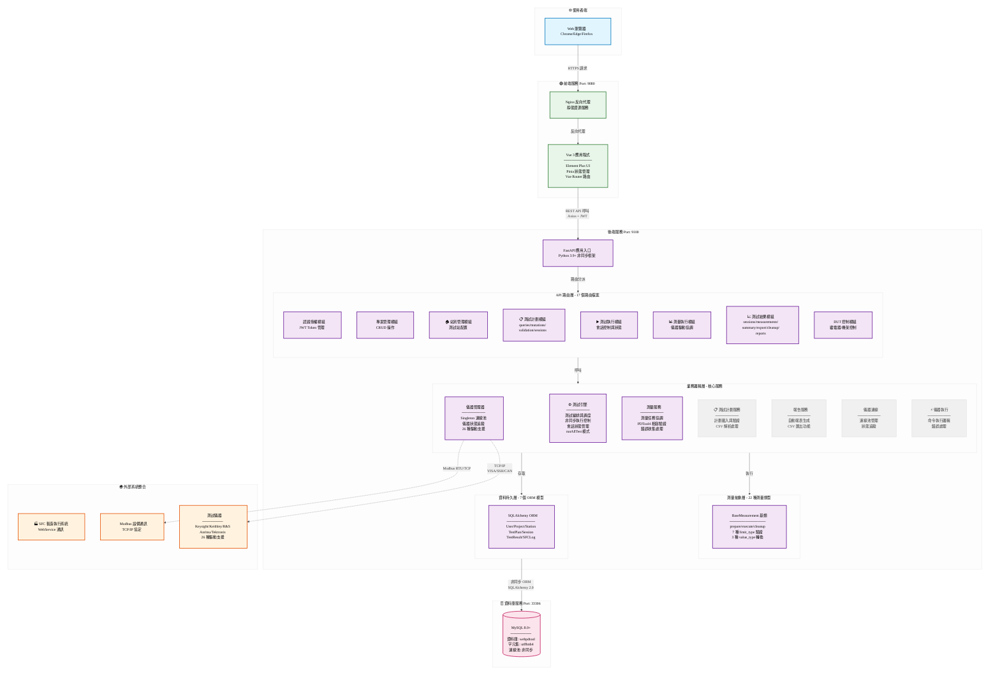
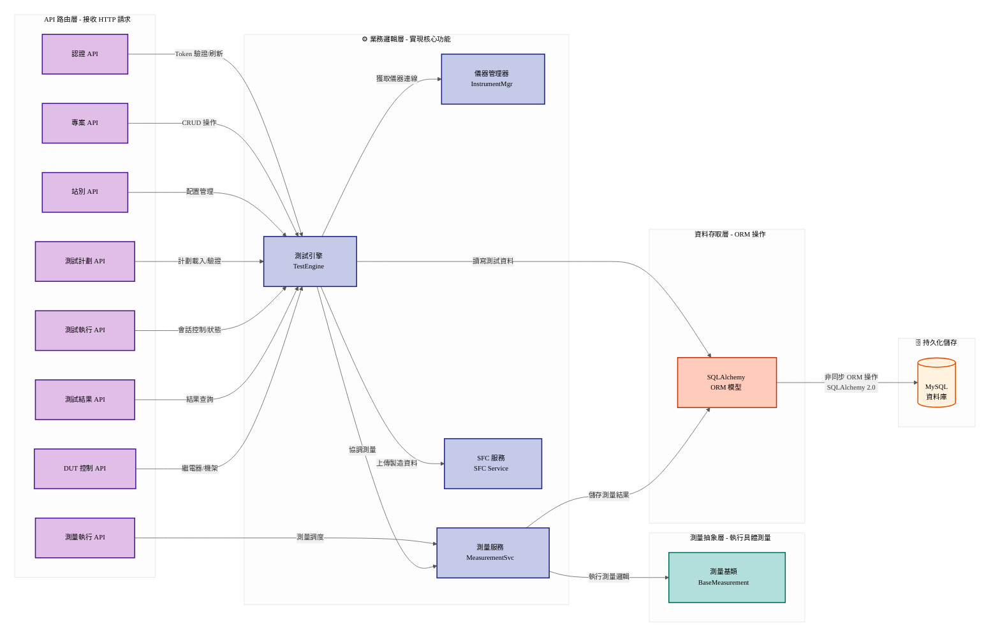
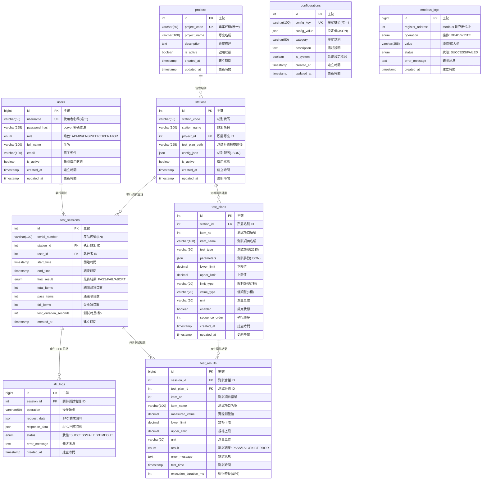

# WebPDTool - Web-based Testing System

> 基於 Vue 3 + FastAPI 的現代化測試系統，從桌面應用程式 PDTool4 重構而來。

---

## 📋 目錄

- [專案概述](#專案概述)
- [技術堆疊](#技術堆疊)
- [系統架構](#系統架構)
- [專案結構](#專案結構)
- [快速開始](#快速開始)
- [API 端點](#api-端點列表)
- [開發進度](#開發進度)
- [技術特色](#技術特色)
- [測試](#測試)
- [部署](#部署)
- [故障排除](#故障排除)
- [更新日誌](#更新日誌)

---

## 📖 專案概述

WebPDTool 是一個 Web 化的產品測試系統，用於執行自動化測試、記錄測試結果。系統採用前後端分離架構，提供完整的測試管理、執行和結果查詢功能。

### 專案狀態

| 項目 | 內容 |
|------|------|
| **版本** | v0.2.1 |
| **完成度** | ~100% (核心功能完成，測量服務完整，26 種儀器驅動實現，使用者管理完成，MDO34 測量完成，lowsheen_lib 遷移完成) |
| **最新更新** | 2026-03-06 - lowsheen_lib 遷移 Phase 2 & 3 完成、TestResults.vue 視圖、MDO34Measurement 實現、AppNavBar 組件 |
| **狀態** | 核心功能完整，儀器驅動完善，測試執行穩定，使用者管理完整，lowsheen_lib 遷移完成 |

### ✨ 主要特色

- ✅ **完整 PDTool4 相容性** - 支援所有 7 種 limit_type 和 3 種 value_type
- ✅ **runAllTest 模式** - 遇到錯誤時繼續執行測試，與 PDTool4 完全一致
- ✅ **22 種測量類型** - PowerSet/Read, ComPort/ConSole/TCPIP Command, SFC, GetSN, OPJudge, Wait, Relay, ChassisRotation, RF_Tool, CMW100, L6MPU, SMCV100B, PEAK_CAN, MDO34, Other 等
- ✅ **26 種儀器驅動** - 完成！Keysight, Keithley, ITECH, GW Instek, R&S, Anritsu, Tektronix 等完整實作
- ✅ **79 個 API 端點** - 模組化設計 (7 個主路由 + results/ 6 子路由 + testplan/ 4 子路由)
- ✅ **現代化前端** - Vue 3 Composition API + Element Plus UI，9 個視圖完整實現
- ✅ **動態參數表單** - 根據測量類型動態生成測試參數表單
- ✅ **完整使用者管理** - 管理員可建立、編輯、刪除使用者，RBAC 角色控制
- ✅ **完整 DUT 控制** - 繼電器控制、機架旋轉、二進位協定支援
- ✅ **Async 架構遷移** - 100% lowsheen_lib 遷移完成 (Strangler Fig 模式，Phase 1-4)

---

## 🛠️ 技術堆疊

### 前端技術

| 技術 | 版本 | 用途 |
|------|------|------|
| **框架** | Vue 3.4.0+ | 核心前端框架 (Composition API) |
| **UI 庫** | Element Plus 2.5.0+ | UI 組件庫 |
| **狀態管理** | Pinia 2.1.0+ | 應用狀態管理 |
| **路由** | Vue Router 4.2.0+ | 頁面路由 |
| **HTTP 客戶端** | Axios 1.6.0+ | API 請求 |
| **建置工具** | Vite 5.0.0+ | 開發與建置工具 |
| **圖標** | @element-plus/icons-vue 2.3.0+ | 圖標支援 |
| **開發端口** | 9080 | 前端服務端口 |

### 後端技術

| 技術 | 版本 | 用途 |
|------|------|------|
| **框架** | FastAPI 0.104.0+ | 核心後端框架 |
| **語言** | Python 3.9+ | 程式語言 |
| **ORM** | SQLAlchemy 2.0.0+ | 資料庫 ORM |
| **資料驗證** | Pydantic 2.0.0+ | 資料驗證 |
| **認證** | python-jose 3.3.0+ | JWT 身份認證 |
| **密碼加密** | passlib + bcrypt | 密碼安全處理 |
| **非同步支援** | asyncio/async-await | 非同步處理 |
| **API 文件** | Swagger UI | API 文檔 (/docs) |
| **服務端口** | 9100 | 後端 API 端口 |

### 資料庫

| 項目 | 版本/配置 |
|------|----------|
| **主資料庫** | MySQL 8.0+ |
| **資料庫端口** | 33306 (Docker 容器映射) |
| **連線池** | SQLAlchemy async engine |
| **字元集** | utf8mb4 |
| **資料表** | 9 個核心表 |

### 部署與容器化

| 項目 | 技術 |
|------|------|
| **容器化** | Docker & Docker Compose |
| **反向代理** | Nginx (內建於前端容器) |
| **健康檢查** | Docker healthcheck 機制 |

---

## 🏗️ 系統架構

### 整體系統架構圖


```mermaid
%%{init: {
  "theme": "base",
  "themeVariables": {
    "fontSize": "14px",
    "fontFamily": "Arial, Helvetica, sans-serif",
    "primaryTextColor": "#333333",
    "lineColor": "#555555",
    "primaryColor": "#f0f0f0"
  },
  "flowchart": {
    "padding": 30,
    "nodeSpacing": 60,
    "rankSpacing": 80,
    "curve": "basis",
    "diagramPadding": 30
  }
}}%%
graph TD
    %% 此圖展示系統整體分層結構與主要資料流向

    %% 客戶端層
    subgraph ClientLayer["🌐 使用者端"]
        BrowserNode[Web 瀏覽器<br/>Chrome/Edge/Firefox]
    end

    %% 前端層
    subgraph FrontendLayer["🟢 前端服務 Port: 9080"]
        NginxNode[Nginx 反向代理<br/>靜態資源服務]
        VueNode[Vue 3 應用程式<br/>───────────<br/>Element Plus UI<br/>Pinia 狀態管理<br/>Vue Router 路由]
    end

    %% 後端層
    subgraph BackendLayer["🚀 後端服務 Port: 9100"]
        FastAPINode[FastAPI 應用入口<br/>Python 3.9+ 非同步框架]

        subgraph APILayer["API 路由層 - 17 個路由檔案"]
            direction TB
            AuthAPINode[🔐 認證授權模組<br/>JWT Token 管理]
            ProjectsAPINode[📁 專案管理模組<br/>CRUD 操作]
            StationsAPINode[🏠 站別管理模組<br/>測試站配置]
            TestPlanAPINode[📋 測試計劃模組<br/>queries/mutations/<br/>validation/sessions]
            TestsAPINode[▶️ 測試執行模組<br/>會話控制與狀態]
            MeasurementsAPINode[📊 測量執行模組<br/>儀器驅動協調]
            ResultsAPINode[📈 測試結果模組<br/>sessions/measurements/<br/>summary/export/cleanup/<br/>reports]
            DUTControlAPINode[🔧 DUT 控制模組<br/>繼電器/機架控制]
        end

        subgraph ServicesLayer["業務邏輯層 - 核心服務"]
            TestEngineNode[⚙️ 測試引擎<br/>─────────<br/>測試編排與調度<br/>非同步執行控制<br/>會話狀態管理<br/>runAllTest 模式]
            InstrumentMgrNode[🔌 儀器管理器<br/>─────────<br/>Singleton 連線池<br/>儀器狀態追蹤<br/>26 種驅動支援]
            MeasurementSvcNode[📏 測量服務<br/>─────────<br/>測量任務協調<br/>PDTool4 相容驗證<br/>錯誤收集處理]
            TestPlanSvcNode[📋 測試計劃服務<br/>─────────<br/>計劃載入與驗證<br/>CSV 解析處理]
            ReportSvcNode[📄 報告服務<br/>─────────<br/>自動報表生成<br/>CSV 匯出功能]
            InstrumentConnNode[🔗 儀器連線<br/>─────────<br/>連線池管理<br/>狀態追蹤]
            InstrumentExecNode[⚡ 儀器執行<br/>─────────<br/>命令執行邏輯<br/>錯誤處理]
        end

        subgraph MeasurementsLayer["測量抽象層 - 22 種測量類型"]
            BaseMeasureNode[📐 BaseMeasurement 基類<br/>──────────────<br/>prepare/execute/cleanup<br/>7 種 limit_type 驗證<br/>3 種 value_type 轉換]
        end

        subgraph ModelsLayer["資料持久層 - 7 個 ORM 模型"]
            ORMNode[💾 SQLAlchemy ORM<br/>───────────<br/>User/Project/Station<br/>TestPlan/Session<br/>TestResult/SFCLog]
        end
    end

    %% 資料庫層
    subgraph DatabaseLayer["🗄️ 資料庫服務 Port: 33306"]
        MySQLNode[(MySQL 8.0+<br/>────────<br/>資料庫: webpdtool<br/>字元集: utf8mb4<br/>連線池: 非同步)]
    end

    %% 外部系統
    subgraph ExternalLayer["🌍 外部系統整合"]
        SFCNode[🏭 SFC 製造執行系統<br/>WebService 通訊]
        ModbusNode[📡 Modbus 設備通訊<br/>TCP/IP 協定]
        InstrumentsNode[🔬 測試儀器<br/>────────<br/>Keysight/Keithley/R&S<br/>Anritsu/Tektronix<br/>26 種驅動支援]
    end

    %% 主要資料流向
    BrowserNode -->|HTTPS 請求| NginxNode
    NginxNode -->|反向代理| VueNode
    VueNode -->|REST API 呼叫<br/>Axios + JWT| FastAPINode

    FastAPINode -->|路由分派| APILayer
    APILayer -->|呼叫| ServicesLayer
    ServicesLayer -->|執行| MeasurementsLayer
    ServicesLayer -->|存取| ModelsLayer

    ModelsLayer -->|非同步 ORM<br/>SQLAlchemy 2.0| MySQLNode
    InstrumentMgrNode -.->|TCP/IP<br/>VISA/SSH/CAN| InstrumentsNode
    InstrumentMgrNode -.->|Modbus RTU/TCP| ModbusNode

    %% 樣式定義
    classDef clientStyle fill:#e1f5ff,stroke:#0277bd,stroke-width:2px,color:#000
    classDef frontendStyle fill:#e8f5e9,stroke:#2e7d32,stroke-width:2px,color:#000
    classDef backendStyle fill:#f3e5f5,stroke:#6a1b9a,stroke-width:2px,color:#000
    classDef dbStyle fill:#fce4ec,stroke:#c2185b,stroke-width:2px,color:#000
    classDef externalStyle fill:#fff3e0,stroke:#e65100,stroke-width:2px,color:#000

    class BrowserNode clientStyle
    class NginxNode,VueNode frontendStyle
    class FastAPINode,AuthAPINode,ProjectsAPINode,StationsAPINode,TestPlanAPINode,TestsAPINode,MeasurementsAPINode,ResultsAPINode,DUTControlAPINode,TestEngineNode,InstrumentMgrNode,MeasurementSvcNode,BaseMeasureNode,ORMNode backendStyle
    class MySQLNode dbStyle
    class SFCNode,ModbusNode,InstrumentsNode externalStyle
```

> **📖 架構說明**: 主圖展示系統整體分層結構，API→Services→Models/Measurements 的詳細連線關係見下圖。

### API 層與服務層連線關係

此圖展示 API 端點如何調用業務邏輯服務，以及服務之間的協作關係。


```mermaid
%%{init: {
  "theme": "base",
  "themeVariables": {
    "fontSize": "14px",
    "fontFamily": "Arial, Helvetica, sans-serif",
    "primaryTextColor": "#333333",
    "lineColor": "#555555",
    "primaryColor": "#f0f0f0"
  },
  "flowchart": {
    "padding": 30,
    "nodeSpacing": 60,
    "rankSpacing": 80,
    "curve": "basis",
    "diagramPadding": 30
  }
}}%%
graph LR
    %% 此圖展示 API、Service、Measurement、Model 之間的調用關係

    subgraph APIGroup["📡 API 路由層 - 接收 HTTP 請求"]
        AuthAPI[認證 API]
        ProjectsAPI[專案 API]
        StationsAPI[站別 API]
        TestPlansAPI[測試計劃 API]
        TestsAPI[測試執行 API]
        MeasurementsAPI[測量執行 API]
        ResultsAPI[測試結果 API]
        DUTControlAPI[DUT 控制 API]
    end

    subgraph ServicesGroup["⚙️ 業務邏輯層 - 實現核心功能"]
        TestEngineService[測試引擎<br/>TestEngine]
        InstrumentMgrService[儀器管理器<br/>InstrumentMgr]
        MeasurementSvcService[測量服務<br/>MeasurementSvc]
        SFCSvcService[SFC 服務<br/>SFC Service]
    end

    subgraph MeasurementsGroup["📏 測量抽象層 - 執行具體測量"]
        BaseMeasureClass[測量基類<br/>BaseMeasurement]
    end

    subgraph ModelsGroup["💾 資料存取層 - ORM 操作"]
        ORMLayer[SQLAlchemy<br/>ORM 模型]
    end

    subgraph DBGroup["🗄️ 持久化儲存"]
        MySQLDB[(MySQL<br/>資料庫)]
    end

    %% API → Services 調用關係
    AuthAPI -->|Token 驗證/刷新| TestEngineService
    ProjectsAPI -->|CRUD 操作| TestEngineService
    StationsAPI -->|配置管理| TestEngineService
    TestPlansAPI -->|計劃載入/驗證| TestEngineService
    TestsAPI -->|會話控制/狀態| TestEngineService
    MeasurementsAPI -->|測量調度| MeasurementSvcService
    ResultsAPI -->|結果查詢| TestEngineService
    DUTControlAPI -->|繼電器/機架| TestEngineService

    %% Services 內部協作
    TestEngineService -->|獲取儀器連線| InstrumentMgrService
    TestEngineService -->|協調測量| MeasurementSvcService
    TestEngineService -->|上傳製造資料| SFCSvcService
    MeasurementSvcService -->|執行測量邏輯| BaseMeasureClass

    %% Services → Models 資料存取
    TestEngineService -->|讀寫測試資料| ORMLayer
    MeasurementSvcService -->|儲存測量結果| ORMLayer

    %% Models → Database 持久化
    ORMLayer -->|非同步 ORM 操作<br/>SQLAlchemy 2.0| MySQLDB

    %% 樣式定義
    classDef apiStyle fill:#e1bee7,stroke:#4a148c,stroke-width:2px,color:#000
    classDef svcStyle fill:#c5cae9,stroke:#1a237e,stroke-width:2px,color:#000
    classDef measureStyle fill:#b2dfdb,stroke:#00695c,stroke-width:2px,color:#000
    classDef modelStyle fill:#ffccbc,stroke:#bf360c,stroke-width:2px,color:#000
    classDef dbStyle fill:#fff3e0,stroke:#e65100,stroke-width:2px,color:#000

    class AuthAPI,ProjectsAPI,StationsAPI,TestPlansAPI,TestsAPI,MeasurementsAPI,ResultsAPI,DUTControlAPI apiStyle
    class TestEngineService,InstrumentMgrService,MeasurementSvcService,SFCSvcService svcStyle
    class BaseMeasureClass measureStyle
    class ORMLayer modelStyle
    class MySQLDB dbStyle
```

### 測試執行完整流程

此流程圖展示從使用者登入到測試完成的完整生命週期，包含 runAllTest 模式的錯誤處理邏輯。


```mermaid
%%{init: {
  "theme": "base",
  "themeVariables": {
    "fontSize": "14px",
    "fontFamily": "Arial, Helvetica, sans-serif",
    "primaryTextColor": "#333333",
    "lineColor": "#555555",
    "primaryColor": "#f0f0f0"
  },
  "flowchart": {
    "padding": 20,
    "nodeSpacing": 60,
    "rankSpacing": 80,
    "curve": "basis",
    "diagramPadding": 30
  }
}}%%
flowchart TD
    %% 此圖展示測試執行的完整生命週期，包含 runAllTest 模式的錯誤容錯處理

    Start([🟢 流程開始])
    Login[使用者登入<br/>輸入帳號密碼]
    ValidateUser{{身分驗證<br/>通過?}}
    GetToken[取得 JWT Token<br/>儲存至 localStorage]

    SelectProject[選擇測試專案<br/>與站別]
    LoadConfig[載入站別配置<br/>儀器連線設定]
    LoadTestPlan[載入測試計劃<br/>CSV 項目清單]

    InputSN[輸入產品序號<br/>掃描條碼]
    ValidateSN{{SN 格式<br/>有效?}}
    CreateSession[創建測試會話<br/>記錄至 test_sessions]

    StartTest[啟動測試執行<br/>POST /api/tests/sessions/start]
    GetNextItem[獲取下一測試項目<br/>依 sequence_order 排序]

    HasItem{{還有未執行<br/>測試項目?}}
    CalcResult[計算最終結果<br/>PASS/FAIL 統計]
    LoadMeasure[載入測量配置<br/>MEASUREMENT_REGISTRY]

    Execute[執行測量<br/>prepare → execute → cleanup]
    GetValue[獲取測量值<br/>儀器讀取/命令執行]
    Validate[驗證測試點<br/>validate_result 方法]

    SaveResult[儲存測試結果<br/>記錄至 test_results]
    UpdateUI[更新前端 UI<br/>顯示即時狀態]

    TestFailed{{測試項目<br/>失敗?}}
    CheckRunAllTest{{runAllTest<br/>模式?}}
    CollectError[收集錯誤資訊<br/>繼續執行下一項]

    UpdateSession[更新會話狀態<br/>final_result, 統計資料]

    NeedSFC{{站別配置<br/>需上傳 SFC?}}
    UploadSFC[上傳至 SFC 系統<br/>MES 製造資料]
    LogSFC[記錄 SFC 日誌<br/>sfc_logs 表]
    ShowReport[顯示測試報告<br/>PASS/FAIL 摘要]

    ContinueTest{{繼續測試<br/>下一個產品?}}
    End([🔴 流程結束])

    %% 流程連接
    Start --> Login
    Login --> ValidateUser
    ValidateUser -->|❌ 驗證失敗| Login
    ValidateUser -->|✅ 驗證成功| GetToken

    GetToken --> SelectProject
    SelectProject --> LoadConfig
    LoadConfig --> LoadTestPlan

    LoadTestPlan --> InputSN
    InputSN --> ValidateSN
    ValidateSN -->|❌ 無效格式| InputSN
    ValidateSN -->|✅ 格式正確| CreateSession

    CreateSession --> StartTest
    StartTest --> GetNextItem

    GetNextItem --> HasItem
    HasItem -->|❌ 無更多項目| CalcResult
    HasItem -->|✅ 有下一項目| LoadMeasure

    LoadMeasure --> Execute
    Execute --> GetValue
    GetValue --> Validate

    Validate --> SaveResult
    SaveResult --> UpdateUI

    UpdateUI --> TestFailed
    TestFailed -->|❌ PASS| GetNextItem
    TestFailed -->|✅ FAIL/ERROR| CheckRunAllTest

    CheckRunAllTest -->|✅ 啟用| CollectError
    CheckRunAllTest -->|❌ 停用| CalcResult

    CollectError --> GetNextItem

    CalcResult --> UpdateSession

    UpdateSession --> NeedSFC
    NeedSFC -->|✅ 需要上傳| UploadSFC
    UploadSFC --> LogSFC
    LogSFC --> ShowReport
    NeedSFC -->|❌ 不需上傳| ShowReport

    ShowReport --> ContinueTest
    ContinueTest -->|✅ 繼續| InputSN
    ContinueTest -->|❌ 結束| End

    %% 樣式定義
    classDef dbOp fill:#bbdefb,stroke:#1565c0,stroke-width:2px,color:#000
    classDef decision fill:#fff9c4,stroke:#f57f17,stroke-width:2px,color:#000
    classDef startN fill:#c8e6c9,stroke:#2e7d32,stroke-width:2px,color:#000
    classDef endN fill:#ffcdd2,stroke:#c62828,stroke-width:2px,color:#000
    classDef act fill:#e1f5fe,stroke:#01579b,stroke-width:2px,color:#000
    classDef error fill:#ffebee,stroke:#c62828,stroke-width:2px,color:#000

    %% 應用樣式
    class CreateSession,SaveResult,UpdateSession,LogSFC dbOp
    class ValidateUser,ValidateSN,HasItem,TestFailed,CheckRunAllTest,NeedSFC,ContinueTest decision
    class Login,GetToken,SelectProject,LoadConfig,LoadTestPlan,InputSN,StartTest,GetNextItem,LoadMeasure,Execute,GetValue,Validate,UpdateUI,CalcResult,UploadSFC,ShowReport act
    class CollectError error
    class Start startN
    class End endN
```

### 資料庫關係圖

展示系統中 9 個核心資料表之間的關聯性與資料流向。


```mermaid
erDiagram
    %% 使用者與測試會話關係
    users ||--o{ test_sessions : "執行測試"

    %% 專案與站別關係
    projects ||--o{ stations : "包含站別"

    %% 站別與測試計劃/會話關係
    stations ||--o{ test_plans : "定義測試計劃"
    stations ||--o{ test_sessions : "執行測試會話"

    %% 測試計劃與測試結果關係
    test_plans ||--o{ test_results : "產生測試結果"

    %% 測試會話與測試結果/SFC日誌關係
    test_sessions ||--|{ test_results : "包含測試結果"
    test_sessions ||--o{ sfc_logs : "產生 SFC 日誌"

    %% 資料表定義
    users {
        bigint id PK "主鍵"
        varchar(50) username UK "使用者名稱(唯一)"
        varchar(255) password_hash "bcrypt 密碼雜湊"
        enum role "角色: ADMIN/ENGINEER/OPERATOR"
        varchar(100) full_name "全名"
        varchar(100) email "電子郵件"
        boolean is_active "帳號啟用狀態"
        timestamp created_at "建立時間"
        timestamp updated_at "更新時間"
    }

    projects {
        int id PK "主鍵"
        varchar(50) project_code UK "專案代碼(唯一)"
        varchar(100) project_name "專案名稱"
        text description "專案描述"
        boolean is_active "啟用狀態"
        timestamp created_at "建立時間"
        timestamp updated_at "更新時間"
    }

    stations {
        int id PK "主鍵"
        varchar(50) station_code "站別代碼"
        varchar(100) station_name "站別名稱"
        int project_id FK "所屬專案 ID"
        varchar(255) test_plan_path "測試計劃檔案路徑"
        json config_json "站別配置(JSON)"
        boolean is_active "啟用狀態"
        timestamp created_at "建立時間"
        timestamp updated_at "更新時間"
    }

    test_plans {
        int id PK "主鍵"
        int station_id FK "所屬站別 ID"
        int item_no "測試項目編號"
        varchar(100) item_name "測試項目名稱"
        varchar(50) test_type "測試類型(22種)"
        json parameters "測試參數(JSON)"
        decimal lower_limit "下限值"
        decimal upper_limit "上限值"
        varchar(20) limit_type "限制類型(7種)"
        varchar(20) value_type "值類型(3種)"
        varchar(20) unit "測量單位"
        boolean enabled "啟用狀態"
        int sequence_order "執行順序"
        timestamp created_at "建立時間"
        timestamp updated_at "更新時間"
    }

    test_sessions {
        int id PK "主鍵"
        varchar(100) serial_number "產品序號(SN)"
        int station_id FK "執行站別 ID"
        int user_id FK "執行者 ID"
        timestamp start_time "開始時間"
        timestamp end_time "結束時間"
        enum final_result "最終結果: PASS/FAIL/ABORT"
        int total_items "總測試項目數"
        int pass_items "通過項目數"
        int fail_items "失敗項目數"
        int test_duration_seconds "測試時長(秒)"
        timestamp created_at "建立時間"
    }

    test_results {
        bigint id PK "主鍵"
        int session_id FK "測試會話 ID"
        int test_plan_id FK "測試計劃 ID"
        int item_no "測試項目編號"
        varchar(100) item_name "測試項目名稱"
        decimal measured_value "實際測量值"
        decimal lower_limit "規格下限"
        decimal upper_limit "規格上限"
        varchar(20) unit "測量單位"
        enum result "測試結果: PASS/FAIL/SKIP/ERROR"
        text error_message "錯誤訊息"
        timestamp test_time "測試時間"
        int execution_duration_ms "執行時長(毫秒)"
    }

    sfc_logs {
        bigint id PK "主鍵"
        int session_id FK "關聯測試會話 ID"
        varchar(50) operation "操作類型"
        json request_data "SFC 請求資料"
        json response_data "SFC 回應資料"
        enum status "狀態: SUCCESS/FAILED/TIMEOUT"
        text error_message "錯誤訊息"
        timestamp created_at "建立時間"
    }

    configurations {
        int id PK "主鍵"
        varchar(100) config_key UK "設定鍵值(唯一)"
        json config_value "設定值(JSON)"
        varchar(50) category "設定類別"
        text description "描述說明"
        boolean is_system "系統設定標記"
        timestamp created_at "建立時間"
        timestamp updated_at "更新時間"
    }

    modbus_logs {
        bigint id PK "主鍵"
        int register_address "Modbus 暫存器位址"
        enum operation "操作: READ/WRITE"
        varchar(255) value "讀取/寫入值"
        enum status "狀態: SUCCESS/FAILED"
        text error_message "錯誤訊息"
        timestamp created_at "建立時間"
    }
```

---

## 📁 專案結構

```
WebPDTool/
├── backend/                    # FastAPI 後端應用 (111 個 Python 檔案, ~24,215 行代碼)
│   ├── app/
│   │   ├── api/               # RESTful API 路由 (7 個主路由 + 2 子模組)
│   │   │   ├── auth.py        # 認證 API (5 端點)
│   │   │   ├── users.py       # 使用者管理 API (6 端點)
│   │   │   ├── projects.py    # 專案管理 API (5 端點)
│   │   │   ├── stations.py    # 站別管理 API (5 端點)
│   │   │   ├── tests.py       # 測試執行 API (13 端點)
│   │   │   ├── measurements.py           # 測量執行 API (13 端點)
│   │   │   ├── dut_control.py            # DUT 控制 API (9 端點)
│   │   │   ├── testplan/                 # 測試計劃子模組 (12 端點)
│   │   │   │   ├── queries.py            (3 端點)
│   │   │   │   ├── mutations.py          (7 端點)
│   │   │   │   ├── sessions.py           (1 端點)
│   │   │   │   └── validation.py         (1 端點)
│   │   │   ├── results/                  # 測試結果子模組 (11 端點)
│   │   │   │   ├── sessions.py           (2 端點)
│   │   │   │   ├── measurements.py       (1 端點)
│   │   │   │   ├── summary.py            (1 端點)
│   │   │   │   ├── export.py             (1 端點)
│   │   │   │   ├── cleanup.py            (2 端點)
│   │   │   │   └── reports.py            (4 端點)
│   │   │   └── __init__.py
│   │   ├── models/            # SQLAlchemy 資料模型 (7 個 ORM 模型)
│   │   │   ├── user.py        # 使用者模型 (with UserRole enum)
│   │   │   ├── project.py     # 專案模型
│   │   │   ├── station.py     # 站別模型
│   │   │   ├── testplan.py    # 測試計劃模型
│   │   │   ├── test_session.py    # 測試會話模型
│   │   │   ├── test_result.py     # 測試結果模型
│   │   │   ├── sfc_log.py         # SFC 日誌模型
│   │   │   └── __init__.py
│   │   ├── services/          # 業務邏輯層 (核心服務)
│   │   │   ├── auth.py        # 認證服務
│   │   │   ├── test_engine.py         # 測試引擎
│   │   │   ├── measurement_service.py  # 測量服務 (runAllTest 模式)
│   │   │   ├── instrument_manager.py  # 儀器管理器 (Singleton 連線池)
│   │   │   ├── instrument_connection.py  # 儀器連線管理
│   │   │   ├── instrument_executor.py    # 儀器指令執行 (現代/舊模式橋接)
│   │   │   ├── test_plan_service.py   # 測試計劃服務
│   │   │   ├── report_service.py      # 報告服務
│   │   │   ├── dut_comms/             # DUT 通訊子模組
│   │   │   │   ├── relay_controller.py
│   │   │   │   ├── chassis_controller.py
│   │   │   │   ├── common/
│   │   │   │   ├── ls_comms/
│   │   │   │   ├── vcu_ether_comms/
│   │   │   │   └── ltl_chassis_fixt_comms/
│   │   │   └── instruments/           # 26 種儀器驅動實現 + 1 基類
│   │   │       ├── __init__.py
│   │   │       ├── base.py            # BaseInstrumentDriver 基類
│   │   │       ├── a2260b.py          # Keysight 多功能儀器
│   │   │       ├── a34970a.py         # 高頻測試儀
│   │   │       ├── analog_discovery_2.py  # Digilent 示波器
│   │   │       ├── aps7050.py         # RF 電源放大器
│   │   │       ├── cmw100.py          # 通訊測試系統
│   │   │       ├── comport_command.py # 串口通訊 (async class)
│   │   │       ├── console_command.py # 主控台命令 (async class)
│   │   │       ├── daq6510.py         # Keithley 資料採集
│   │   │       ├── daq973a.py         # DAQ 資料採集
│   │   │       ├── dwf_constants.py   # Digilent Waveforms 常數
│   │   │       ├── ftm_on.py          # FTM 控制
│   │   │       ├── it6723c.py         # ITECH 電源
│   │   │       ├── keithley2015.py    # Keithley 數位萬用表
│   │   │       ├── l6mpu_pos_ssh.py   # L6MPU 位置控制
│   │   │       ├── l6mpu_ssh.py       # L6MPU SSH 控制
│   │   │       ├── l6mpu_ssh_comport.py  # L6MPU 混合模式
│   │   │       ├── mdo34.py           # Tektronix 示波器
│   │   │       ├── model2303.py       # GW Instek 直流電源
│   │   │       ├── model2306.py       # GW Instek 數位負載
│   │   │       ├── mt8872a.py         # RF 測試系統
│   │   │       ├── n5182a.py          # N5182A 信號產生器
│   │   │       ├── peak_can.py        # CAN 匯流排分析
│   │   │       ├── psw3072.py         # R&S 電源
│   │   │       ├── smcv100b.py        # RF 功率監測
│   │   │       ├── tcpip_command.py   # TCP/IP 通訊 (async class)
│   │   │       └── wait_test.py       # 延遲測試
│   │   ├── measurements/      # 測量抽象層 (22 種測量類型)
│   │   │   ├── base.py        # BaseMeasurement 基類 (PDTool4 驗證邏輯)
│   │   │   ├── implementations.py  # 22 種測量實作 + MEASUREMENT_REGISTRY
│   │   │   └── __init__.py
│   │   ├── config/            # 配置管理
│   │   │   ├── instruments.py # 儀器配置 (InstrumentConfig)
│   │   │   └── __init__.py
│   │   ├── core/              # 核心功能模組
│   │   │   ├── database.py    # 資料庫配置
│   │   │   ├── logging.py     # 日誌配置
│   │   │   ├── security.py    # 安全性配置
│   │   │   ├── exceptions.py  # 自訂異常
│   │   │   ├── constants.py   # 系統常數
│   │   │   ├── api_helpers.py # API 輔助函數
│   │   │   ├── instrument_config.py  # 儀器配置核心
│   │   │   ├── measurement_constants.py  # 測量常數
│   │   │   ├── report_config.py      # 報告配置
│   │   │   └── __init__.py
│   │   ├── utils/             # 工具函數
│   │   │   ├── csv_parser.py  # CSV 解析工具
│   │   │   └── __init__.py
│   │   ├── schemas/           # Pydantic 資料驗證模型
│   │   │   ├── user.py
│   │   │   ├── project.py
│   │   │   ├── testplan.py
│   │   │   ├── test_result.py
│   │   │   ├── measurement.py
│   │   │   └── __init__.py
│   │   ├── config.py          # 應用配置 (Pydantic Settings)
│   │   ├── dependencies.py    # FastAPI 依賴注入
│   │   ├── main.py            # 應用入口點
│   │   └── __init__.py
│   ├── src/
│   │   └── lowsheen_lib/      # Legacy 腳本 (遷移中，70% 完成)
│   │       ├── ComPortCommand.py
│   │       ├── ConSoleCommand.py
│   │       ├── TCPIPCommand.py
│   │       ├── remote_instrument.py
│   │       └── ... (其他 20+ 腳本)
│   ├── scripts/               # 工具腳本
│   │   ├── import_testplan.py # 測試計劃匯入工具
│   │   ├── batch_import.sh    # 批量匯入腳本
│   │   ├── test_refactoring.py # 重構測試套件
│   │   └── add_testplan_fields.sql # 資料庫遷移
│   ├── tests/                 # 測試套件
│   │   ├── test_api/
│   │   ├── test_services/
│   │   ├── test_integration/
│   │   └── conftest.py
│   ├── alembic/               # 資料庫遷移
│   │   ├── versions/          # 遷移版本
│   │   └── env.py             # Alembic 配置
│   ├── logs/                  # 應用日誌
│   ├── testplans/             # 測試計劃範例
│   ├── instruments.example.json  # 儀器配置範例
│   ├── pyproject.toml         # Python 專案配置
│   ├── uv.lock                # uv 依賴鎖定檔案
│   ├── Dockerfile             # 後端 Docker 映像
│   ├── .env                   # 環境變數 (本地開發)
│   ├── .env.example           # 環境變數範本
│   ├── .dockerignore          # Docker 忽略檔案
│   └── alembic.ini            # Alembic 初始化檔案
├── frontend/                  # Vue 3 前端應用 (~7,454 行代碼)
│   ├── src/
│   │   ├── views/             # 頁面組件 (9 個視圖)
│   │   │   ├── Login.vue      # 登入頁面
│   │   │   ├── TestMain.vue   # 測試執行主介面 (runAllTest 模式支援)
│   │   │   ├── TestExecution.vue  # 測試執行監控
│   │   │   ├── TestHistory.vue    # 測試歷史查詢
│   │   │   ├── TestResults.vue    # 測試結果查看
│   │   │   ├── TestPlanManage.vue  # 測試計劃管理
│   │   │   ├── ProjectManage.vue   # 專案站別管理
│   │   │   ├── UserManage.vue      # 使用者管理 (admin only)
│   │   │   └── SystemConfig.vue    # 系統配置管理
│   │   ├── components/        # 可複用組件 (3 個)
│   │   │   ├── AppNavBar.vue               # 應用程式導航欄
│   │   │   ├── ProjectStationSelector.vue  # 專案站別選擇器
│   │   │   └── DynamicParamForm.vue        # 動態參數表單
│   │   ├── composables/       # 組合式函數
│   │   │   └── useMeasurementParams.js  # 測量參數管理
│   │   ├── api/               # API 客戶端 (8 個模組)
│   │   │   ├── client.js      # Axios 客戶端配置 (JWT 攔截器)
│   │   │   ├── auth.js        # 認證 API 客戶端
│   │   │   ├── users.js       # 使用者 API 客戶端
│   │   │   ├── projects.js    # 專案 API 客戶端
│   │   │   ├── testplans.js   # 測試計劃 API 客戶端
│   │   │   ├── tests.js       # 測試執行 API 客戶端
│   │   │   ├── testResults.js # 測試結果 API 客戶端
│   │   │   └── measurements.js # 測量 API 客戶端
│   │   ├── stores/            # Pinia 狀態管理 (3 個)
│   │   │   ├── auth.js        # 認證狀態
│   │   │   ├── project.js     # 專案狀態
│   │   │   └── users.js       # 使用者狀態
│   │   ├── router/            # Vue Router 配置
│   │   │   └── index.js
│   │   ├── App.vue            # 根組件
│   │   ├── main.js            # 應用入口點
│   │   └── public/            # 靜態資源
│   │       ├── index.html
│   │       └── favicon.svg
│   ├── dist/                  # 建置輸出目錄
│   ├── Dockerfile             # 前端 Docker 映像
│   ├── nginx.conf             # Nginx 配置
│   ├── package.json           # NPM 專案配置
│   ├── package-lock.json      # NPM 鎖定檔案
│   ├── vite.config.js         # Vite 配置
│   ├── .env.development       # 開發環境變數
│   ├── .dockerignore          # Docker 忽略檔案
│   └── README.md
├── database/                  # 資料庫設計 (9 張資料表)
│   ├── schema.sql             # 資料庫 Schema (完整定義)
│   ├── seed_data.sql          # 初始資料 (測試用戶與專案)
│   └── README.md
├── docs/                      # 技術文檔
│   ├── index.md               # 文檔索引
│   ├── REFACTORING_SUMMARY.md          # 重構完成報告
│   ├── PDTool4_Measurement_Module_Analysis.md  # PDTool4 分析
│   ├── README_import_testplan.md        # 測試計劃匯入指南
│   ├── api/                               # API 文檔
│   │   └── users-api.md                   # 使用者 API 參考
│   ├── analysis/                         # 代碼分析
│   ├── bugfix/                            # 修復記錄 (20+ issues)
│   ├── code_review/                       # 代碼審查
│   ├── lowsheen_lib/                      # lowsheen_lib 遷移文檔
│   ├── features/                          # 功能文檔
│   ├── plans/                             # 實施計劃
│   └── architecture/                      # 架構文檔
├── docker-compose.yml         # Docker Compose 配置 (生產環境)
├── docker-compose.dev.yml     # Docker Compose 開發環境配置
├── docker-start.sh            # Docker 啟動腳本
├── .env.example               # 環境變數範本
├── .gitignore                 # Git 忽略檔案
├── README.md                  # 本檔案
└── CLAUDE.md                  # Claude Code 開發指南
```

---

## 🚀 快速開始

### Docker 環境 (推薦)

```bash
# 啟動所有服務
docker-compose up -d

# 查看日誌
docker-compose logs -f backend  # 後端日誌
docker-compose logs -f frontend # 前端日誌

# 停止服務
docker-compose down

# 重建服務
docker-compose build --no-cache
docker-compose up -d

# 資料庫初始化 (首次運行)
docker-compose exec db mysql -uroot -p${MYSQL_ROOT_PASSWORD} webpdtool < database/schema.sql
docker-compose exec db mysql -uroot -p${MYSQL_ROOT_PASSWORD} webpdtool < database/seed_data.sql
```

### 本機開發

```bash
# 後端 (需要 Python 3.9+)
cd backend
uv venv
uv sync
uvicorn app.main:app --reload --host 0.0.0.0 --port 9100

# 前端 (需要 Node.js 16+)
cd frontend
npm install
npm run dev  # 執行於 http://localhost:5173

# 資料庫連線
mysql -h localhost -P 33306 -u pdtool -p webpdtool
# 預設密碼: pdtool123
```

### 測試

```bash
cd backend

# 執行所有測試
uv run pytest

# 執行特定測試檔案
uv run pytest tests/test_api/test_auth.py

# 執行並生成覆蓋率報告
uv run pytest --cov=app tests/
```

### 測試計劃匯入

```bash
cd backend

# 匯入單個 CSV 檔案
uv run python scripts/import_testplan.py \
  --project "PROJECT_CODE" \
  --station "STATION_CODE" \
  --csv-file "/path/to/testplan.csv"

# 批量匯入所有測試計劃
bash scripts/batch_import.sh
```

---

## 📋 API 端點列表

**總路由數**: 79 個 API 端點

**分佈**:
- 7 個主路由文件: 56 個端點
- `testplan/` 子模組 (4 檔案): 12 個端點
- `results/` 子模組 (6 檔案): 11 個端點

**詳細分佈**:

| 路由文件 | 端點數 |
|---------|-------|
| auth.py | 5 |
| users.py | 6 |
| projects.py | 5 |
| stations.py | 5 |
| tests.py | 13 |
| measurements.py | 13 |
| dut_control.py | 9 |
| testplan/ (合計) | 12 |
| results/ (合計) | 11 |

### 認證模組 (Authentication)

| 方法 | 端點 | 說明 |
|------|------|------|
| `POST` | `/api/auth/login` | 使用者登入 |
| `POST` | `/api/auth/logout` | 使用者登出 |
| `POST` | `/api/auth/refresh` | 刷新 JWT Token |
| `GET` | `/api/auth/me` | 獲取當前使用者資訊 |

### 使用者管理 (Users) - Admin Only

| 方法 | 端點 | 說明 |
|------|------|------|
| `GET` | `/api/users` | 列出使用者 (支援分頁、搜尋、篩選) |
| `GET` | `/api/users/{id}` | 獲取特定使用者 |
| `POST` | `/api/users` | 建立新使用者 (admin only) |
| `PUT` | `/api/users/{id}` | 更新使用者 (admin only) |
| `PUT` | `/api/users/{id}/password` | 修改密碼 (admin or self) |
| `DELETE` | `/api/users/{id}` | 刪除使用者 (admin only) |

### 專案管理 (Projects)

| 方法 | 端點 | 說明 |
|------|------|------|
| `GET` | `/api/projects` | 列出所有專案 |
| `POST` | `/api/projects` | 建立新專案 |
| `GET` | `/api/projects/{project_id}` | 獲取專案詳情 |
| `PUT` | `/api/projects/{project_id}` | 更新專案 |
| `DELETE` | `/api/projects/{project_id}` | 刪除專案 |

### 站別管理 (Stations)

| 方法 | 端點 | 說明 |
|------|------|------|
| `GET` | `/api/stations` | 列出所有站別 |
| `POST` | `/api/stations` | 建立新站別 |
| `GET` | `/api/stations/{station_id}` | 獲取站別詳情 |
| `PUT` | `/api/stations/{station_id}` | 更新站別 |
| `DELETE` | `/api/stations/{station_id}` | 刪除站別 |

### 測試計劃 (Test Plans)

| 方法 | 端點 | 說明 |
|------|------|------|
| `GET` | `/api/testplan/queries` | 查詢測試計劃 (3 端點) |
| `POST` | `/api/testplan/mutations` | 建立/更新測試計劃 (7 端點) |
| `POST` | `/api/testplan/validation` | 驗證測試計劃 (1 端點) |
| `GET` | `/api/testplan/sessions` | 查詢測試會話 (1 端點) |

### 測試執行 (Tests)

| 方法 | 端點 | 說明 |
|------|------|------|
| `POST` | `/api/tests/sessions/start` | 啟動測試會話 |
| `GET` | `/api/tests/sessions/{session_id}` | 獲取會話狀態 |
| `POST` | `/api/tests/sessions/{session_id}/stop` | 停止測試會話 |
| `GET` | `/api/tests/sessions/{session_id}/results` | 獲取測試結果 |

### 測量執行 (Measurements)

| 方法 | 端點 | 說明 |
|------|------|------|
| `GET` | `/api/measurements/types` | 列出測量類型 |
| `GET` | `/api/measurements/instruments` | 列出儀器狀態 |
| `POST` | `/api/measurements/validate` | 驗證測量參數 |

### 測試結果 (Results)

| 方法 | 端點 | 說明 |
|------|------|------|
| `GET` | `/api/results/sessions` | 查詢測試會話歷史 |
| `GET` | `/api/results/sessions/{session_id}` | 獲取會話詳細結果 |
| `GET` | `/api/results/measurements` | 查詢測量記錄 |
| `GET` | `/api/results/summary` | 獲取測試統計摘要 |
| `GET` | `/api/results/export` | 匯出測試結果 |
| `POST` | `/api/results/cleanup` | 清理舊記錄 |
| `GET` | `/api/results/reports` | 生成報告 (4 端點) |

### DUT 控制 (DUT Control)

| 方法 | 端點 | 說明 |
|------|------|------|
| `POST` | `/api/dut/relay/set` | 設定繼電器狀態 |
| `POST` | `/api/dut/chassis/rotate` | 旋轉機架 |
| `POST` | `/api/dut/binary/send` | 發送二進位指令 |

---

## 📊 開發進度

### 核心功能完成度

| 功能模組 | 完成度 | 說明 |
|---------|--------|------|
| **資料庫設計** | 100% | 9 個資料表 (7 個核心 ORM 模型) 完整設計與實現 |
| **後端 API** | 100% | 7 個主路由 + 2 個子模組 (results/, testplan/)，79 個端點完整實現 |
| **前端 UI** | 100% | 9 個視圖 + 3 個組件，功能完整 |
| **測量服務** | 100% | 22 種測量類型，BaseMeasurement 基類完整 |
| **儀器驅動** | 100% | 26 種儀器驅動 + 1 個基類 (base.py)，完整實現 |
| **Command 測量遷移** | 100% | ComPort/ConSole/TCPIP 完整遷移至 async class |
| **使用者管理** | 100% | Admin CRUD 操作完成，RBAC 角色控制 |
| **lowsheen_lib 遷移** | 100% | Phase 1-4 完成，完全移除 subprocess 依賴 (2026-03-06) |
| **runAllTest 模式** | 100% | 完整支援，邏輯與 PDTool4 一致 |
| **測試執行引擎** | 100% | 非同步架構，會話管理完整 |
| **認證授權** | 100% | JWT Token，RBAC 角色管理 |
| **CSV 匯入** | 100% | 自動化測試計劃匯入 |
| **結果報告** | 100% | 統計匯總、CSV 匯出、PDF 報告 |
| **DUT 通訊** | 100% | 繼電器、機架、協定控制完整 |
| **代碼品質** | 95% | 經完整 code review，關鍵問題已修正 |
| **文檔** | 95% | 架構文檔、API 文檔完整，使用指南持續更新 |

### 代碼統計

| 指標 | 數值 |
|------|------|
| **後端 Python 檔案** | 111 個 (app 目錄) |
| **後端代碼行數** | ~24,215 行 (app 目錄) |
| **前端檔案 (Vue/JS)** | 27 個 (9 視圖 + 3 組件 + 8 API 模組 + 3 stores + router + main + App) |
| **前端代碼行數** | ~7,454 行 (src 目錄) |
| **資料庫表** | 9 個核心表 (7 個 ORM 模型) |
| **API 路由** | 7 個主路由 (56 端點) + testplan/ 4 子路由 (12 端點) + results/ 6 子路由 (11 端點) |
| **API 端點總數** | 79 個 |
| **ORM 模型** | 7 個核心模型 |
| **測量類型** | 22 種實作類別 |
| **儀器驅動** | 26 種驅動器 + 1 個基類 |
| **Bug 修正** | 20+ |
| **Code Review 文檔** | 10+ |

### 最近完成

- ✅ 2026-03-06: **lowsheen_lib 遷移 Phase 2 & Phase 3 完成** - `_cleanup_used_instruments()` 和 `reset_instrument()` 遷移至現代 async 驅動
- ✅ 2026-03-06: 新增 TestResults.vue 測試結果視圖與 testResults.js API 客戶端
- ✅ 2026-03-06: 實現 MDO34Measurement class，完成 lowsheen_lib 遷移缺口
- ✅ 2026-03-06: 新增 AppNavBar.vue 導航欄組件，簡化導航架構
- ✅ 2026-02-25: 使用者管理 UI 完成 (UserManage.vue, users store, API)
- ✅ 2026-02-25: 使用者 API 搜尋與篩選功能 (offset, limit, search, role, is_active)
- ✅ 2026-02-24: Command 測量遷移完成 (ComPort/ConSole/TCPIP → async class)
- ✅ 2026-02-24: Issue #9 修正 - console/comport/tcpip 測量執行鏈
- ✅ 2026-02-10: 動態參數表單實現與前端優化
- ✅ 2026-02-06: 測量服務架構重構，代碼縮減 66.6%
- ✅ 2026-01-30: DUT 控制系統整合 (繼電器、機架、協定)

### 下一步計劃

- [ ] WebSocket 實時更新支援
- [ ] 性能優化與壓力測試
- [ ] 國際化 (i18n) 支援
- [ ] 行動應用版本 (React Native)

---

## 遷移狀態追蹤

### lowsheen_lib 遷移進度

**整體完成度: 100%** (更新於 2026-03-06)

使用 **Strangler Fig 模式** 進行遷移 - 新系統逐步取代舊系統，保持向後兼容。

| 遷移階段 | 狀態 | 說明 |
|---------|------|------|
| **Phase 1: 主執行路徑** | ✅ 完成 | `execute_single_measurement()` 完全委託給 `implementations.py` |
| **Phase 2: 清理路徑** | ✅ 完成 (2026-03-06) | `_cleanup_used_instruments()` 遷移至 `InstrumentExecutor.cleanup_instruments()` |
| **Phase 3: 重置路徑** | ✅ 完成 (2026-03-06) | `reset_instrument()` 遷移至 `InstrumentExecutor.reset_instrument()` |
| **Phase 4: 清理殘留代碼** | ✅ 完成 (2026-03-06) | 移除 `instrument_reset_map`，保留 script_map 作為有效 fallback |

### 已遷移測量類型 (22 種)

| 測量類型 | 原始腳本 | 現代實作 | 狀態 |
|---------|---------|---------|------|
| Dummy | (測試用) | `DummyMeasurement` | ✅ |
| Other | other.py | `OtherMeasurement` | ✅ |
| ComPort | ComPortCommand.py | `ComPortMeasurement` | ✅ |
| ConSole | ConSoleCommand.py | `ConSoleMeasurement` | ✅ |
| TCPIP | TCPIPCommand.py | `TCPIPMeasurement` | ✅ |
| PowerRead | DAQ973A_test.py, etc. | `PowerReadMeasurement` | ✅ |
| PowerSet | 2303_test.py, etc. | `PowerSetMeasurement` | ✅ |
| SFC | sfc_test.py | `SFCMeasurement` | ✅ |
| GetSN | get_sn.py | `GetSNMeasurement` | ✅ |
| OPJudge | OPjudge_*.py | `OPJudgeMeasurement` | ✅ |
| Wait | Wait_test.py | `WaitMeasurement` | ✅ |
| Relay | relay_control.py | `RelayMeasurement` | ✅ |
| ChassisRotation | chassis_rotation.py | `ChassisRotationMeasurement` | ✅ |
| RF_Tool_LTE_TX | RF_tool/ | `RF_Tool_LTE_TX_Measurement` | ✅ |
| RF_Tool_LTE_RX | RF_tool/ | `RF_Tool_LTE_RX_Measurement` | ✅ |
| CMW100_BLE | CMW100/ | `CMW100_BLE_Measurement` | ✅ |
| CMW100_WiFi | CMW100/ | `CMW100_WiFi_Measurement` | ✅ |
| L6MPU_LTE_Check | l6mpu_*.py | `L6MPU_LTE_Check_Measurement` | ✅ |
| L6MPU_PLC_Test | l6mpu_*.py | `L6MPU_PLC_Test_Measurement` | ✅ |
| MDO34 | mdo34.py | `MDO34Measurement` | ✅ |
| SMCV100B_RF | smcv100b.py | `SMCV100B_RF_Output_Measurement` | ✅ |
| PEAK_CAN | PEAK_API/ | `PEAK_CAN_Message_Measurement` | ✅ |

### 已遷移儀器驅動 (26 種 + 1 基類)

詳見 `docs/lowsheen_lib/MIGRATION_SUMMARY.md`

| 儀器類型 | 驅動器檔案 | 狀態 |
|---------|-----------|------|
| DAQ973A | `daq973a.py` | ✅ |
| MODEL2303 | `model2303.py` | ✅ |
| MODEL2306 | `model2306.py` | ✅ |
| IT6723C | `it6723c.py` | ✅ |
| 2260B | `a2260b.py` | ✅ |
| APS7050 | `aps7050.py` | ✅ |
| 34970A | `a34970a.py` | ✅ |
| DAQ6510 | `daq6510.py` | ✅ |
| PSW3072 | `psw3072.py` | ✅ |
| KEITHLEY2015 | `keithley2015.py` | ✅ |
| MDO34 | `mdo34.py` | ✅ (驅動器 + MDO34Measurement class) |
| ComPort | `comport_command.py` | ✅ (async class) |
| ConSole | `console_command.py` | ✅ (async class) |
| TCPIP | `tcpip_command.py` | ✅ (async class) |
| Wait | `wait_test.py` | ✅ |
| CMW100 | `cmw100.py` | ✅ |
| MT8872A | `mt8872a.py` | ✅ |
| N5182A | `n5182a.py` | ✅ |
| SMCV100B | `smcv100b.py` | ✅ |
| FTM_On | `ftm_on.py` | ✅ |
| Analog_Discovery_2 | `analog_discovery_2.py` | ✅ |
| PEAK_CAN | `peak_can.py` | ✅ |
| L6MPU_SSH | `l6mpu_ssh.py` | ✅ |
| L6MPU_SSH_ComPort | `l6mpu_ssh_comport.py` | ✅ |
| L6MPU_POS_SSH | `l6mpu_pos_ssh.py` | ✅ |
| BaseInstrument | `base.py` | ✅ |
| DWF Constants | `dwf_constants.py` | ✅ |

### 遷移修正記錄

| 缺口 | 嚴重性 | 狀態 | 修正日期 |
|------|-------|------|----------|
| `_cleanup_used_instruments()` subprocess | 高 | ✅ 已修正 (2026-03-06) | 委派給 `InstrumentExecutor.cleanup_instruments()` |
| `reset_instrument()` 硬編碼 if/elif | 高 | ✅ 已修正 (2026-03-06) | 委派給 `InstrumentExecutor.reset_instrument()` |
| `used_instruments` 從未填入 | 中 | ✅ 已修正 (2026-03-06) | session_data 初始化加入追蹤 |
| MDO34 implementations.py 分支 | 中 | ✅ 已解決 (2026-03-06) | MDO34Measurement class 已完整實現 |

**詳細修正文檔**: `docs/bugfix/lowsheen-lib-migration-phase2-phase3-fix.md`

---

## Code Review 摘要

**評估日期**: 2026-01-30
**範圍**: 完整後端 API (17 個路由檔案)

### 問題統計

| 嚴重性 | 數量 | 狀態 |
|-------|------|------|
| Critical | 7 | ✅ 已修正 |
| High | 6 | ✅ 已修正 |
| Medium | 7 | ✅ 大部分已修正 |
| Low | 6 | 📝 待處理 |

### 關鍵發現

1. **架構優勢**
   - 模組化路由架構 (testplan/, results/ 子目錄)
   - Service 層模式 (逐步取代直接 DB 查詢)
   - 一致的錯誤處理 (HTTPException)
   - Pydantic schema 驗證

2. **已修正問題**
   - 死代碼移除
   - 認證一致性 (統一使用 `get_current_active_user`)
   - 參數傳遞問題 (wait_msec, 動態表單)
   - 資料庫架構匹配

3. **技術債**
   - 部分中文註釋待轉英文
   - 部分硬編碼設定待提取
   - print 語句待改為 logger

詳見 `docs/code_review/SUMMARY.md`

---

## 🔧 技術特色

### 完整 PDTool4 相容性

系統實現了 PDTool4 的所有驗證邏輯，包括：
- **7 種 limit_type**: lower, upper, both, equality, inequality, partial, none
- **3 種 value_type**: string, integer, float
- **完全相同的驗證規則**: 無縮放、浮點精度處理

```python
# PDTool4 驗證邏輯的完整實現
def validate_result(self, measured_value, lower_limit, upper_limit,
                   limit_type='both', value_type='float') -> Tuple[bool, str]:
    # 詳見 backend/app/measurements/base.py
```

### runAllTest 模式

支援 PDTool4 的完整 runAllTest 邏輯：
- 遇到失敗時繼續執行所有測試項目
- 收集所有錯誤資訊
- 最後一次性報告所有失敗

```javascript
// 前端 TestMain.vue 中的 runAllTest 模式控制
const runAllTest = ref(true);  // UI 切換開關
```

### 非同步架構

使用 Python asyncio 實現完整的非同步操作：
- 資料庫查詢: SQLAlchemy async ORM
- 儀器通訊: 非同步 TCP/Serial
- API 處理: FastAPI 的非同步路由

### 儀器驅動抽象

通過 MEASUREMENT_REGISTRY 實現的可擴展驅動系統：
```python
MEASUREMENT_REGISTRY = {
    'PowerSet': PowerSetMeasurement,
    'PowerRead': PowerReadMeasurement,
    'ComPort': ComPortMeasurement,
    # ... 等 22 種測量類型
}
```

### InstrumentExecutor 橋接層

`instrument_executor.py` 提供現代/舊模式雙執行路徑橋接：
- **現代模式**: 直接呼叫 async driver (優先使用)
- **舊模式**: subprocess 執行舊腳本 (向後兼容)

---

## 🧪 測試

### 單元測試

```bash
cd backend
uv run pytest tests/test_api/ -v
uv run pytest tests/test_services/ -v
```

### 整合測試

```bash
cd backend
uv run pytest tests/test_integration/ -v
```

### 覆蓋率報告

```bash
cd backend
uv run pytest --cov=app --cov-report=html tests/
# 報告位置: htmlcov/index.html
```

### 重構測試套件

```bash
cd backend
uv run python scripts/test_refactoring.py
```

---

## 🐳 部署

### 生產環境部署

```bash
# 使用 Docker Compose (推薦)
docker-compose up -d

# 檢查服務狀態
docker-compose ps

# 查看日誌
docker-compose logs -f

# 停止服務
docker-compose down
```

### 環境配置

在 `.env` 中設置以下變數：

```bash
# 資料庫
DATABASE_URL=mysql+asyncmy://pdtool:pdtool123@db:3306/webpdtool
MYSQL_ROOT_PASSWORD=rootpassword
MYSQL_USER=pdtool
MYSQL_PASSWORD=pdtool123

# 安全性
SECRET_KEY=your-secret-key-minimum-32-characters

# JWT Token
ACCESS_TOKEN_EXPIRE_MINUTES=480  # 8 小時

# 除錯模式
DEBUG=false  # 生產環境務必設為 false
```

### 資料庫初始化

```bash
# 首次部署時執行
docker-compose exec db mysql -uroot -p${MYSQL_ROOT_PASSWORD} webpdtool < database/schema.sql
docker-compose exec db mysql -uroot -p${MYSQL_ROOT_PASSWORD} webpdtool < database/seed_data.sql
```

---

## 🔍 故障排除

### 後端問題

```bash
# 檢查後端日誌
docker-compose logs -f backend | grep ERROR

# 驗證資料庫連線
docker-compose exec backend uv run python -c "from app.core.database import engine; print('DB OK')"

# 檢查 API 健康狀態
curl http://localhost:9100/docs
```

### 前端問題

```bash
# 檢查前端建置
cd frontend && npm run build

# 驗證 API 連線
curl http://localhost:9100/docs
```

### 資料庫問題

```bash
# 連線至資料庫
docker-compose exec db mysql -uroot -p${MYSQL_ROOT_PASSWORD} webpdtool

# 檢查資料表
SHOW TABLES;
SELECT COUNT(*) FROM test_plans;
```

### 測試執行問題

- 檢查儀器狀態: `GET /api/measurements/instruments`
- 查看會話狀態: `GET /api/tests/sessions/{session_id}/status`
- 檢查測試結果: `GET /api/tests/sessions/{session_id}/results`

---

## 📚 文檔

詳細文檔位於 `/docs` 目錄：
- `CLAUDE.md` - Claude Code 開發指南
- `REFACTORING_SUMMARY.md` - 重構完成報告
- `PDTool4_Measurement_Module_Analysis.md` - PDTool4 分析
- `README_import_testplan.md` - 測試計劃匯入指南

---

## 📝 更新日誌

### v0.2.1 (2026-03-06)

**新增功能**
- lowsheen_lib 遷移 Phase 2 & Phase 3 完成 - 完全移除 subprocess 依賴
- TestResults.vue 測試結果視圖 (獨立結果查看頁面)
- MDO34Measurement class 完整實現 (Tektronix 示波器測量)
- AppNavBar.vue 導航欄組件，簡化路由導航
- testResults.js 前端 API 客戶端

**架構改進**
- `_cleanup_used_instruments()` 遷移至 `InstrumentExecutor.cleanup_instruments()` (Phase 2)
- `reset_instrument()` 遷移至 `InstrumentExecutor.reset_instrument()` (Phase 3)
- 移除 `instrument_reset_map`，保留 script_map 作為有效 fallback (Phase 4)
- `used_instruments` 追蹤修正 - session_data 初始化加入追蹤

**文檔更新**
- README.md lowsheen_lib 遷移進度更新為 100%
- 新增 `docs/bugfix/lowsheen-lib-migration-phase2-phase3-fix.md` 詳細修正文檔
- 準確統計 API 端點：79 個 (7 主路由 + 2 子模組)
- 準確統計測量類型：22 種實作類別
- 準確統計儀器驅動：26 種驅動器 + 1 基類
- 準確統計代碼行數：後端 ~24,215 行，前端 ~7,454 行

**修正**
- 解決 Docker 容器中路徑依賴問題 (`./src/lowsheen_lib/`)
- 解決 fire-and-forget subprocess 問題 (cleanup 未 await)
- 更新 lowsheen_lib 遷移缺口追蹤 (MDO34 已解決)
- 修正架構圖中儀器驅動數量 (26 種，非 27 種)
- 移除重複的遷移表格

---

### v0.2.0 (2026-02-25)

**新增功能**
- 使用者管理系統完成 (UserManage.vue, users API, users store)
- 使用者搜尋與篩選 (offset, limit, search, role, is_active)
- UserRole enum 使用 (ADMIN, ENGINEER, OPERATOR)
- 使用者整合測試 (test_integration/test_users_integration.py)
- ErrorMessages 常數使用統一

**文檔更新**
- 使用者 API 文檔 (`docs/api/users-api.md`)
- README.md 根據實際 codebase 重新整理

**修復**
- 前端 getUsers 函數新增篩選支援
- 破損的文檔連結修正

### v0.1.0 (2026-02-24)

**新增功能**
- Command 測量類型完整遷移 (ComPort/ConSole/TCPIP → async class)
- 21 種測量類型全部實現
- 動態參數表單實現，根據測量類型動態生成表單項目
- lowsheen_lib 遷移驗證文檔

**修復**
- Issue #9: console/comport/tcpip 測量執行鏈多重修正
- smcv100b.py 預存在縮排 SyntaxError
- 前端非數值 measured_value 觸發 DB DECIMAL 欄位 500 錯誤
- Code review 關鍵問題修正

**重構**
- 測量服務架構重構，代碼縮減 66.6%
- 文檔結構調整與完善
- 雙層配置架構驗證 (root .env vs backend .env)

---

## 📄 許可證

本專案采用 MIT 許可證。

---

**最後更新**: 2026-03-06 | **版本**: v0.2.1 | **狀態**: 核心功能完整，使用者管理完成，MDO34 測量實現，穩定版本
