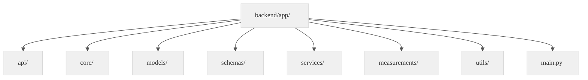
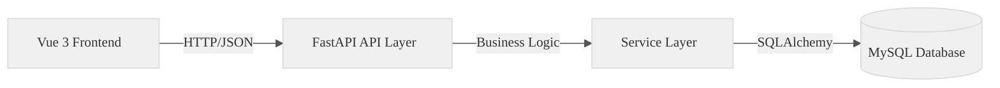
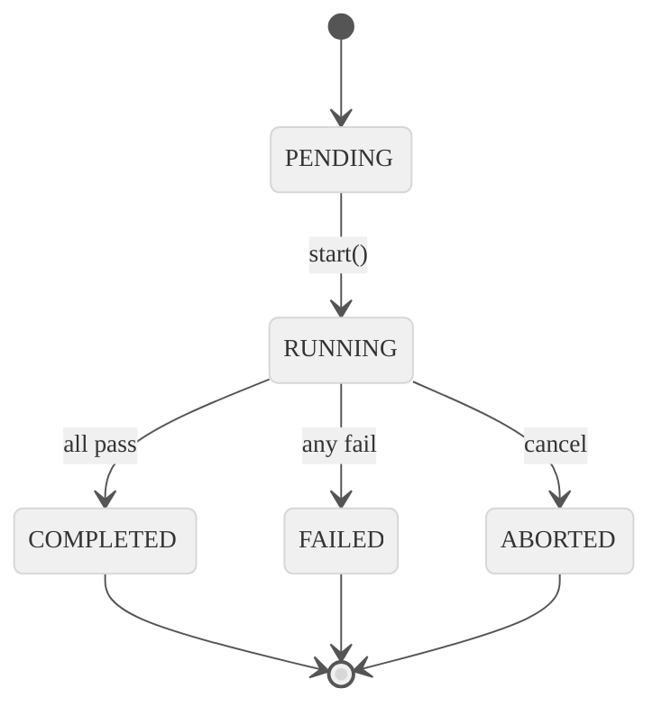

# WebPDTool Backend Architecture - Complete Documentation Index

This document provides a comprehensive index of all architecture documentation for the WebPDTool backend system.

---

## Overview

WebPDTool is a web-based automated testing system refactored from the desktop application PDTool4. It executes hardware tests on manufactured products, validates results against test plans, and records outcomes.

**Technology Stack:**
- **Frontend:** Vue 3 + Element Plus + Pinia
- **Backend:** FastAPI + SQLAlchemy 2.0 + Pydantic 2.0
- **Database:** MySQL 8.0
- **Communication:** Async/await with asyncio

---

## Documentation Files

### 1. [Backend Complete Analysis](./backend_complete_analysis.md)
**Purpose:** Comprehensive backend architecture overview

**Contents:**
- Architecture overview with technology stack
- Module-by-module analysis (core, models, schemas, api, services, measurements)
- UML diagrams:
  - Package structure diagram
  - Core components class diagram
  - Database entity relationship diagram
  - API endpoint flow diagram
  - Test execution sequence diagram
  - Measurement abstraction component diagram
  - Test session state machine
- Request flow descriptions
- Design patterns overview
- Key statistics and extensibility guide

**When to read:** First document to read for understanding the overall backend architecture

---

### 2. [Backend Module Relationships](./backend_module_relationships.md)
**Purpose:** Detailed module dependency and relationship diagrams

**Contents:**
- Complete module dependency graph
- API to service mapping diagram
- Schema to model mapping
- Measurement type hierarchy
- Instrument driver hierarchy
- Test plan service class diagram

**When to read:** When understanding how different modules interact and depend on each other

---

### 3. [Backend Request Flows](./backend_request_flows.md)
**Purpose:** Detailed sequence diagrams for all major request flows

**Contents:**
- Authentication flow (login with JWT)
- Test plan import flow (CSV parsing)
- Test execution flow (normal mode)
- Test execution flow (runAllTest mode)
- Measurement execution flow (three-phase pattern)
- Instrument connection flow (singleton pattern)
- Results query flow (with pagination)
- CSV export flow

**When to read:** When understanding the step-by-step execution of specific operations

---

### 4. [Mermaid Diagrams](./mermaid_diagrams.md)
**Purpose:** System-wide UML diagrams including frontend

**Contents:**
- Complete system class diagram (frontend + backend)
- Data flow diagram
- Database ER diagram

**When to read:** When needing high-level system overview including frontend components

---

### 5. [Core Application](./core_application.md)
**Purpose:** Reference to original PDTool4 desktop application

**Contents:**
- PDtool.py main application structure
- Key classes (MainWindow_Login, MainWindow_Measure)
- Configuration file structure

**When to read:** When understanding PDTool4 compatibility requirements

---

### 6. [Architecture Workflow](./architecture_workflow.md)
**Purpose:** Development workflow documentation

---

## Quick Reference

### Directory Structure

```
backend/app/
├── api/                    # API router layer (FastAPI routes)
├── core/                   # Core infrastructure (database, security, logging)
├── models/                 # SQLAlchemy ORM models (7 database tables)
├── schemas/                # Pydantic validation schemas
├── services/               # Business logic layer
│   ├── test_engine.py
│   ├── measurement_service.py (2,103 lines)
│   ├── test_plan_service.py (933 lines)
│   ├── instrument_manager.py
│   └── instruments/        # 23 instrument drivers
├── measurements/           # Measurement abstraction layer
│   ├── base.py             # Abstract base class
│   ├── registry.py         # Runtime registration
│   └── implementations.py  # 13 measurement types
├── utils/                  # Utilities (CSV parser)
├── main.py                 # FastAPI application entry point
├── config.py               # Configuration management
└── dependencies.py         # Dependency injection
```

### Database Schema

| Table | Purpose | Primary Key | Foreign Keys |
|-------|---------|-------------|--------------|
| `users` | User accounts | `id` | - |
| `projects` | Test projects | `id` | - |
| `stations` | Test stations | `id` | `project_id` |
| `test_plans` | Test plan definitions | `id` | `station_id`, `project_id` |
| `test_sessions` | Test execution sessions | `id` | `project_id`, `station_id`, `user_id` |
| `test_results` | Individual test results | `id` | `test_session_id`, `test_plan_id` |
| `sfc_logs` | SFC web service logs | `id` | `test_session_id` |

### API Endpoints Summary

| Category | Endpoints |
|----------|-----------|
| **Auth** | POST /api/auth/login, POST /api/auth/logout |
| **Projects** | GET/POST/PUT/DELETE /api/projects |
| **Stations** | GET/POST/PUT/DELETE /api/stations |
| **Test Plans** | GET/POST/PUT/DELETE /api/testplan/* |
| **Tests** | POST /api/tests/sessions/start, GET /api/tests/sessions/:id/status |
| **Measurements** | GET /api/measurements/instruments |
| **Results** | GET /api/results/sessions, GET /api/results/summary |

### Key Design Patterns

1. **Measurement Abstraction Pattern** - Base class with 13 concrete implementations
2. **Registry Pattern** - Runtime measurement registration
3. **Singleton Pattern** - InstrumentManager ensures single connection pool
4. **Dependency Injection** - FastAPI `Depends()` for database and auth
5. **Strategy Pattern** - Limit type validation (7 types)

### PDTool4 Compatibility Features

1. **7 Limit Types:** lower, upper, both, equality, inequality, partial, none
2. **3 Value Types:** string, integer, float
3. **runAllTest Mode:** Continue execution after failures
4. **TestPointMap Pattern:** Dictionary-like test plan manager

---

## UML Diagram Gallery

### Package Structure


### Three-Tier Architecture


### Test Session State Machine


---

## Key Statistics

| Metric | Value |
|--------|-------|
| Total Backend Code | 24,190 lines |
| API Endpoints | ~50 endpoints |
| Database Tables | 7 tables |
| Measurement Types | 13 types |
| Instrument Drivers | 23 drivers |
| Limit Types | 7 types (PDTool4) |
| Value Types | 3 types (PDTool4) |

---

## Development Guidelines

### Adding a New Measurement Type

1. Create class in `backend/app/measurements/implementations.py`:
```python
class NewMeasurement(BaseMeasurement):
    async def prepare(self, params): pass
    async def execute(self, params): pass
    async def cleanup(self): pass
```

2. Register in `backend/app/measurements/registry.py`:
```python
MEASUREMENT_REGISTRY.register('NewType', NewMeasurement)
```

3. Use in test plan CSV with `ExecuteName=NewType`

### Adding a New Instrument Driver

1. Create class in `backend/app/services/instruments/`:
```python
class NewInstrumentDriver(BaseInstrumentDriver):
    async def initialize(self): pass
    async def reset(self): pass
    async def read_value(self): pass
```

2. Register in `INSTRUMENT_DRIVERS` dict

3. Use in measurement implementations

---

## Related Documentation

- [CLAUDE.md](../../CLAUDE.md) - Project-specific Claude Code instructions
- [README.md](../../README.md) - Project overview and setup
- [UML Diagram Style Guide](../guides/uml_diagram.md) - Mermaid diagram standards

---

`★ Insight ─────────────────────────────────────`
1. The **measurement abstraction layer** is the key to PDTool4 compatibility - it standardizes test execution while allowing unlimited extensibility
2. **Three-phase execution** (prepare → execute → cleanup) ensures hardware resources are properly managed even when tests fail
3. The **registry pattern** enables runtime addition of new measurement types without modifying core code, making the system highly maintainable
`─────────────────────────────────────────────────`
