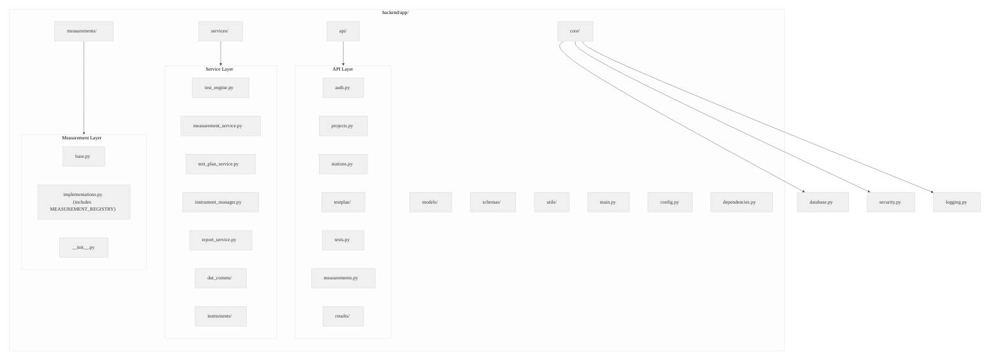
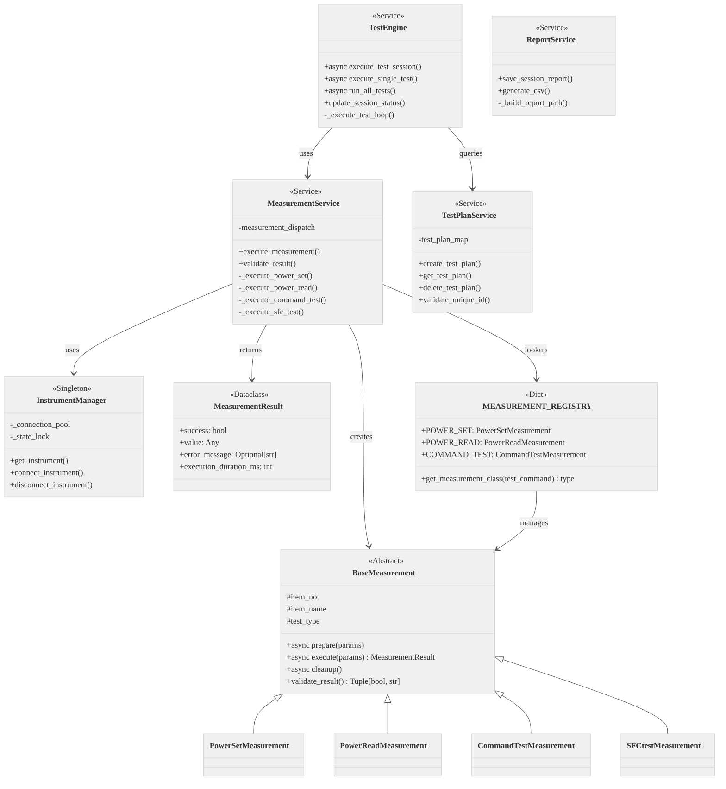
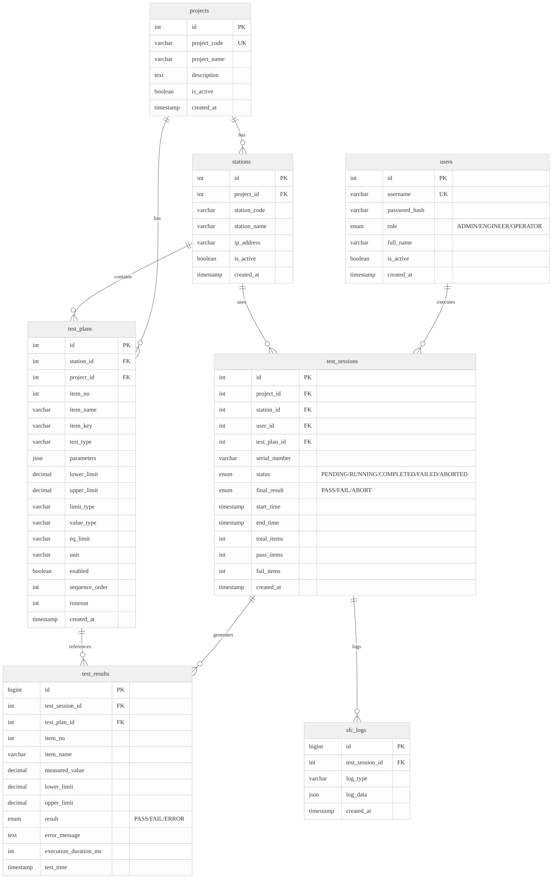
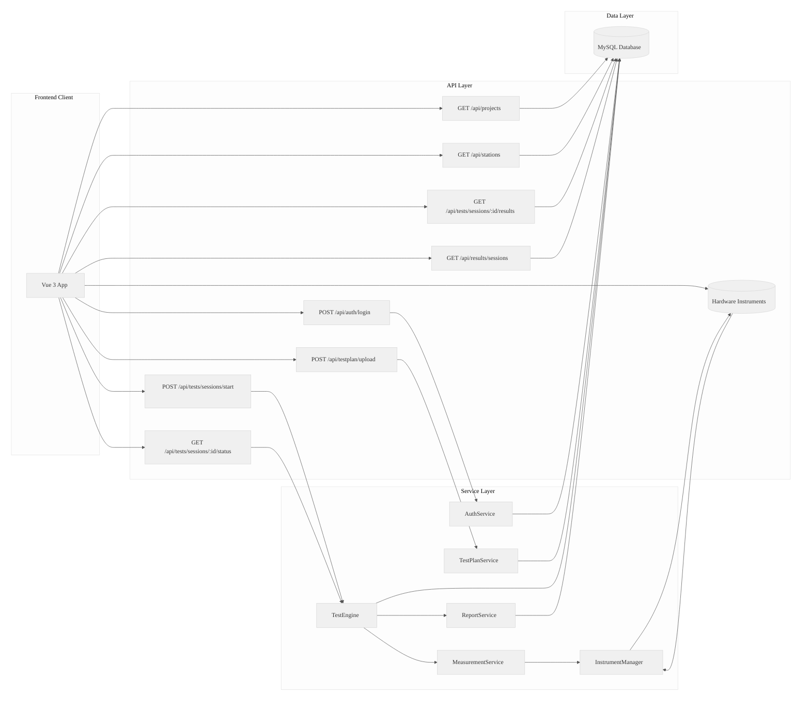
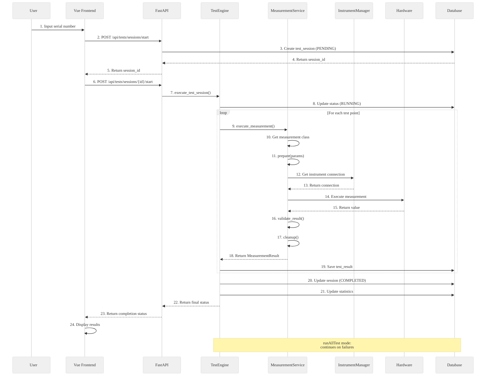
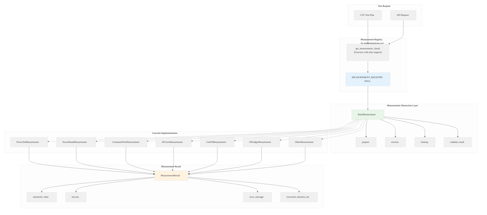
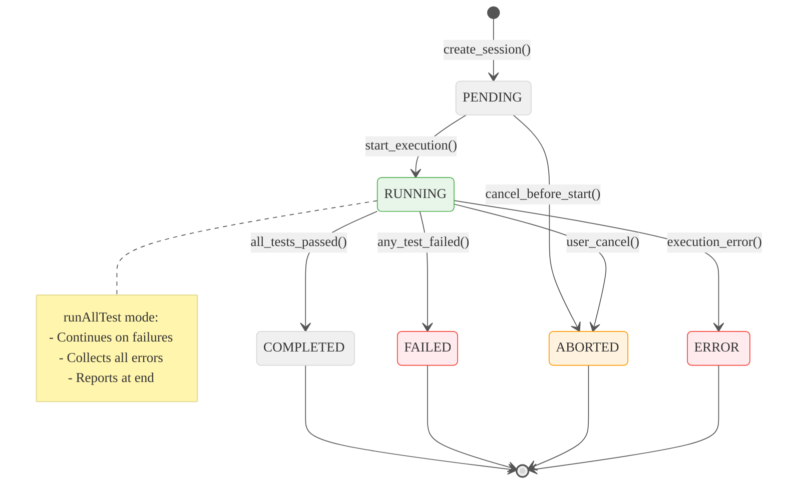

# Backend Architecture - Complete Analysis

This document provides a comprehensive analysis of the WebPDTool backend architecture, including detailed UML diagrams following the Mermaid style guide.

---

## Table of Contents

1. [Architecture Overview](#architecture-overview)
2. [Module Analysis](#module-analysis)
3. [UML Diagrams](#uml-diagrams)
4. [Request Flows](#request-flows)
5. [Design Patterns](#design-patterns)

---

## Architecture Overview

### Technology Stack

```
┌─────────────────────────────────────────────────────────────┐
│                     Frontend (Vue 3)                        │
│                  Element Plus + Pinia                       │
└─────────────────────────────────────────────────────────────┘
                              │
                              ▼
┌─────────────────────────────────────────────────────────────┐
│                    Backend (FastAPI)                        │
│                    SQLAlchemy 2.0+                          │
│                    Pydantic 2.0+                            │
└─────────────────────────────────────────────────────────────┘
                              │
                              ▼
┌─────────────────────────────────────────────────────────────┐
│                    Database (MySQL 8.0)                    │
│                      utf8mb4 charset                        │
└─────────────────────────────────────────────────────────────┘
```

### Directory Structure

```
backend/app/
├── api/                    # API router layer (FastAPI routes)
├── core/                   # Core infrastructure
├── models/                 # SQLAlchemy ORM models (7 tables)
├── schemas/                # Pydantic validation schemas
├── services/               # Business logic layer
├── measurements/           # Measurement abstraction layer
├── utils/                  # Utilities (CSV parser, helpers)
├── instrumentation/        # Instrument drivers (23 drivers)
├── main.py                 # FastAPI application entry point
├── config.py               # Configuration management
└── dependencies.py         # Dependency injection
```

---

## Module Analysis

### 1. Core Module (`app/core/`)

**Purpose:** Infrastructure and shared utilities

| File | Purpose |
|------|---------|
| `database.py` | Async database connection pooling |
| `security.py` | JWT authentication and password hashing |
| `logging.py` | Application logging setup |
| `api_helpers.py` | API utilities to reduce duplication |
| `exceptions.py` | Custom exception definitions |
| `constants.py` | Static constants and messages |
| `measurement_constants.py` | PDTool4 compatibility constants |

### 2. Models Module (`app/models/`)

**Purpose:** SQLAlchemy ORM database models

**7 Database Tables:**
- `users` - User accounts with roles
- `projects` - Test projects
- `stations` - Test stations
- `test_plans` - Test plan definitions
- `test_sessions` - Test execution sessions
- `test_results` - Individual test results
- `sfc_logs` - SFC web service logs

### 3. Schemas Module (`app/schemas/`)

**Purpose:** Pydantic validation models for request/response

| Schema File | Purpose |
|-------------|---------|
| `user.py` | User authentication models |
| `project.py` | Project management |
| `station.py` | Station management |
| `testplan.py` | Test plan CRUD |
| `test_session.py` | Test session handling |
| `test_result.py` | Test result display |
| `measurement.py` | Instrument API models |

### 4. API Module (`app/api/`)

**Purpose:** FastAPI router layer with endpoints

**API Routers:**
- `auth.py` - Authentication (login/logout)
- `projects.py` - Project CRUD
- `stations.py` - Station CRUD
- `testplan/` - Test plan endpoints
- `tests.py` - Test execution endpoints
- `measurements.py` - Instrument management
- `results/` - Results endpoints

### 5. Services Module (`app/services/`)

**Purpose:** Business logic layer

| Service | Purpose |
|---------|---------|
| `test_engine.py` | Orchestrates async test execution |
| `measurement_service.py` | Core measurement dispatch logic (2,103 lines) |
| `test_plan_service.py` | Test plan management (933 lines) |
| `instrument_manager.py` | Instrument connection pooling |
| `instrument_connection.py` | Base instrument connection protocol |
| `report_service.py` | Automatic CSV report generation |
| `dut_comms/` | DUT communication (relay, chassis) |
| `instruments/` | Hardware drivers (23 drivers) |

### 6. Measurements Module (`app/measurements/`)

**Purpose:** Measurement abstraction layer (PDTool4 compatibility)

**Components:**
- `base.py` - Abstract base class `BaseMeasurement` and `MeasurementResult`
- `implementations.py` - Concrete measurement implementations and `MEASUREMENT_REGISTRY` dictionary
- `__init__.py` - Package exports and public API

---

## UML Diagrams

### Package Structure Diagram



### Class Diagram - Core Components



### Database Entity Relationship Diagram



### API Endpoint Flow Diagram



### Sequence Diagram - Test Execution Flow



### Component Diagram - Measurement Abstraction



### State Machine - Test Session



---

## Request Flows

### 1. Authentication Flow

```
User → Login.vue
  ↓ POST /api/auth/login
AuthAPI → AuthService
  ↓ verify_password()
Database → User record
  ↓ create_access_token()
AuthService → JWT Token
  ↓ Return to frontend
Frontend → Store in Pinia + localStorage
  ↓ Add to Axios interceptor
All subsequent requests → Include Authorization header
```

### 2. Test Plan Import Flow

```
TestPlanManage.vue
  ↓ POST /api/testplan/upload (with CSV file)
TestPlanAPI → TestPlanCSVParser
  ↓ parse_csv_file()
CSV Parser → TestPlanCSVRow[]
  ↓ csv_row_to_testplan_dict()
TestPlanService → validate_unique_id()
  ↓ For each row:
    ↓ Create TestPlan model
    ↓ Add to database
  ↓ Commit transaction
  ↓ Return upload statistics
```

### 3. Test Execution Flow (runAllTest mode)

```
TestMain.vue
  ↓ POST /api/tests/sessions/start
TestsAPI → TestEngine.execute_test_session()
  ↓ Create session (PENDING)
  ↓ Update to RUNNING
  ↓ For each test point:
    ↓ MeasurementService.execute_measurement()
    ↓ Get measurement class from registry
    ↓ measurement.prepare()
    ↓ measurement.execute()
    ↓ validate_result() (PDTool4 logic)
    ↓ measurement.cleanup()
    ↓ Save test_result
    ↓ runAllTest: continue on failure
  ↓ Update session (COMPLETED/FAILED)
ReportService → Auto-save CSV report
  ↓ Return session status
```

---

## Design Patterns

### 1. Measurement Abstraction Pattern

```python
# Base class defines interface
class BaseMeasurement(ABC):
    @abstractmethod
    async def prepare(self, params): pass
    @abstractmethod
    async def execute(self, params): pass
    @abstractmethod
    async def cleanup(self): pass

# Concrete implementations
class PowerSetMeasurement(BaseMeasurement):
    async def execute(self, params):
        # PowerSet-specific logic
        pass
```

### 2. Registry Pattern

```python
# Dictionary-based registry in implementations.py
MEASUREMENT_REGISTRY = {
    "POWER_SET": PowerSetMeasurement,
    "POWER_READ": PowerReadMeasurement,
    "COMMAND_TEST": CommandTestMeasurement,
    # ... other measurement types
}

# Lookup with alias support via get_measurement_class()
cls = get_measurement_class('PowerSet')  # Supports aliases
measurement = cls()
```

### 3. Singleton Pattern (InstrumentManager)

```python
# Ensures single connection pool
instrument_manager = InstrumentManager()
instance = instrument_manager.get_instrument(instrument_id)
```

### 4. Dependency Injection (FastAPI)

```python
@router.get("/sessions")
async def get_sessions(
    db: Session = Depends(get_db),
    current_user: dict = Depends(get_current_active_user)
):
    # Use injected dependencies
    pass
```

### 5. Strategy Pattern (Limit Validation)

```python
LIMIT_TYPE_MAP = {
    'lower': LOWER_LIMIT_TYPE,
    'upper': UPPER_LIMIT_TYPE,
    'both': BOTH_LIMIT_TYPE,
    # ... 7 limit types
}
```

---

## Key Statistics

| Metric | Value |
|--------|-------|
| Total Backend Code | 24,190 lines |
| API Endpoints | ~50 endpoints |
| Database Tables | 7 tables |
| Measurement Types | 13 types |
| Instrument Drivers | 23 drivers |
| Limit Types | 7 types |
| Value Types | 3 types |

---

## Extensibility

### Adding a New Measurement Type

1. Create class in `measurements/implementations.py`:
   ```python
   class NewMeasurement(BaseMeasurement):
       async def prepare(self, params: Dict[str, Any]) -> None:
           # Setup logic
           pass

       async def execute(self, params: Dict[str, Any]) -> MeasurementResult:
           # Execution logic
           return MeasurementResult(success=True, value=result)

       async def cleanup(self) -> None:
           # Cleanup logic
           pass
   ```

2. Register in `MEASUREMENT_REGISTRY` dictionary (same file):
   ```python
   MEASUREMENT_REGISTRY = {
       # ... existing entries
       "NEW_TYPE": NewMeasurement,
   }
   ```

3. Update command mapping in `get_measurement_class()` if needed for aliases

4. Use in test plan CSV with `test_type=NEW_TYPE` or alias

5. Export from `__init__.py` if needed in other modules

### Adding a New Instrument Driver

1. Create class in `services/instruments/`
2. Inherit from `BaseInstrumentDriver`
3. Register in `INSTRUMENT_DRIVERS` dict
4. Use in measurement implementations

---

`★ Insight ─────────────────────────────────────`
1. The **measurement abstraction layer** is the core of PDTool4 compatibility - it enables runtime registration of new test types without modifying core code
2. **Dictionary-based registry** (MEASUREMENT_REGISTRY) with `get_measurement_class()` function provides flexible lookup with alias support, making the system highly extensible
3. **Three-phase execution** (prepare → execute → cleanup) ensures proper resource management and hardware state control
4. **Co-located design** - Registry and implementations in the same file (`implementations.py`) simplifies the architecture for this scale of system
`─────────────────────────────────────────────────`
