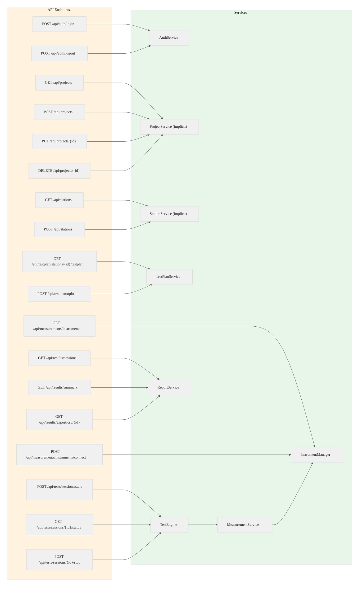
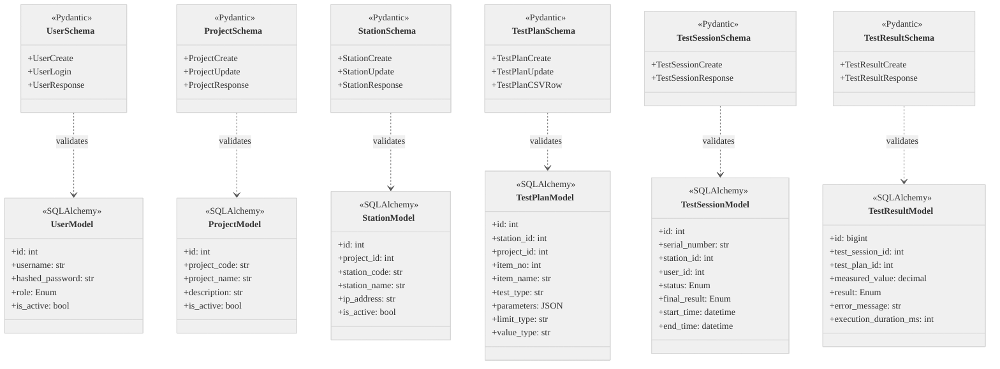
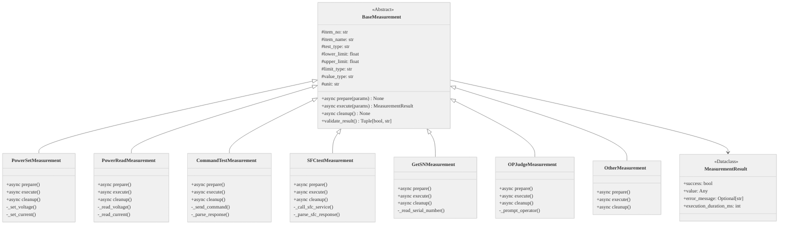
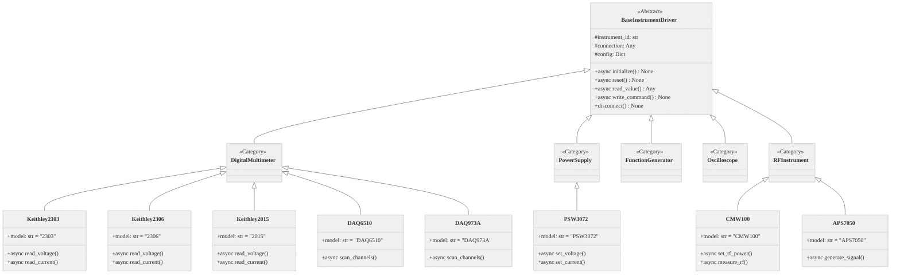
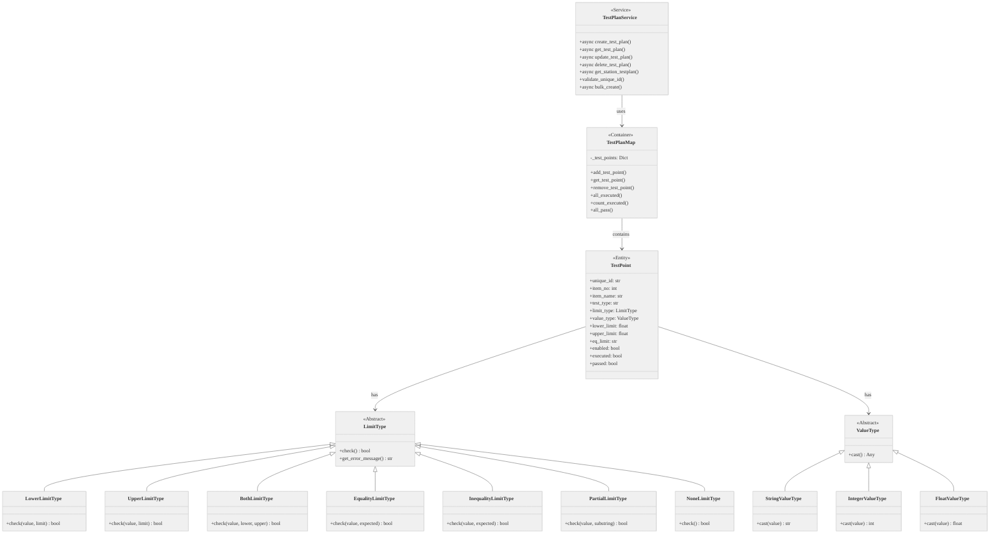

# Backend Module Relationships - Detailed UML

This document provides detailed UML diagrams showing the relationships between all backend modules.

---

## 1. Module Dependency Graph

```mermaid
%%{init: {
  "theme": "base",
  "themeVariables": {
    "fontSize": "16px",
    "fontFamily": "Arial, Helvetica, sans-serif",
    "primaryTextColor": "#333333",
    "lineColor": "#555555",
    "primaryColor": "#f0f0f0"
  },
  "flowchart": {
    "padding": 20,
    "nodeSpacing": 60,
    "rankSpacing": 80,
    "curve": "basis",
    "diagramPadding": 30
  }
}}%%
graph TB
    subgraph Entry["Entry Points"]
        Main["main.py"]
        Dep["dependencies.py"]
    end

    subgraph API["API Layer (app/api/)"]
        AuthAPI["auth.py"]
        ProjectsAPI["projects.py"]
        StationsAPI["stations.py"]
        TestplanAPI["testplan/"]
        TestsAPI["tests.py"]
        MeasurementsAPI["measurements.py"]
        ResultsAPI["results/"]
    end

    subgraph Core["Core Layer (app/core/)"]
        Database["database.py"]
        Security["security.py"]
        Logging["logging.py"]
        Helpers["api_helpers.py"]
        Exceptions["exceptions.py"]
        Constants["constants.py"]
    end

    subgraph Schemas["Schemas Layer (app/schemas/)"]
        UserSchema["user.py"]
        ProjectSchema["project.py"]
        StationSchema["station.py"]
        TestplanSchema["testplan.py"]
        SessionSchema["test_session.py"]
        ResultSchema["test_result.py"]
        MeasurementSchema["measurement.py"]
    end

    subgraph Models["Models Layer (app/models/)"]
        UserModel["user.py"]
        ProjectModel["project.py"]
        StationModel["station.py"]
        TestplanModel["test_plan.py"]
        SessionModel["test_session.py"]
        ResultModel["test_result.py"]
        SfcLogModel["sfc_log.py"]
    end

    subgraph Services["Service Layer (app/services/)"]
        TestEngine["test_engine.py"]
        MeasurementService["measurement_service.py"]
        TestPlanService["test_plan_service.py"]
        InstrumentManager["instrument_manager.py"]
        InstrumentConnection["instrument_connection.py"]
        ReportService["report_service.py"]
        AuthService["auth.py"]
    end

    subgraph Measurements["Measurement Layer (app/measurements/)"]
        Base["base.py"]
        Registry["registry.py"]
        Implementations["implementations.py"]
    end

    subgraph Utils["Utils Layer (app/utils/)"]
        CSVParser["csv_parser.py"]
    end

    subgraph Instruments["Instrument Drivers (app/services/instruments/)"]
        BaseDriver["base.py"]
        COMPort["comport_command.py"]
        Console["console_command.py"]
        Drivers["23 drivers"]
    end

    subgraph DUTComms["DUT Communications (app/services/dut_comms/)"]
        RelayController["relay_controller.py"]
        ChassisController["chassis_controller.py"]
        ChassisProtocol["ltl_chassis_fixt_comms/"]
    end

    %% Entry to API
    Main --> AuthAPI
    Main --> ProjectsAPI
    Main --> StationsAPI
    Main --> TestplanAPI
    Main --> TestsAPI
    Main --> MeasurementsAPI
    Main --> ResultsAPI
    Dep --> AuthAPI
    Dep --> Security

    %% API to Core
    AuthAPI --> Security
    AuthAPI --> Database
    TestsAPI --> Database
    MeasurementsAPI --> Database
    ResultsAPI --> Database

    %% API to Services
    TestsAPI --> TestEngine
    MeasurementsAPI --> InstrumentManager
    TestplanAPI --> TestPlanService
    ResultsAPI --> Database

    %% Services to Core
    TestEngine --> Database
    MeasurementService --> Database
    TestPlanService --> Database
    AuthService --> Database
    InstrumentManager --> Logging

    %% Services to Measurements
    MeasurementService --> Base
    MeasurementService --> Registry
    MeasurementService --> Implementations

    %% Services to Instruments
    InstrumentManager --> InstrumentConnection
    MeasurementService --> InstrumentManager

    %% Measurements Base
    Implementations --> Base
    Registry --> Base

    %% TestPlan to Utils
    TestPlanService --> CSVParser

    %% Instruments
    InstrumentConnection --> BaseDriver
    Drivers --> BaseDriver
    Drivers --> COMPort
    Drivers --> Console

    %% DUT Comms
    ChassisController --> ChassisProtocol
    RelayController --> COMPort

    %% API to Schemas
    AuthAPI --> UserSchema
    ProjectsAPI --> ProjectSchema
    StationsAPI --> StationSchema
    TestplanAPI --> TestplanSchema
    TestsAPI --> SessionSchema
    TestsAPI --> ResultSchema
    MeasurementsAPI --> MeasurementSchema

    %% Schemas to Models (validation mapping)
    UserSchema -.-> UserModel
    ProjectSchema -.-> ProjectModel
    StationSchema -.-> StationModel
    TestplanSchema -.-> TestplanModel
    SessionSchema -.-> SessionModel
    ResultSchema -.-> ResultModel

    %% Services to Models
    TestEngine --> SessionModel
    TestEngine --> ResultModel
    MeasurementService --> TestplanModel
    TestPlanService --> TestplanModel
    AuthService --> UserModel
    InstrumentManager --> SessionModel

    %% Styles
    style Entry fill:#E3F2FD
    style API fill:#FFF3E0
    style Core fill:#F3E5F5
    style Services fill:#E8F5E9
    style Measurements fill:#FCE4EC
    style Instruments fill:#E0F2F1
    style DUTComms fill:#E0F2F1
```

---

## 2. API to Service Mapping Diagram

---

## 3. Schema to Model Mapping

---

## 4. Measurement Type Hierarchy

---

## 5. Instrument Driver Hierarchy

---

## 6. Test Plan Service Class Diagram

---

`★ Insight ─────────────────────────────────────`
1. **Schema-to-Model separation** ensures clean validation layer (Pydantic) before database persistence (SQLAlchemy), preventing invalid data from reaching the database
2. **Limit/Value Type polymorphism** allows PDTool4's 7 limit types and 3 value types to be extended without modifying validation logic
3. **TestPlanMap** implements a dictionary-like container that tracks execution state (executed, passed) for runAllTest mode error collection
`─────────────────────────────────────────────────`
