# Backend Request Flows - Sequence Diagrams

This document provides detailed sequence diagrams for all major request flows in the WebPDTool backend.

---

## Table of Contents

1. [Authentication Flow](#1-authentication-flow)
2. [Test Plan Import Flow](#2-test-plan-import-flow)
3. [Test Execution Flow (Normal Mode)](#3-test-execution-flow-normal-mode)
4. [Test Execution Flow (runAllTest Mode)](#4-test-execution-flow-runalltest-mode)
5. [Measurement Execution Flow](#5-measurement-execution-flow)
6. [Instrument Connection Flow](#6-instrument-connection-flow)
7. [Results Query Flow](#7-results-query-flow)
8. [CSV Export Flow](#8-csv-export-flow)

---

## 1. Authentication Flow


---

## 2. Test Plan Import Flow

```mermaid
%%{init: {
  "theme": "base",
  "themeVariables": {
    "fontSize": "16px",
    "fontFamily": "Arial, Helvetica, sans-serif",
    "primaryTextColor": "#333333",
    "lineColor": "#555555",
    "primaryColor": "#f0f0f0"
  },
  "sequence": {
    "diagramMarginX": 50,
    "diagramMarginY": 10,
    "actorMargin": 50,
    "width": 150,
    "height": 65,
    "boxMargin": 10,
    "messageMargin": 35,
    "noteMargin": 10,
    "activationMargin": 5
  }
}}%%
sequenceDiagram
    participant User as 👤 User
    participant Frontend as TestPlanManage.vue
    participant API as TestPlan API
    participant Parser as CSV Parser
    participant Service as TestPlanService
    participant DB as Database

    User->>Frontend: 1. Select CSV file
    Frontend->>API: 2. POST /api/testplan/upload\nFormData{file, replace_existing}
    activate API

    API->>API: 3. Validate file type (.csv)
    API->>API: 4. Read file content (bytes)

    API->>Parser: 5. parse_and_convert()\n(file_content, station_id, project_id)
    activate Parser

    Parser->>Parser: 6. Decode bytes to string
    Parser->>Parser: 7. Create CSV DictReader

    loop For each CSV row
        Parser->>Parser: 8. csv_row_to_testplan_dict()
        Note over Parser: Map PDTool4 columns:\n- ItemKey → item_key\n- LL → lower_limit\n- UL → upper_limit\n- LimitType → limit_type\n- ValueType → value_type\n- ExecuteName → test_type

        Parser->>Parser: 9. Parse limits (float)
        Parser->>Parser: 10. Parse timeout/wait_msec (int)
        Parser->>Parser: 11. Build parameters JSON
    end

    Parser-->>API: 12. Return List[TestPlanDict]
    deactivate Parser

    alt replace_existing = true
        API->>Service: 13. delete_station_testplans()
        activate Service
        Service->>DB: 14. DELETE FROM test_plans\nWHERE station_id = ?
        DB-->>Service: 15. Delete count
        Service-->>API: 16. Confirm deleted
        deactivate Service
    end

    API->>Service: 17. bulk_create_testplans()\n(test_plan_dicts)
    activate Service

    loop For each test_plan_dict
        Service->>Service: 18. validate_unique_id()\n(item_no, station_id)
        Service->>DB: 19. Check existing
        DB-->>Service: 20. Exists or not

        alt Unique ID exists
            Service->>Service: 21a. Skip or update
        else Unique ID available
            Service->>DB: 21b. INSERT INTO test_plans
        end
    end

    Service->>DB: 22. COMMIT transaction
    DB-->>Service: 23. Confirm committed
    Service-->>API: 24. Return created count
    deactivate Service

    API-->>Frontend: 25. Return {created, updated, failed}
    deactivate API

    Frontend-->>User: 26. Display success message

    Note over Frontend,DB: CSV columns expected:\nID, ItemKey, ValueType, LimitType,\nEqLimit, LL, UL, ExecuteName, etc.
```



---

## 3. Test Execution Flow (Normal Mode)

```mermaid
%%{init: {
  "theme": "base",
  "themeVariables": {
    "fontSize": "16px",
    "fontFamily": "Arial, Helvetica, sans-serif",
    "primaryTextColor": "#333333",
    "lineColor": "#555555",
    "primaryColor": "#f0f0f0"
  },
  "sequence": {
    "diagramMarginX": 50,
    "diagramMarginY": 10,
    "actorMargin": 50,
    "width": 150,
    "height": 65,
    "boxMargin": 10,
    "messageMargin": 35,
    "noteMargin": 10,
    "activationMargin": 5
  }
}}%%
sequenceDiagram
    participant User as 👤 User
    participant Frontend as TestMain.vue
    participant API as Tests API
    participant Engine as TestEngine
    participant MeasureSvc as MeasurementService
    participant Instrument as InstrumentManager
    participant Hardware as Test Instruments
    participant DB as Database
    participant Report as ReportService

    User->>Frontend: 1. Input serial number
    Frontend->>API: 2. POST /api/tests/sessions/start\n{serial_number, station_id, project_id}
    activate API

    API->>DB: 3. INSERT INTO test_sessions\n(status=PENDING)
    activate DB
    DB-->>API: 4. Return session_id
    deactivate DB

    API-->>Frontend: 5. Return {session_id, status}
    deactivate API

    Frontend->>API: 6. POST /api/tests/sessions/{id}/start
    activate API

    API->>Engine: 7. execute_test_session(session_id)
    activate Engine

    Engine->>DB: 8. UPDATE test_sessions\nSET status=RUNNING
    activate DB
    DB-->>Engine: 9. Confirm updated
    deactivate DB

    Engine->>DB: 10. SELECT * FROM test_plans\nWHERE station_id=? ORDER BY sequence_order
    activate DB
    DB-->>Engine: 11. Return test plans
    deactivate DB

    loop For each test point
        Engine->>MeasureSvc: 12. execute_measurement(test_plan)
        activate MeasureSvc

        MeasureSvc->>MeasureSvc: 13. Get measurement class\nfrom registry

        MeasureSvc->>MeasureSvc: 14. measurement.prepare(params)
        Note over MeasureSvc: Configure parameters,\nsetup instrument

        MeasureSvc->>Instrument: 15. Get instrument connection
        activate Instrument
        Instrument-->>MeasureSvc: 16. Return connection
        deactivate Instrument

        MeasureSvc->>Hardware: 17. Execute measurement\nvia instrument driver
        activate Hardware
        Hardware-->>MeasureSvc: 18. Return measured value
        deactivate Hardware

        MeasureSvc->>MeasureSvc: 19. validate_result()\n(PDTool4 logic)

        MeasureSvc->>MeasureSvc: 20. measurement.cleanup()

        MeasureSvc-->>Engine: 21. Return MeasurementResult\n{success, value, error_message}
        deactivate MeasureSvc

        Engine->>DB: 22. INSERT INTO test_results
        activate DB
        DB-->>Engine: 23. Confirm saved
        deactivate DB

        alt Result is FAIL and NOT runAllTest mode
            Engine->>DB: 24. UPDATE test_sessions\nSET status=FAILED
            Engine-->>API: 25. Return FAILED status
            API-->>Frontend: 26. Return with error
            Frontend-->>User: 27. Display failure
        end
    end

    Engine->>DB: 28. UPDATE test_sessions\nSET status=COMPLETED\nSET final_result
    activate DB
    DB-->>Engine: 29. Confirm updated
    deactivate DB

    Engine->>Report: 30. save_session_report(session_id)
    activate Report
    Report->>DB: 31. Query session results
    DB-->>Report: 32. Return results
    Report->>Report: 33. Generate CSV
    Report->>Report: 34. Save to reports/{project}/{station}/{date}/
    Report-->>Engine: 35. Report saved
    deactivate Report

    Engine-->>API: 36. Return COMPLETED with statistics
    deactivate Engine

    API-->>Frontend: 37. Return {status, pass_count, fail_count}
    deactivate API

    Frontend-->>User: 38. Display results summary

    Note over Engine,DB: Normal mode: stops on first failure\nrunAllTest mode: continues (see next diagram)
```



---

## 4. Test Execution Flow (runAllTest Mode)


---

## 5. Measurement Execution Flow


---

## 6. Instrument Connection Flow


---

## 7. Results Query Flow


---

## 8. CSV Export Flow

```mermaid
%%{init: {
  "theme": "base",
  "themeVariables": {
    "fontSize": "16px",
    "fontFamily": "Arial, Helvetica, sans-serif",
    "primaryTextColor": "#333333",
    "lineColor": "#555555",
    "primaryColor": "#f0f0f0"
  },
  "sequence": {
    "diagramMarginX": 50,
    "diagramMarginY": 10,
    "actorMargin": 50,
    "width": 150,
    "height": 65,
    "boxMargin": 10,
    "messageMargin": 35,
    "noteMargin": 10,
    "activationMargin": 5
  }
}}%%
sequenceDiagram
    participant User as 👤 User
    participant Frontend as ResultsView.vue
    participant API as Results API
    participant DB as Database
    participant CSV as CSVBuilder

    User->>Frontend: 1. Click "Export CSV" button
    Frontend->>API: 2. GET /api/results/export/csv/{session_id}
    activate API

    API->>DB: 3. SELECT ts.*, tr.*\nFROM test_sessions ts\nJOIN test_results tr\nWHERE ts.id=?
    activate DB
    DB-->>API: 4. Return session with all results
    deactivate DB

    API->>CSV: 5. build_csv_content(session, results)
    activate CSV

    CSV->>CSV: 6. Create CSV writer
    CSV->>CSV: 7. Write header row:\nItemNo, ItemName, MeasuredValue,\nLowerLimit, UpperLimit, Unit,\nResult, ErrorMessage, ExecutionTime

    loop For each test result
        CSV->>CSV: 8. Format values\n- Decimal precision\n- Date/time format\n- Escape special characters
        CSV->>CSV: 9. Write data row
    end

    CSV-->>API: 10. Return CSV content (string)
    deactivate CSV

    API->>API: 11. Set headers:\nContent-Type: text/csv\nContent-Disposition: attachment;\nfilename="session_{id}_{timestamp}.csv"

    API-->>Frontend: 12. Return CSV file
    deactivate API

    Frontend->>Frontend: 13. Trigger browser download\nCreate <a> element with download attribute

    Frontend-->>User: 14. File downloads to Downloads folder

    Note over CSV: CSV format matches PDTool4\nfor compatibility
```

---

## Summary of Request Flows

| Flow | Entry Point | Key Services | Database Tables |
|------|-------------|--------------|-----------------|
| Authentication | POST /api/auth/login | AuthService | users |
| Test Plan Import | POST /api/testplan/upload | TestPlanService, CSVParser | test_plans |
| Test Execution | POST /api/tests/sessions/start | TestEngine, MeasurementService | test_sessions, test_results |
| Measurement | Internal (MeasurementService) | ConcreteMeasurement classes | (via TestResult) |
| Instrument Connection | Internal (InstrumentManager) | InstrumentManager | (instrument config) |
| Results Query | GET /api/results/sessions | StatisticsCalculator | test_sessions, test_results |
| CSV Export | GET /api/results/export/csv | CSVBuilder | test_sessions, test_results |

---

`★ Insight ─────────────────────────────────────`
1. **runAllTest mode** differs from normal mode by continuing execution after failures and collecting all errors in a list for summary reporting
2. **Three-phase measurement execution** (prepare → execute → cleanup) ensures proper resource management even when exceptions occur
3. **Instrument manager singleton** prevents multiple simultaneous connections to the same hardware, which could cause race conditions or communication errors
`─────────────────────────────────────────────────`
