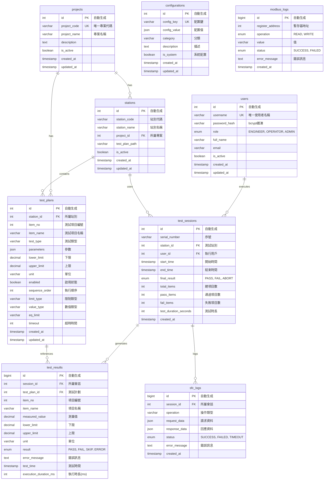

# WebPDTool - Mermaid 圖表

本文件包含 WebPDTool 系統的 Mermaid 圖表，可直接複製到 README.md 中使用。

## UML 類別圖 (Mermaid)

```mermaid
classDiagram
    %% Frontend Layer
    class LoginVue {
        <<Vue Component>>
    }
    class SystemConfigVue {
        <<Vue Component>>
    }
    class TestMainVue {
        <<Vue Component>>
        +barcode input
        +real-time progress
        +SFC configuration
        +runAllTest toggle
    }
    class TestPlanManageVue {
        <<Vue Component>>
    }
    class TestExecutionVue {
        <<Vue Component>>
    }
    class TestHistoryVue {
        <<Vue Component>>
    }
    class ProjectStationSelector {
        <<Vue Component>>
    }
    class AuthStore {
        <<Pinia Store>>
    }
    class ProjectStore {
        <<Pinia Store>>
    }
    class APIClient {
        <<Axios>>
    }

    %% Backend API Layer
    class AuthAPI {
        <<FastAPI Router>>
    }
    class ProjectsAPI {
        <<FastAPI Router>>
    }
    class StationsAPI {
        <<FastAPI Router>>
    }
    class TestPlansAPI {
        <<FastAPI Router>>
    }
    class TestsAPI {
        <<FastAPI Router>>
    }
    class MeasurementsAPI {
        <<FastAPI Router>>
    }
    class ResultsAPI {
        <<FastAPI Router>>
    }

    %% Service Layer
    class AuthService {
        <<Service>>
    }
    class TestEngine {
        <<Service>>
        +async test execution
        +session state management
        +runAllTest mode
        +task scheduling
    }
    class InstrumentManager {
        <<Service>>
        +Singleton pattern
        +connection pool
        +state tracking
    }
    class MeasurementService {
        <<Service>>
    }
    class TestPlanService {
        <<Service>>
    }
    class SFCService {
        <<Service>>
    }

    %% Measurement Layer
    class BaseMeasurement {
        <<Abstract>>
        #item_no
        #item_name
        #test_type
        #lower_limit
        #upper_limit
        #unit
        #timeout
        #limit_type
        #value_type
        #eq_limit
        +execute() MeasurementResult
        #prepare()
        #cleanup()
        #validate()
    }
    class PowerSet {
        +execute()
        +setVoltage()
        +setCurrent()
    }
    class PowerRead {
        +execute()
        +readVoltage()
        +readCurrent()
    }
    class CommandTest {
        +execute()
        +sendCommand()
        +readResponse()
    }
    class SFCtest {
        +execute()
        +callSFCService()
    }
    class GetSN {
        +execute()
        +readSerialNumber()
    }
    class OPjudge {
        +execute()
        +promptOperator()
    }
    class Other {
        +execute()
    }
    class MeasurementResult {
        +item_no
        +item_name
        +measured_value
        +lower_limit
        +upper_limit
        +unit
        +result
        +error_message
        +execution_duration_ms
        +toDict()
    }
    class LimitType {
        <<Enumeration>>
        LOWER_LIMIT
        UPPER_LIMIT
        LOWER_UPPER_LIMIT
        EQUALITY_LIMIT
        NON_EQUALITY_LIMIT
        INEQUALITY_LIMIT
    }
    class ValueType {
        <<Enumeration>>
        StringType
        IntType
        FloatType
    }

    %% Data Models
    class User {
        +int id
        +str username
        +str password_hash
        +str role
        +str full_name
        +str email
        +bool is_active
        +datetime created_at
        +datetime updated_at
    }
    class Project {
        +int id
        +str project_code
        +str project_name
        +str description
        +bool is_active
        +datetime created_at
        +datetime updated_at
    }
    class Station {
        +int id
        +str station_code
        +str station_name
        +int project_id
        +str test_plan_path
        +bool is_active
        +datetime created_at
        +datetime updated_at
    }
    class TestPlan {
        +int id
        +int station_id
        +int item_no
        +str item_name
        +str test_type
        +json parameters
        +decimal lower_limit
        +decimal upper_limit
        +str unit
        +bool enabled
        +int sequence_order
        +str limit_type
        +str value_type
        +datetime created_at
    }
    class TestSession {
        +int id
        +str serial_number
        +int station_id
        +int user_id
        +datetime start_time
        +datetime end_time
        +str final_result
        +int total_items
        +int pass_items
        +int fail_items
        +int test_duration_seconds
    }
    class TestResult {
        +bigint id
        +int session_id
        +int test_plan_id
        +int item_no
        +str item_name
        +decimal measured_value
        +str result
        +str error_message
        +int execution_duration_ms
    }
    class SFCLog {
        +int id
        +int session_id
        +str operation
        +json request_data
        +json response_data
        +str status
        +datetime created_at
    }

    %% External Systems
    class Instruments {
        <<External>>
        Power Supply
        Digital Multimeter
        Serial Devices
    }
    class SFCSystem {
        <<External>>
        SOAP/REST API
    }

    %% Frontend Relationships
    LoginVue --> APIClient
    SystemConfigVue --> APIClient
    SystemConfigVue --> ProjectStationSelector
    TestMainVue --> APIClient
    TestPlanManageVue --> APIClient
    TestExecutionVue --> APIClient
    TestHistoryVue --> APIClient
    AuthStore --> APIClient
    ProjectStore --> APIClient

    %% API Relationships
    APIClient --> AuthAPI
    APIClient --> ProjectsAPI
    APIClient --> StationsAPI
    APIClient --> TestPlansAPI
    APIClient --> TestsAPI
    APIClient --> MeasurementsAPI
    APIClient --> ResultsAPI

    %% API to Service
    AuthAPI --> AuthService
    ProjectsAPI --> Project
    StationsAPI --> Station
    TestPlansAPI --> TestPlan
    TestPlansAPI --> TestPlanService
    TestsAPI --> TestEngine
    TestsAPI --> TestSession
    MeasurementsAPI --> MeasurementService
    MeasurementsAPI --> InstrumentManager
    ResultsAPI --> TestResult
    ResultsAPI --> TestSession

    %% Service Relationships
    TestEngine --> TestSession
    TestEngine --> TestResult
    MeasurementService --> BaseMeasurement
    MeasurementService --> InstrumentManager
    TestPlanService --> TestPlan

    %% Measurement Inheritance
    BaseMeasurement <|-- PowerSet
    BaseMeasurement <|-- PowerRead
    BaseMeasurement <|-- CommandTest
    BaseMeasurement <|-- SFCtest
    BaseMeasurement <|-- GetSN
    BaseMeasurement <|-- OPjudge
    BaseMeasurement <|-- Other
    BaseMeasurement --> MeasurementResult
    BaseMeasurement --> LimitType
    BaseMeasurement --> ValueType

    %% Model Relationships
    Station --> Project : belongs to
    TestPlan --> Station : belongs to
    TestSession --> Station : uses
    TestSession --> User : executed by
    TestResult --> TestSession : belongs to
    TestResult --> TestPlan : references
    SFCLog --> TestSession : logs

    %% External Relationships
    MeasurementService ..> Instruments : communicates
    SFCService ..> SFCSystem : calls
    InstrumentManager ..> Instruments : manages

    note for TestEngine "測試引擎功能:\n- 非同步測試執行\n- 會話狀態管理\n- runAllTest模式\n- 任務調度"
    note for BaseMeasurement "測量基類功能:\n- 標準化介面\n- PDTool4驗證邏輯\n- 7種limit_type支援\n- 3種value_type支援"
    note for TestMainVue "前端測試控制:\n- PDTool4風格UI\n- 條碼輸入\n- 即時進度顯示\n- SFC配置\n- runAllTest切換"
```

## 資料流程圖 (Mermaid)

```mermaid
flowchart TB
    User([使用者])
    
    subgraph Frontend["前端層 (Vue 3)"]
        Login[Login.vue]
        Config[SystemConfig.vue]
        TestMain[TestMain.vue]
        TestPlan[TestPlanManage.vue]
        History[TestHistory.vue]
        Stores[Pinia Stores]
    end
    
    subgraph Backend["後端 API 層 (FastAPI)"]
        AuthAPI[Auth API]
        ProjectsAPI[Projects API]
        StationsAPI[Stations API]
        TestPlansAPI[Test Plans API]
        TestsAPI[Test Execution API]
        MeasurementsAPI[Measurements API]
        ResultsAPI[Results API]
    end
    
    subgraph Services["服務層"]
        AuthService[Auth Service]
        TestEngine[Test Engine]
        InstrumentMgr[Instrument Manager]
        MeasureSvc[Measurement Service]
        TestPlanSvc[Test Plan Service]
        SFCService[SFC Service]
    end
    
    subgraph Measurements["測量層"]
        Base[BaseMeasurement]
        PowerSet[PowerSet]
        PowerRead[PowerRead]
        CommandTest[CommandTest]
        SFCtest[SFCtest]
        GetSN[GetSN]
        OPjudge[OPjudge]
        Other[Other]
    end
    
    MySQL[(MySQL Database)]
    Instruments[測試儀器]
    SFCSystem[SFC系統]
    
    %% 認證流程
    User -->|1. 登入| Login
    Login -->|2. POST /api/auth/login| AuthAPI
    AuthAPI -->|3. 驗證密碼| AuthService
    AuthService -->|4. 查詢用戶| MySQL
    MySQL -->|5. 返回資料| AuthService
    AuthService -->|6. 產生JWT| AuthAPI
    AuthAPI -->|7. 返回Token| Login
    Login -->|8. 儲存狀態| Stores
    
    %% 專案/站別選擇
    User -->|9. 系統配置| Config
    Config -->|10. GET /api/projects| ProjectsAPI
    ProjectsAPI -->|11. 查詢| MySQL
    Config -->|12. GET /api/stations| StationsAPI
    StationsAPI -->|13. 查詢| MySQL
    Config -->|14. 儲存| Stores
    Config -->|15. 進入| TestMain
    
    %% 測試計劃管理
    User -->|16. 管理| TestPlan
    TestPlan -->|17. GET /testplan| TestPlansAPI
    TestPlansAPI -->|18. 查詢| MySQL
    TestPlan -->|19. POST /upload| TestPlansAPI
    TestPlansAPI -->|20. 解析CSV| TestPlanSvc
    TestPlanSvc -->|21. 儲存| MySQL
    
    %% 測試執行流程
    User -->|22. 輸入條碼| TestMain
    TestMain -->|23. POST /sessions| TestsAPI
    TestsAPI -->|24. 建立會話| MySQL
    TestMain -->|25. POST /start| TestsAPI
    TestsAPI -->|26. 啟動測試| TestEngine
    TestEngine -->|27. 取得計劃| MySQL
    TestEngine -->|28. 執行| MeasureSvc
    MeasureSvc -->|29. 建立物件| Base
    Base -.->|實作| PowerSet
    Base -.->|實作| PowerRead
    Base -.->|實作| CommandTest
    Base -.->|實作| SFCtest
    Base -.->|實作| GetSN
    Base -.->|實作| OPjudge
    Base -.->|實作| Other
    
    %% 儀器通訊
    PowerSet -->|30. 取得連線| InstrumentMgr
    InstrumentMgr -->|31. 分配| Instruments
    PowerRead -->|32. 讀取| Instruments
    CommandTest -->|33. 發送指令| Instruments
    
    %% SFC整合
    SFCtest -->|34. 呼叫| SFCService
    SFCService -->|35. WebService| SFCSystem
    SFCService -->|36. 記錄| MySQL
    
    %% 結果驗證與儲存
    PowerSet -->|37. 返回結果| MeasureSvc
    PowerRead -->|37. 返回結果| MeasureSvc
    CommandTest -->|37. 返回結果| MeasureSvc
    SFCtest -->|37. 返回結果| MeasureSvc
    MeasureSvc -->|38. 驗證| TestEngine
    TestEngine -->|39. 儲存結果| MySQL
    TestEngine -->|40. 更新統計| MySQL
    
    %% 即時狀態輪詢
    TestMain -->|41. 輪詢狀態| TestsAPI
    TestsAPI -->|42. 查詢進度| TestEngine
    TestEngine -->|43. 返回狀態| TestsAPI
    TestsAPI -->|44. 返回進度| TestMain
    
    %% 測試結果查詢
    User -->|45. 歷史查詢| History
    History -->|46. GET /sessions| ResultsAPI
    ResultsAPI -->|47. 查詢| MySQL
    History -->|48. GET /summary| ResultsAPI
    ResultsAPI -->|49. 統計| MySQL
    History -->|50. GET /export| ResultsAPI
    ResultsAPI -->|51. 匯出| MySQL
    
    %% 儀器管理
    TestMain -->|52. GET /instruments| MeasurementsAPI
    MeasurementsAPI -->|53. 查詢狀態| InstrumentMgr
    TestMain -->|54. POST /reset| MeasurementsAPI
    MeasurementsAPI -->|55. 重置| InstrumentMgr
    
    style Frontend fill:#F3E5F5
    style Backend fill:#FFF3E0
    style Services fill:#E8F5E9
    style Measurements fill:#FCE4EC
    style MySQL fill:#E0F7FA
    style Instruments fill:#E1BEE7
    style SFCSystem fill:#E1BEE7
```

## 資料表關係圖 (ER Diagram - Mermaid)

## 使用說明

1. 將上述 Mermaid 代碼塊複製到你的 Markdown 文件中
2. Mermaid 圖表會自動在支持 Mermaid 的 Markdown 查看器中渲染（如 GitHub、GitLab、VS Code 等）
3. 如果需要導出為圖片，可以使用 [Mermaid Live Editor](https://mermaid.live/)

## 與 PlantUML 的差異

- **語法簡潔**：Mermaid 語法更加簡潔和現代化
- **原生支持**：許多平台（GitHub、GitLab、Notion 等）原生支持 Mermaid
- **無需外部渲染**：不需要額外的渲染服務
- **實時預覽**：在支持的編輯器中可以實時預覽
