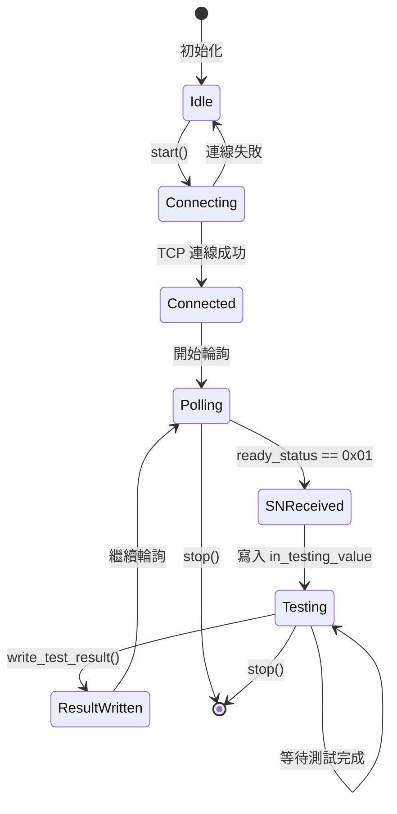

# Modbus 模組架構分析

**建立日期：** 2026-03-25

## 概述

WebPDTool 的 Modbus 模組是從桌面應用 PDTool4 遷移而來的 TCP Modbus 通訊系統，用於自動化測試環境中的序列號（SN）讀取和測試結果回寫。該模組採用全非同步設計，與 FastAPI 架構深度整合。

**主要功能：**
- 從 Modbus TCP 設備讀取產品序列號
- 自動觸發測試流程
- 測試完成後回寫 PASS/FAIL 結果
- 支援模擬模式（無需實體硬體）
- WebSocket 即時狀態通知

---

## 模組結構

```
backend/app/
├── models/
│   └── modbus_config.py          # SQLAlchemy ORM 模型
├── schemas/
│   └── modbus.py                 # Pydantic 驗證 Schema
├── api/
│   ├── modbus.py                 # REST API 路由
│   └── modbus_ws.py              # WebSocket 端點
├── services/modbus/
│   ├── __init__.py
│   ├── modbus_config.py          # 配置轉換工具
│   ├── modbus_listener.py        # 核心監聽服務
│   └── modbus_manager.py         # 單例管理器
└── services/
    └── test_engine.py            # 測試引擎整合
```

---

## 資料模型

### ModbusConfig ORM Model

**檔案：** `backend/app/models/modbus_config.py`

```python
class ModbusConfig(Base):
    __tablename__ = "modbus_configs"

    # 主鍵與關聯
    id: int (PK, autoincrement)
    station_id: int (FK -> stations.id, UNIQUE)

    # TCP 連線設定
    server_host: str = "127.0.0.1"
    server_port: int = 502
    device_id: int = 1              # Modbus 裝置位址 (slave address)
    enabled: bool = False
    delay_seconds: float = 1.0     # 輪詢延遲

    # 暫存器位址（十六進位字串格式）
    ready_status_address: str = "0x0013"    # 就緒狀態暫存器
    read_sn_address: str = "0x0064"         # SN 讀取位址
    test_status_address: str = "0x0014"     # 測試狀態暫存器
    test_result_address: str = "0x0015"     # 測試結果暫存器

    # 暫存器長度與值
    ready_status_length: int = 1
    read_sn_length: int = 11               # SN 佔用 11 個暫存器
    test_status_length: int = 1
    test_result_length: int = 1

    # 狀態值（十六進位字串）
    in_testing_value: str = "0x00"
    test_finished_value: str = "0x01"
    test_no_result: str = "0x00"
    test_pass_value: str = "0x01"
    test_fail_value: str = "0x02"

    # 模擬模式
    simulation_mode: bool = False

    # 時間戳記（Unix timestamp）
    created_at: int
    updated_at: int

    # 關聯
    station: Station (back_populates="modbus_config")
```

**關鍵設計決策：**
- 使用 `station_id` 唯一約束確保每個工站只有一組 Modbus 設定
- 暫存器位址儲存為十六進位字串（相容 PDTool4 格式）
- 支援 ModbusTools 記號法（如 "400022" 表示 holding register 22）

---

## Schema 層

**檔案：** `backend/app/schemas/modbus.py`

### Schema 類別

| Schema | 用途 |
|--------|------|
| `ModbusConfigBase` | 基礎欄位定義，包含十六進位驗證 |
| `ModbusConfigCreate` | 建立配置請求，需包含 `station_id` |
| `ModbusConfigUpdate` | 更新配置請求，所有欄位可選 |
| `ModbusConfigResponse` | API 回應格式 |
| `ModbusStatusResponse` | 監聽器狀態回應 |

### 十六進位驗證邏輯

```python
@field_validator([...])
@classmethod
def validate_hex_string(cls, v: str) -> str:
    # 接受 0x 前綴的十六進位字串
    if v.startswith('0x') or v.startswith('0X'):
        int(v, 16)
    # 或純數字字串（相容舊資料）
    elif not v.isdigit():
        raise ValueError('Hex address must start with 0x or 0X...')
    return v
```

---

## 服務層架構

### 1. ModbusListenerService（核心監聽服務）

**檔案：** `backend/app/services/modbus/modbus_listener.py`

#### 狀態機



#### 生命週期方法

| 方法 | 說明 |
|------|------|
| `start()` | 建立背景 asyncio 任務開始輪詢 |
| `stop()` | 取消任務並關閉 TCP 連線 |
| `_run_async()` | 主迴圈：處理連線、讀取 SN、錯誤恢復 |
| `inject_sn(sn)` | 模擬模式：手動注入 SN |
| `write_test_result(passed)` | 測試完成後回寫結果 |

#### 關鍵屬性

```python
# 控制旗標
running: bool          # 監聽器是否運行中
connected: bool        # TCP 連線狀態
_testing: bool         # 是否正在測試中（防止重入）
_testing_since: datetime  # 測試開始時間（逾時檢查）

# 統計資訊
cycle_count: int       # 輪詢次數
start_time: datetime   # 啟動時間
last_sn: str           # 最後接收的 SN
last_error: str        # 最後錯誤訊息

# 回呼函數（取代 Qt Signals）
on_sn_received: Callable[[str], None]
on_error: Callable[[str], None]
on_connected: Callable[[bool], None]
on_cycle: Callable[[int], None]
```

#### 輪詢流程（真實模式）

```
1. 檢查 TCP 連線，必要時重連
2. 檢查 _testing 逾時（5 分鐘自動清除）
3. 讀取 ready_status 暫存器
4. 若 ready_status == 0x01:
   a. 檢查 _testing 旗標，若為真則跳過
   b. 讀取 SN 暫存器（11 個 holding registers）
   c. 清除 ready_status（寫入 0x00）
   d. 寫入 test_status = in_testing_value
   e. 重置 test_result = no_result
   f. 設定 _testing = True, 記錄 _testing_since
   g. 解碼 SN（每個暫存器 2 個 ASCII 字元）
   h. 觸發 on_sn_received 回呼
5. 等待 delay_seconds
6. 迴圈
```

#### SN 解碼邏輯

```python
def _decode_sn(self, registers: list) -> str:
    """
    每個 16-bit 暫存器包含 2 個 ASCII 字元（高位元組、低位元組）
    例如：[0x4845, 0x4C4C, 0x4F00] -> "HELL" + '\0' -> "HELL"
    """
    ascii_string = ''.join(
        f"{chr(high_byte)}{chr(low_byte)}"
        for decimal_number in registers
        for high_byte, low_byte in [self._byte_offset(decimal_number)]
    )
    return ascii_string.replace('\0', '')
```

#### 測試結果回寫

```python
async def write_test_result(self, passed: bool) -> None:
    # 1. 寫入 test_status = test_finished_value (0x01)
    # 2. 寫入 test_result = test_pass_value (0x01) 或 test_fail_value (0x02)
    # 3. 讀取回驗證
    # 4. 清除 _testing 旗標
```

### 2. ModbusManager（單例管理器）

**檔案：** `backend/app/services/modbus/modbus_manager.py`

```python
class ModbusManager:
    """
    單例管理器，集中管理所有工站的 Modbus 監聽器
    """
    active_listeners: Dict[int, ModbusListenerService] = {}

    async def start_listener(config, callbacks) -> ModbusListenerService
    async def stop_listener(station_id) -> None
    async def stop_all() -> None
    def get_listener(station_id) -> Optional[ModbusListenerService]
    def get_status(station_id) -> Optional[Dict]
    def get_all_statuses() -> Dict[int, Dict]
    async def write_test_result(station_id, passed) -> bool
```

**責任：**
- 確保每個工站只有一個運行中的監聽器
- 提供集中式狀態查詢
- 協調測試結果寫入

### 3. modbus_config.py（配置轉換）

**檔案：** `backend/app/services/modbus/modbus_config.py`

```python
def modbus_config_to_dict(config) -> Dict[str, Any]:
    """
    將資料庫模型/Schema 轉換為 PDTool4 相容的字典格式
    鍵名遵循 PDTool4 慣例（如 ready_status_Add）
    """
    return {
        "ready_status_Add": config.ready_status_address,
        "ready_status_Len": hex(config.ready_status_length),
        "read_sn_Add": config.read_sn_address,
        "read_sn_Len": hex(config.read_sn_length),
        # ...
        "simulation_Mode": "1" if config.simulation_mode else "0",
        "Delay": str(int(config.delay_seconds))
    }
```

---

## API 層

### REST API（`/api/modbus`）

**檔案：** `backend/app/api/modbus.py`

| 端點 | 方法 | 說明 |
|------|------|------|
| `/configs` | GET | 取得所有配置 |
| `/configs` | POST | 建立新配置（驗證 station 存在） |
| `/configs/{id}` | GET | 取得特定配置 |
| `/configs/{id}` | PUT | 更新配置 |
| `/configs/{id}` | DELETE | 刪除配置 |
| `/stations/{station_id}/config` | GET | 取得工站配置 |
| `/status` | GET | 取得所有監聽器狀態 |
| `/status/{station_id}` | GET | 取得工站監聽器狀態 |

### WebSocket API（`/api/modbus/ws/{station_id}`）

**檔案：** `backend/app/api/modbus_ws.py`

#### 客戶端 → 伺服器訊息

| Action | 參數 | 說明 |
|--------|------|------|
| `subscribe` | - | 訂閱事件 |
| `start` | - | 啟動監聽器 |
| `stop` | - | 停止監聽器 |
| `get_status` | - | 查詢狀態 |
| `inject_sn` | `sn: str` | 模擬模式：注入 SN |
| `write_result` | `passed: bool` | 寫入測試結果 |
| `unsubscribe` | - | 取消訂閱 |

#### 伺服器 → 客戶端訊息

| Type | 資料 | 說明 |
|------|------|------|
| `status` | `data: {...}` | 狀態更新 |
| `sn_received` | `sn: str` | 接收到 SN |
| `error` | `message: str` | 錯誤訊息 |
| `connected_change` | `connected: bool` | 連線狀態變更 |
| `cycle_update` | `cycle_count: int` | 輪詢次數更新 |

#### ModbusConnectionManager

```python
class ModbusConnectionManager:
    active_connections: Dict[int, Set[WebSocket]]

    async def connect(websocket, station_id)
    def disconnect(websocket, station_id)
    async def send_to_station(station_id, message)
    async def broadcast(message)
```

**設計：** 每個工站維護獨立的 WebSocket 連線集合，支援多個客戶端同時監聽同一工站事件。

---

## 測試引擎整合

**檔案：** `backend/app/services/test_engine.py`

### 自動結果回寫

```python
async def _write_modbus_result(self, station_id: int, passed: bool) -> None:
    """
    測試會話完成後自動回寫結果到 Modbus 設備
    如果沒有運行中的監聽器則靜默跳過
    """
    try:
        written = await modbus_manager.write_test_result(station_id, passed)
        if written:
            self.logger.info(f"Wrote Modbus result: {'PASS' if passed else 'FAIL'}")
    except Exception as e:
        # 不讓 Modbus 寫入失敗影響測試會話
        self.logger.error(f"Failed to write Modbus result: {e}")
```

**呼叫時機：** 在 `_finalize_session()` 中，測試會話完成並生成報告後自動呼叫。

---

## 完整執行流程

### 1. 監聽器啟動流程

```
前端 (TestMain.vue)
    ↓ WebSocket: {"action": "start"}
modbus_ws.py
    ↓ 從資料庫載入 ModbusConfig
    ↓ 建立 ModbusConfigCreate
    ↓ 設定回呼函數 (on_sn_received, on_error, on_connected, on_cycle)
modbus_manager.start_listener()
    ↓ 建立 ModbusListenerService
    ↓ 呼叫 listener.start()
modbus_listener.start()
    ↓ 建立 asyncio.create_task(_run_async)
    ↓ 設定 running = True
    ↓
_run_async() 主迴圈
```

### 2. SN 讀取與測試觸發流程

```
_run_async() 輪詢迴圈
    ↓
讀取 ready_status 暫存器
    ↓ 值 == 0x01
_read_sn_async()
    ↓ 1. 檢查 _testing 旗標（防止重入）
    ↓ 2. 讀取 SN 暫存器 (11 個 registers)
    ↓ 3. 清除 ready_status (寫入 0x00)
    ↓ 4. 寫入 test_status = in_testing (0x00)
    ↓ 5. 重置 test_result = no_result (0x00)
    ↓ 6. 設定 _testing = True, _testing_since = now
    ↓ 7. 解碼 SN 暫存器值為 ASCII 字串
    ↓
on_sn_received(sn) 回呼
    ↓
ws_manager.send_to_station()
    ↓
前端收到 WebSocket: {"type": "sn_received", "sn": "..."}
    ↓ 自動填入 SN 並啟動測試
前端呼叫 POST /api/tests/sessions/start
    ↓
test_engine.execute_test_session()
    ↓ [執行測試]
    ↓
_finalize_session()
    ↓ 呼叫 _write_modbus_result()
    ↓
modbus_manager.write_test_result(station_id, passed)
    ↓
listener.write_test_result(passed)
    ↓ 1. 寫入 test_status = finished (0x01)
    ↓ 2. 寫入 test_result = pass/fail (0x01/0x02)
    ↓ 3. 讀取回驗證
    ↓ 4. 清除 _testing = False
```

### 3. 模擬模式流程

```
simulation_mode = true
    ↓
_run_async() 檢測模擬模式
    ↓ 跳過 TCP 連線，設定 connected = True
    ↓ 進入 idle 迴圈，等待 inject_sn()
前端 WebSocket: {"action": "inject_sn", "sn": "TEST123"}
    ↓
listener.inject_sn("TEST123")
    ↓ 設定 last_sn = "TEST123"
    ↓ 觸發 on_sn_received("TEST123")
    ↓
[測試執行...]
    ↓
前端 WebSocket: {"action": "write_result", "passed": true}
    ↓
listener.write_test_result(True)
    ↓ [模擬模式跳過實體寫入]
    ↓ 清除 _testing = False
```

---

## 與 PDTool4 的差異

| 特性 | PDTool4 | WebPDTool |
|------|---------|-----------|
| 執行緒模型 | QThread | asyncio Task |
| 事件通知 | Qt Signals | 回呼函數 + WebSocket |
| 配置來源 | INI 檔案 | 資料庫 (modbus_configs 表) |
| 生命週期管理 | 手動管理 | ModbusManager 單例 |
| 錯誤處理 | Qt Exception | asyncio.CancelledError |
| 非同步支援 | 否 | 是 (AsyncModbusTcpClient) |

---

## 關鍵實作細節

### 1. 地址轉換 (`_str2hex`)

```python
def _str2hex(self, hex_str: str) -> int:
    """
    支援兩種格式：
    1. 十六進位字串: "0x0013" -> 19
    2. ModbusTools 記號法: "400022" -> 21 (400001-based holding register)
    """
    if hex_str.lower().startswith("0x"):
        return int(hex_str, 16)
    val = int(hex_str, 10)
    if val >= 400001:  # Holding register notation
        return val - 400001
    return val
```

### 2. 防重入機制

```python
# _testing 旗標防止同一 SN 在測試期間重複觸發
if self._testing:
    logger.debug("SN read skipped, previous test still in progress")
    return

# 逾時自動清除（5 分鐘）
if self._testing and self._testing_since:
    elapsed = (datetime.utcnow() - self._testing_since).total_seconds()
    if elapsed > 300:
        self._testing = False
        self._testing_since = None
```

### 3. 自動重連邏輯

```python
while self.running:
    if not self.client.connected:
        connected = await self.client.connect()
        if not connected:
            # 通知連線斷開
            if self.connected:
                self.connected = False
                if self.on_connected:
                    self.on_connected(False)
            # 等待後重試
            await asyncio.sleep(delay_time)
            continue

    # 首次連線成功通知
    if not self.connected:
        self.connected = True
        if self.on_connected:
            self.on_connected(True)
```

---

## 資料庫遷移

**遷移檔案：** `backend/alembic/versions/d31e415c57a9_add_modbus_config_table.py`

```python
def upgrade() -> None:
    op.create_table(
        'modbus_configs',
        # ... 23 個欄位 ...
        sa.ForeignKeyConstraint(['station_id'], ['stations.id']),
        sa.UniqueConstraint('station_id')
    )
    op.create_index('ix_modbus_configs_station_id', ...)
```

---

## 測試涵蓋

相關測試檔案：
- `tests/test_models/test_modbus_config_model.py` - ORM 模型測試
- `tests/test_schemas/test_modbus_schemas.py` - Schema 驗證測試
- `tests/test_services/test_modbus_listener_service.py` - 監聽器單元測試
- `tests/test_services/test_modbus_manager.py` - 管理器測試
- `tests/test_services/test_modbus_ws.py` - WebSocket 測試
- `tests/test_services/test_modbus_integration.py` - 整合測試
- `tests/test_services/test_modbus_e2e.py` - 端到端測試

---

## 配置建議

### 生產環境

```python
{
    "server_host": "192.168.1.100",  # 實體 Modbus 設備 IP
    "server_port": 502,
    "device_id": 1,
    "enabled": true,
    "delay_seconds": 1.0,
    "simulation_mode": false
}
```

### 開發/測試環境

```python
{
    "server_host": "127.0.0.1",
    "server_port": 502,
    "device_id": 1,
    "enabled": true,
    "delay_seconds": 0.5,  # 更短的延遲
    "simulation_mode": true  # 使用模擬模式
}
```

---

## 故障排除

### 常見問題

| 症狀 | 原因 | 解決方案 |
|------|------|----------|
| `Cannot connect to Modbus server` | IP/埠錯誤或設備離線 | 檢查 `server_host` 和 `server_port` |
| SN 重複觸發 | ready_status 未清除 | 確認 `_read_sn_async` 中的清除邏輯 |
| 測試結果未回寫 | 監聽器已停止 | 確認 `running` 狀態 |
| `_testing` 逾時 | write_result 未呼叫 | 檢查測試引擎整合 |

### 除錯日誌

```python
logger.info(f"[Modbus] {host}:{port} ReadHoldingReg addr=0x{addr:04X} -> 0x{val:04X}")
logger.error(f"Modbus operation error: {e}")
logger.warning(f"Station {station_id}: _testing timed out after {elapsed:.0f}s")
```

---

## 相關文件

- [架構索引](./ARCHITECTURE_INDEX.md)
- [測試引擎架構](./core_application.md)
- [API 路由結構](../api/README.md)
