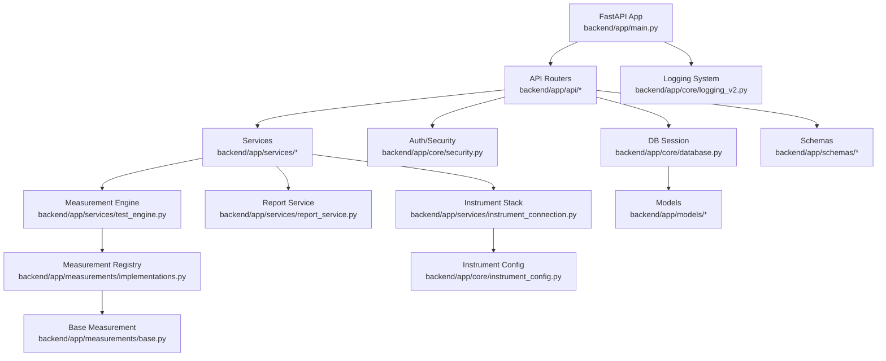
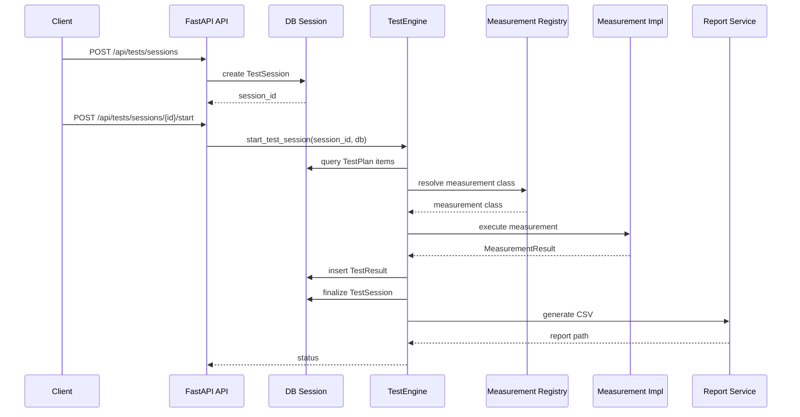

# Backend Codebase Analysis (WebPDTool)

## Overview
The backend is a FastAPI application with a classic layered structure:
- API routers in `backend/app/api`
- Core utilities (config, logging, DB, security) in `backend/app/core`
- SQLAlchemy models in `backend/app/models`
- Pydantic schemas in `backend/app/schemas`
- Business logic in `backend/app/services`
- Measurement system in `backend/app/measurements`
- Alembic migrations in `backend/alembic`
- Tests in `backend/tests`

`backend/app/main.py` is the entry point. It initializes logging, configures CORS, registers routers, and starts a Redis log flusher if enabled.

## Key Subsystems

### API Layer
- Central router wiring occurs in `backend/app/main.py`.
- Primary endpoints are defined in `backend/app/api/*`.
- Test execution endpoints are in `backend/app/api/tests.py`.
- Measurement results reporting is under `backend/app/api/results/`.

### Database Layer
- `backend/app/core/database.py` defines a **sync** SQLAlchemy engine, `SessionLocal`, and `Base`.
- Models are standard declarative ORM classes (e.g., `backend/app/models/testplan.py`).
- Repositories like `backend/app/repositories/instrument_repository.py` wrap data access.

### Measurement System
- Abstract base, validation logic, and limit/value types are in `backend/app/measurements/base.py`.
- Implementations and dispatch registry are in `backend/app/measurements/implementations.py`.
- Registry supports command, console, comport, tcpip, and device-specific measurement classes.

### Test Execution
- `backend/app/services/test_engine.py` orchestrates full test sessions.
- It loads plan items, dispatches measurement classes, stores results, and finalizes sessions.
- It also triggers report generation after test completion.

### Instruments
- Instrument configuration models and loaders are in `backend/app/core/instrument_config.py`.
- Connection management and drivers live in `backend/app/services/instrument_connection.py` and `backend/app/services/instruments/`.
- A global instrument provider is initialized at startup, with DB-backed support when possible.

### Reporting
- `backend/app/services/report_service.py` generates CSV reports when a test session completes.
- Reports are organized by project, station, and date with a predictable filename format.

### Logging
- `backend/app/core/logging_v2.py` provides structured logging with contextvars, optional Redis streaming, and log file rotation.

## Execution Flow (Typical Test Session)
1. Client creates a test session via API.
2. `TestEngine.start_test_session()` enqueues background execution.
3. The engine loads test plan items for the station.
4. Each item is translated into a dict and mapped to a measurement class via registry.
5. Measurements run sequentially; results are persisted to DB.
6. Session is finalized and a CSV report is generated.

## Module Relationship Diagram

## Data Flow Diagram (Test Execution)

## Notable Risks / Gaps
- **Async endpoints + sync DB**: FastAPI handlers are `async`, but DB operations use sync SQLAlchemy (`SessionLocal`). This can block the event loop under load.
- **Background task uses request-scoped DB session**: `start_test_session()` passes the same `db` session into a background task; the session may be closed after the request ends.
- **Guideline mismatch**: AGENTS.md requires SQLAlchemy 2.0 async usage, but the backend currently uses sync patterns.
- **Startup DB session leak**: `backend/app/main.py` opens a sync session for instrument config provider and does not close it.
- **Command execution exposure**: `OtherMeasurement` can execute arbitrary shell commands from DB fields; treat test plan inputs as sensitive.
- **Logging user context**: `set_user_context` is not wired as middleware in `backend/app/main.py`, so request user ID might not be attached to logs unless explicitly invoked.

## Suggested Follow-Ups
- Migrate DB layer to SQLAlchemy 2.0 async and update API dependencies accordingly.
- Avoid passing a request-scoped `db` into background tasks; create a new session inside the background worker.
- Close the startup DB session used for the instrument provider.
- Review `OtherMeasurement` execution paths for security constraints.
