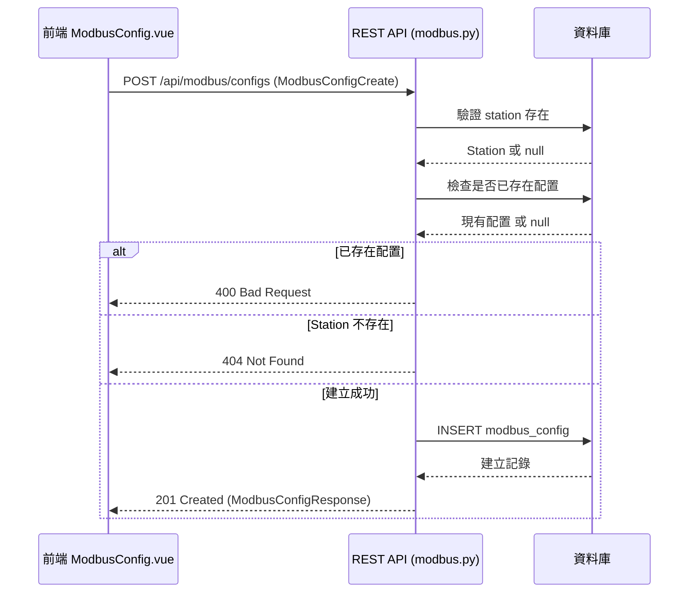
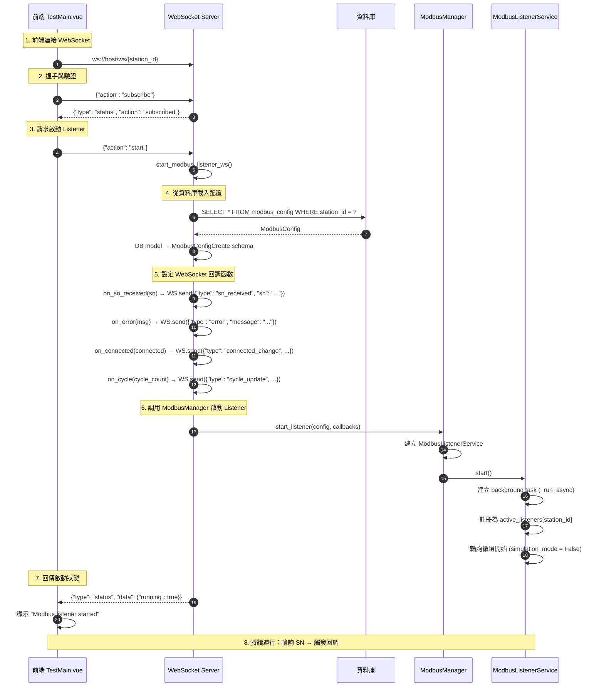
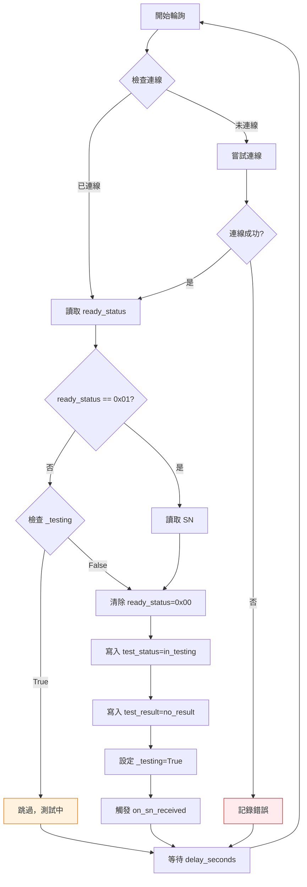
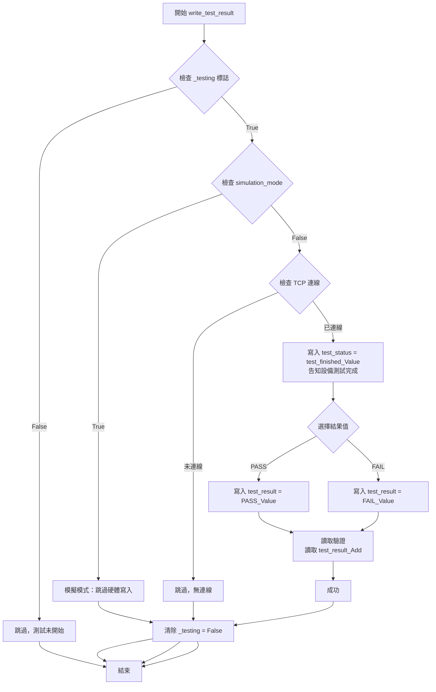
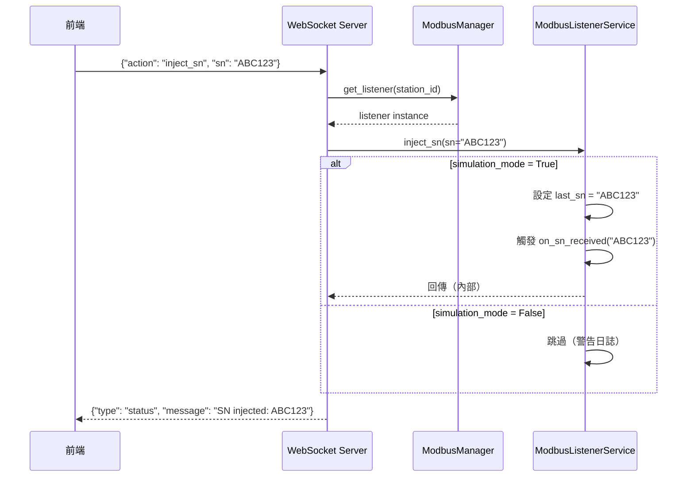
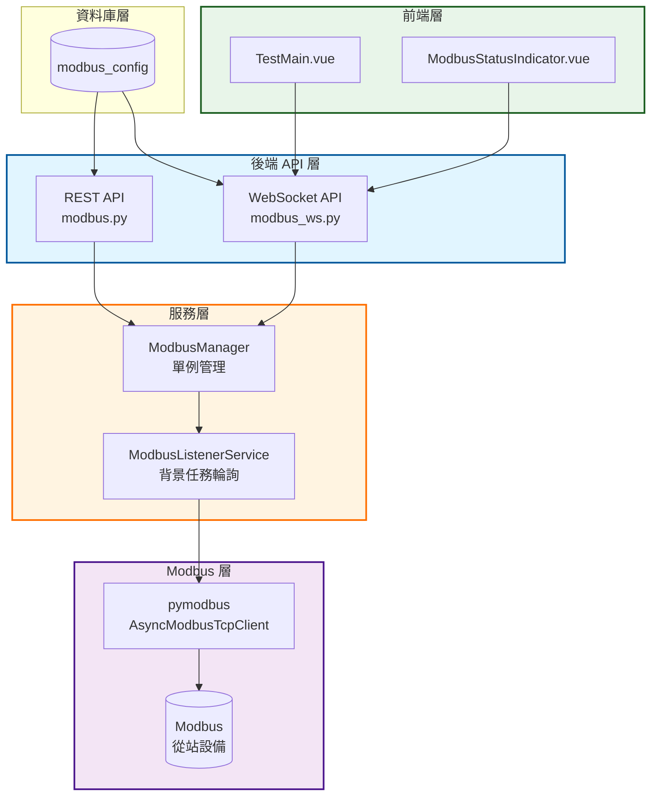
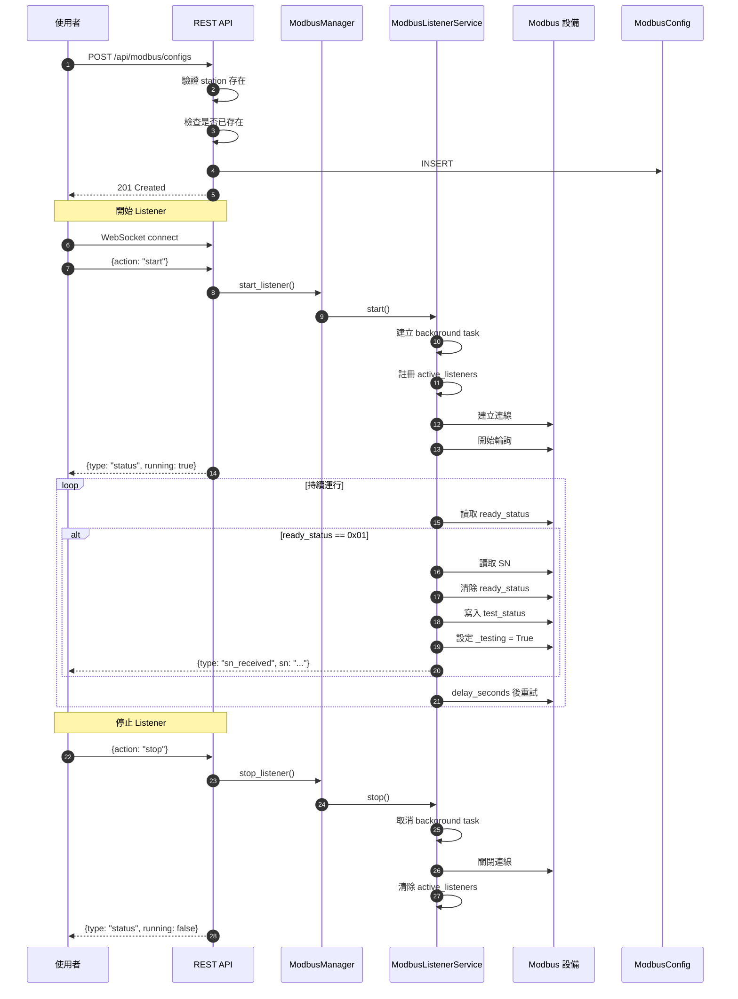
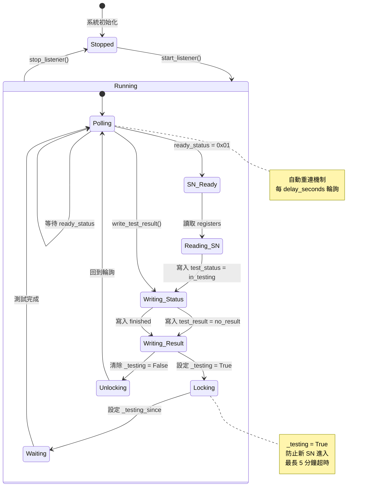
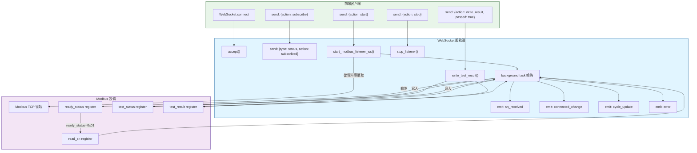
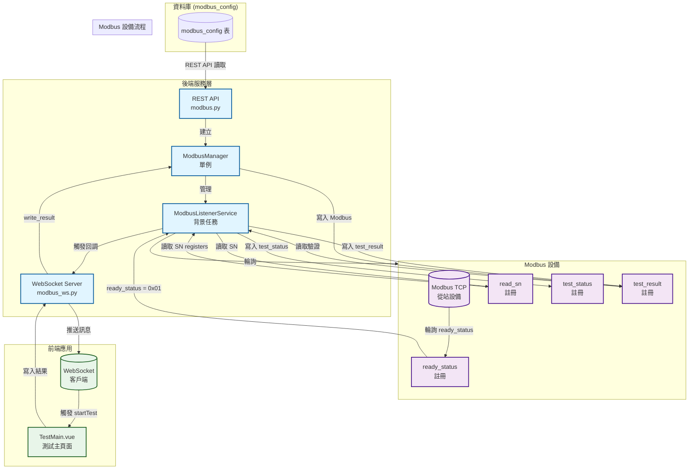

# WebPDTool Modbus 架構完整說明

## 目錄
- [核心元件與檔案結構](#一核心元件與檔案結構)
- [完整流程說明](#二完整流程說明)
- [關鍵設計模式與機制](#三關鍵設計模式與機制)
- [前端整合](#四前端整合)
- [常見問題與處理](#五常見問題與處理)
- [Mermaid 圖表總結](#mermaid-圖表總結)

---

## 一、核心元件與檔案結構

### 1. REST API 層 (backend/app/api/modbus.py)

| 方法 | 路由 | 說明 |
|------|------|------|
| GET | `/api/modbus/configs` | 獲取所有配置 |
| POST | `/api/modbus/configs` | 建立新配置 |
| PUT | `/api/modbus/configs/{id}` | 更新配置 |
| DELETE | `/api/modbus/configs/{id}` | 刪除配置 |
| GET | `/api/modbus/configs/{station_id}/config` | 按 station 獲取 |
| GET | `/api/modbus/status` | 獲取所有 listener 狀態 |
| GET | `/api/modbus/status/{station_id}` | 獲取單一 station 狀態 |

**核心功能：** 資料庫 CRUD、Station 驗證、全站狀態查詢、需要認證

---

### 2. WebSocket API 層 (backend/app/api/modbus_ws.py)

**路由：** `ws://host/ws/{station_id}`

**客戶端 → 服務端：**
| Action | 說明 |
|--------|------|
| `subscribe` | 訂閱該 station |
| `start` | 啟動 Modbus listener |
| `stop` | 停止 listener |
| `get_status` | 獲取當前狀態 |
| `inject_sn` | 模擬模式：注入序列號 |
| `write_result` | 寫入測試結果 |

**服務端 → 客戶端事件：**
| Type | 說明 |
|------|------|
| `status` | 狀態更新 |
| `sn_received` | 收到序列號 |
| `error` | 錯誤訊息 |
| `connected_change` | TCP 連線狀態變化 |
| `cycle_update` | 輪詢週期更新 |

**核心類別：** `ModbusConnectionManager`、`modbus_websocket()`

---

### 3. Service 層 (backend/app/services/modbus/)

| 檔案 | 職責 | 關鍵功能 |
|------|------|----------|
| `modbus_manager.py` | **ModbusManager 單例** | 管理所有 listener 生命週期、集中控制、狀態查詢 |
| `modbus_listener.py` | **ModbusListenerService** | Modbus TCP 通訊、輪詢、讀寫註冊、SN 解碼 |
| `modbus_config.py` | 配置轉換 | `modbus_config_to_dict()` - PDTool4 相容格式轉換 |

---

### 4. 資料庫模型 (backend/app/models/modbus_config.py)

**ModbusConfig 表欄位：**

| 欄位 | 類型 | 說明 |
|------|------|------|
| id | int (PK) | 主鍵 |
| station_id | int (FK) | 關聯 stations |
| server_host | str | Modbus TCP 伺服器位址 |
| server_port | int | Modbus TCP連接埠 |
| device_id | int | 從站 ID |
| enabled | bool | 是否啟用 |
| simulation_mode | bool | 模擬模式 |
| delay_seconds | int | 輪詢間隔（秒） |
| ready_status_address | str | Ready 狀態註冊位址 |
| ready_status_length | int | 讀取長度 |
| read_sn_address | str | SN 註冊位址 |
| read_sn_length | int | SN 讀取長度 |
| test_status_address | str | 測試狀態註冊位址 |
| test_status_length | int | 測試狀態長度 |
| in_testing_value | str | 測試中值 |
| test_finished_value | str | 測試完成值 |
| test_result_address | str | 測試結果註冊位址 |
| test_result_length | int | 結果長度 |
| test_no_result | str | 無結果值 |
| test_pass_value | str | PASS 值 |
| test_fail_value | str | FAIL 值 |
| created_at | datetime | 建立時間 |
| updated_at | datetime | 更新時間 |

---

## 二、完整流程說明

### A. Modbus 配置管理流程



**關鍵邏輯：**
```python
# 驗證 station 存在
result = await db.execute(select(Station).where(Station.id == config.station_id))
station = result.scalar_one_or_none()
if not station:
    raise HTTPException(status_code=404, detail="Station not found")

# 檢查是否已存在配置
existing = await db.execute(
    select(ModbusConfigModel).where(ModbusConfigModel.station_id == config.station_id)
)
if existing.scalar_one_or_none():
    raise HTTPException(status_code=400, detail="Modbus configuration already exists")

# 建立配置
db_config = ModbusConfigModel(**config.model_dump())
db.add(db_config)
await db.commit()
await db.refresh(db_config)
```

---

### B. Modbus Listener 啟動流程（完整串聯）



---

### C. 輪詢機制與狀態機

#### `ModbusListenerService._run_async()` 主循環



#### `_read_sn_async()` SN 讀取流程

```mermaid
flowchart TD
    A[開始 _read_sn_async] --> B[讀取 SN registers<br/>read_sn_Add, read_sn_Len]
    B --> C{檢查 _testing 標誌}
    C -->|True| D[跳過，測試進行中]
    D --> Z[結束]
    C -->|False| E[清除 ready_status = 0x00<br/>防止重複觸發]
    E --> F[寫入 test_status = in_testing_Value<br/>告知設備開始測試]
    F --> G[寫入 test_result = test_no_Result<br/>重置測試結果]
    G --> H[設定 _testing = True<br/>鎖定，防止新 SN 進入]
    H --> I[設定 _testing_since = datetime.utcnow]
    I --> J[回調 on_sn_received sn]
    J --> K[WebSocket 推送至前端<br/>{type: sn_received, sn: ...}]
    K --> Z[結束]
```

#### `write_test_result()` 測試結果寫入流程



---

### D. 模擬模式機制

#### 目的
在無實體 Modbus 設備時測試前端流程

#### 實作差異

| 模式 | TCP 連線 | SN 來源 |
|------|----------|---------|
| **實際模式** (simulation_mode = False) | 建立 AsyncModbusTcpClient | 從 Modbus 設備讀取 |
| **模擬模式** (simulation_mode = True) | 跳過 TCP 連線 | 透過 inject_sn 注入 |

#### 注入流程（模擬模式）



---

## 三、關鍵設計模式與機制

### 1. 單例模式 (Singleton)

**ModbusManager 單例：**
```python
class ModbusManager:
    def __init__(self):
        self.active_listeners: Dict[int, ModbusListenerService] = {}
        self._lock = asyncio.Lock()

modbus_manager = ModbusManager()  # 全局單例
```

**優點：** 確保每個 station 最多一個 listener、統一管理狀態、簡化查詢和監控

---

### 2. 回調函數模式 (Callbacks)

**替代 Qt Signal/Slot：**
```python
listener.on_sn_received = on_sn_received
listener.on_error = on_error
listener.on_connected = on_connected
listener.on_cycle = on_cycle
```

**好處：** 不依賴 Qt 框架、適配 FastAPI 非同步環境、前後端解耦

---

### 3. WebSocket 連接管理

```python
class ModbusConnectionManager:
    active_connections: Dict[int, Set[WebSocket]]

    async def connect(self, websocket: WebSocket, station_id: int):
        await websocket.accept()
        if station_id not in self.active_connections:
            self.active_connections[station_id] = set()
        self.active_connections[station_id].add(websocket)
```

**多連接支援：** 多個前端頁面可同時監控同一個 station

---

### 4. 測試狀態鎖定機制

```python
# _testing 標誌保護
if self._testing:
    logger.debug("Skipping SN read, test in progress")
    return

# 設定測試中
self._testing = True
self._testing_since = datetime.utcnow()

# 測試完成後清除
self._testing = False
self._testing_since = None

# 5 分鐘超時保護
if elapsed > 300s:
    logger.warning("Timeout, clearing _testing flag")
    self._testing = False
```

**目的：** 確保每次 SN 完整測試後才接受新 SN，避免狀態衝突

---

### 5. 註冊位址格式處理

**兩種格式支援：**

| 格式 | 範例 | 說明 |
|------|------|------|
| **十六進位值** | `"0x01"` → `1` | Value 場位 |
| **十進位 ModbusTools 位址** | `"400022"` → `21` | Address 場位（0-based wire address） |

**關鍵代碼：**
```python
def _str2hex(self, hex_str: str) -> int:
    # "0x01" → 1
    if hex_str.lower().startswith("0x"):
        return int(hex_str, 16)

    # "400022" → 21 (400001-based, 0-based = 400022-400001=21)
    val = int(hex_str, 10)
    if val >= 400001:
        return val - 400001
    return val
```

---

### 6. SN 解碼（位元組組合）

**每個 register = 2 個 ASCII 字元（high, low byte）**

```python
def _decode_sn(self, registers: list) -> str:
    ascii_string = ''.join(
        f"{chr(high_byte)}{chr(low_byte)}"
        for decimal_number in registers
        for high_byte, low_byte in [self._byte_offset(decimal_number)]
    )
    return ascii_string.replace('\0', '')

def _byte_offset(self, decimal_number: int) -> tuple:
    high_byte = (decimal_number >> 8) & 0xFF
    low_byte = decimal_number & 0xFF
    return high_byte, low_byte
```

**範例：** `Register [0x4142] → "AB"`, `Register [0x3043] → "0C"` → `"ABC0"`

---

## 四、前端整合

### 1. TestMain.vue 中的 Modbus 集成

```javascript
// 前端監聽 SN received
onSNReceived = (sn) => {
    this.serialNumber = sn
    this.startTest()  // 啟動測試
}

// 測試完成後寫入結果
afterTestComplete = async (passed) => {
    await this.$root.$ws.send({
        action: 'write_result',
        passed: passed
    })
}
```

**關鍵邏輯：** SN 收到 → 自動觸發測試 → 測試結果 → 寫入 Modbus 設備

---

### 2. ModbusStatusIndicator.vue

顯示即時狀態：`running`、`connected`、`cycle_count`、`last_sn`、`error_message`

---

### 3. WebSocket 連線管理

```javascript
// 連接
this.$root.$ws = new WebSocket('ws://host/ws/' + this.stationId)

// 訂閱
this.$root.$ws.send(JSON.stringify({ action: 'subscribe' }))

// 處理訊息
this.$root.$ws.onmessage = (event) => {
    const data = JSON.parse(event.data)
    if (data.type === 'sn_received') {
        this.onSNReceived(data.sn)
    } else if (data.type === 'connected_change') {
        this.connected = data.connected
    }
}

// 斷線處理
this.$root.$ws.onclose = () => {
    this.connected = false
}
```

---

## 五、常見問題與處理

### 1. TCP 連線斷裂與重連

**自動重連機制：** 在 `_run_async()` 主循環中檢查連線狀態，失敗時等待 `delay_seconds` 後重試

**心跳保持：** 每 `delay_seconds` 輪詢一次，確保連線活性

---

### 2. 註冊位址錯誤

**常見錯誤：**
- 混淆 ModbusTools 位址（400001-based）和實際 wire 位址（0-based）
- Hex 字串缺少 `0x` 前綴
- 位址長度設定錯誤

**解決方案：** 使用 `_str2hex()` 統一轉換

---

### 3. SN 解碼失敗

**原因：** Register 值不是有效的 ASCII、位元組順序錯誤、Register 數量不足

**解決方案：** 使用 `_byte_offset()` 正確拆分位元組

---

### 4. 測試狀態未清除

**可能原因：** `write_test_result()` 未被呼叫、模擬模式下未呼叫 `inject_sn()`、`_testing_timeout_seconds` 超時未觸發

**超時保護：**
```python
if self._testing and self._testing_since:
    elapsed = (datetime.utcnow() - self._testing_since).total_seconds()
    if elapsed > self._testing_timeout_seconds:
        logger.warning(f"Timeout, clearing _testing flag after {elapsed:.0f}s")
        self._testing = False
        self._testing_since = None
```

---

### 5. 多連接競爭條件

**處理方式：**
```python
# ModbusManager 使用 asyncio.Lock 防止競爭
async with self._lock:
    if config.station_id in self.active_listeners:
        return self.active_listeners[config.station_id]
    # ...
    self.active_listeners[config.station_id] = listener
```

---

## Mermaid 圖表總結

### A. 系統架構圖



---

### B. Listener 生命週期流程



---

### C. 測試狀態機



---

### D. 訊息交互流程



---

### E. 完整數據流圖



---

## 六、相關檔案清單

### 後端檔案
- `backend/app/api/modbus.py` - REST API
- `backend/app/api/modbus_ws.py` - WebSocket API
- `backend/app/services/modbus/modbus_manager.py` - ModbusManager 單例
- `backend/app/services/modbus/modbus_listener.py` - ModbusListenerService
- `backend/app/services/modbus/modbus_config.py` - 配置轉換
- `backend/app/models/modbus_config.py` - 資料庫模型
- `backend/app/schemas/modbus.py` - Pydantic schemas

### 前端檔案
- `frontend/src/views/TestMain.vue` - 測試主頁面（Modbus 集成）
- `frontend/src/views/ModbusConfig.vue` - Modbus 配置頁面
- `frontend/src/components/ModbusStatusIndicator.vue` - 狀態指示器
- `frontend/src/api/modbus.js` - Modbus API 客戶端

### 參考文件
- PDTool4 ModbusListener.py - 原始實作
- pymodbus 文件 - Modbus 通訊庫

---

## 七、更新日期

- **建立日期：** 2026-03-26
- **版本：** 2.0
- **作者：** Claude Code (glm-4.7-flash)

---

## 八、版本歷史

| 版本 | 日期 | 變更內容 |
|------|------|----------|
| 1.0 | 2026-03-26 | 初始版本，完整架構文件 |
| 1.1 | 2026-03-26 | 新增 Mermaid 圖表總結章節，包含 5 個 Mermaid 圖表 |
| 2.0 | 2026-03-26 | **優化版本**：移除冗餘內容，重構章節結構，使用表格整理列表資訊，精簡代碼範例 |
