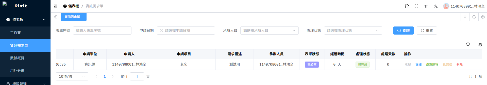
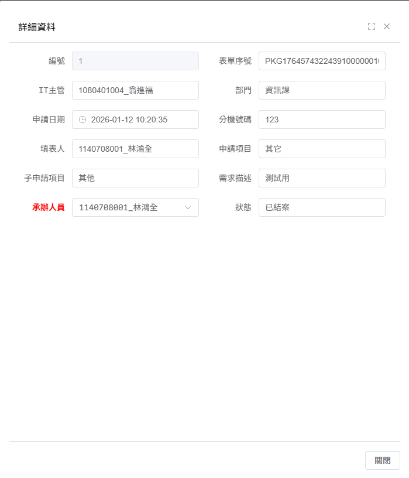
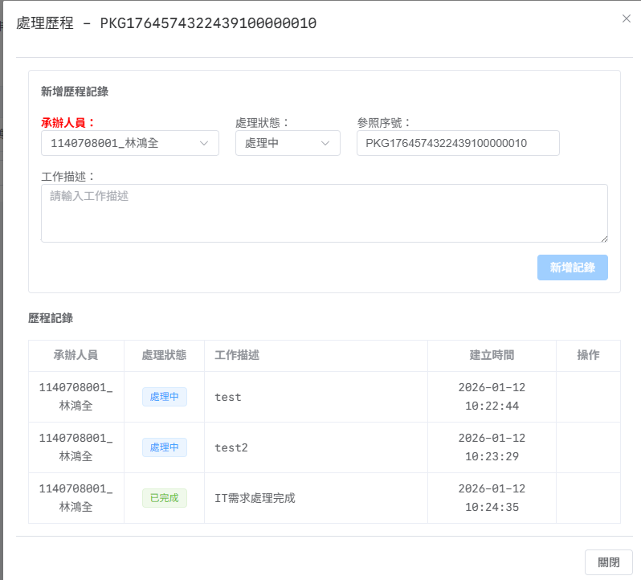

# 資訊需求單報表系統使用說明

## 系統存取資訊

- **報表網址**: https://bpmweb.ggcluster.com/dashboard/it
- **登入帳號**: 個人工號
- **初始密碼**: 個人工號（首次登入時系統會要求修改密碼）

## 系統功能介紹

### 1. 承辦功能
由負責人承接此工單，系統會自動紀錄承辦人員姓名。

**操作步驟:**
1. 點擊「承辦」按鈕
2. 系統自動記錄當前登入使用者為承辦人
3. 工單狀態更新為「處理中」

### 2. 詳細資料
顯示 BPM 上的完整表單資料，包含需求單的所有詳細資訊。

**顯示內容包含:**
- 需求單號
- 申請人
- 需求單標題
- 需求內容說明
- 預計完成日
- 附件
- 申請日期

### 3. 處理歷程功能
讓承辦人員能夠填寫和查看目前的處理情況，追蹤工單處理進度。

**功能說明:**
- 記錄每次處理的時間點
- 填寫處理說明和進度更新
- 上傳相關處理文件或證明
- 追蹤問題解決過程

### 4. 完成功能
處理完成後，使用 BPM 自動簽核到「使用者測試」關卡。

**操作說明:**
1. 確認所有處理項目已完成
2. 填寫完整的處理歷程
3. 點擊「完成」按鈕
4. 系統自動將工單轉至使用者測試關卡

## 系統自動化功能

### BPM 表單狀態更新
- 系統會自動更新 BPM 表單的處理狀態
- 計算並顯示工單經過天數
- 同步處理進度至 BPM 系統

### 處理狀態追蹤
- 自動更新工單的處理狀態
- 計算處理天數，協助追蹤處理效率
- 提供即時的進度回饋

## 注意事項

1. 首次登入請務必修改初始密碼，確保帳號安全
2. 承辦工單後請定期更新處理歷程，保持資訊透明
3. 完成工單前請確認所有處理項目都已妥善記錄
