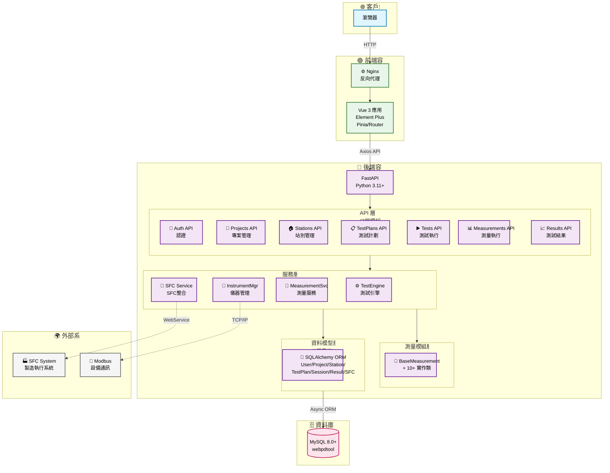

# Mermaid 架構圖優化 Prompt - 進階版

## 使用時機
適用於需要精細控制架構圖各項細節，建立專業級的系統架構文檔。

---

## Prompt 內容

請優化 README.md 中的「整體系統架構圖」Mermaid UML，要求：

## 布局設計
- **主圖**：使用 `graph TB`（垂直流向），適合螢幕寬高比
- **後端子圖各層級**：使用 `direction TB` 保持一致性
- **確保**：嵌套 subgraph 層級清晰，避免視覺混亂

## 字型與節點控制
- **主層級**：`font-size:20px`
  - Client, Frontend, Backend, Database, External
- **子層級**：`font-size:18px`
  - API, Services, Measurements, Models
- **節點寬度設定**（防止文字遮蔽）：
  - API 節點：140-170px
  - Service 節點：150-170px
  - Model 節點：200px

## 樣式定義
保持以下色彩方案：
```mermaid
classDef clientStyle fill:#e1f5ff,stroke:#0277bd,stroke-width:2px,color:#000
classDef frontendStyle fill:#e8f5e9,stroke:#2e7d32,stroke-width:2px,color:#000
classDef backendStyle fill:#f3e5f5,stroke:#6a1b9a,stroke-width:2px,color:#000
classDef dbStyle fill:#fce4ec,stroke:#c2185b,stroke-width:2px,color:#000
classDef externalStyle fill:#f5f5f5,stroke:#616161,stroke-width:2px,color:#000
```

## 連線規則
- **實線（`-->`）**：主要流程連線
- **虛線（`-.->`）**：外部系統連線（SFC、Modbus）
- **簡化**：API→Services→Models 連線，避免過多交叉線

## 節點命名
- 使用 Emoji 圖示增強識別：
  - 🌐 客戶端、🟢 前端、🚀 後端、🗄️ 資料庫、🌍 外部
  - 🔐 認證、📁 專案、🏠 站別、📋 測試計劃、▶️ 測試執行、📊 測量、📈 結果
- 中英文並列標籤：
  ```
  AuthAPI["🔐 Auth API<br/>認證"]
  ProjectsAPI["📁 Projects API<br/>專案管理"]
  ```
- 避免過長描述，改用圖例說明

## 節點合併策略
- **API 層**：7 個模組合併顯示
- **服務層**：4 個服務合併顯示
- **資料模型層**：7 個表格合併顯示
- **測量模組層**：BaseMeasurement + 實作類合併

## 完整範例



---

## 檢查清單

完成後請確認：
- [ ] 所有節點文字完整顯示，無遮蔽
- [ ] 字型大小一致（主層級 20px，子層級 18px）
- [ ] Emoji 圖示正確顯示
- [ ] 色彩方案統一
- [ ] 連線清晰無交叉
- [ ] 子圖布局方向正確
- [ ] 寬高比適合螢幕顯示

---

## 進階技巧

### 1. 動態調整節點大小
```mermaid
style NodeName width:150px,height:60px
```

### 2. 自訂節點形狀
```mermaid
Node["文字"] - 矩形（預設）
Node(["文字"]) - 圓角矩形
Node[("文字")] - 圓柱體（資料庫）
Node(("文字")) - 圓形
```

### 3. 連線標籤
```mermaid
A -->|標籤文字| B
A -.->|虛線標籤| B
```

### 4. 樣式繼承
```mermaid
classDef baseStyle fill:#fff,stroke:#000,stroke-width:2px
classDef extendedStyle fill:#f0f0f0,stroke:#000,stroke-width:2px

class Node1,Node2 baseStyle
class Node3 extendedStyle
```
