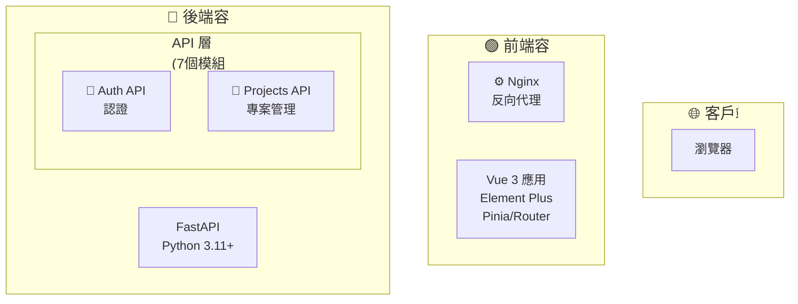

# Mermaid 架構圖優化 Prompt - 基礎版

## 使用時機
適用於初次優化 Mermaid UML 架構圖，建立清晰的視覺結構。

---

## Prompt 內容

請優化 README.md 中的「整體系統架構圖」Mermaid UML，要求：

### 1. 布局方向
- 主圖使用 `graph TB` (Top-Bottom) 垂直流向
- API 層子圖使用 `direction TB` 保持一致性
- 確保適合螢幕寬高比

### 2. 字型大小
- 主層級（Client/Frontend/Backend/Database/External）：`font-size:20px`
- 子層級（API/Services/Measurements/Models）：`font-size:18px`

### 3. 防止文字遮蔽
- 為每個節點設定 `width` 樣式（範圍：140-200px）
- 使用 `<br/>` 換行而非過長文字
- 保持節點標籤簡潔清晰

### 4. 視覺元素
- 保留 Emoji 圖示增強識別度
- 保持色彩樣式（藍/綠/紫/粉/灰）
- 簡化連線，使用虛線表示外部系統連線

### 5. 節點合併
- 7 個 API 合併為「API 層 (7個模組)」
- 4 個 Services 合併為「服務層 (4個)」
- 7 個 Models 合併為「資料模型層 (7個表格)」

### 6. 樣式定義
```mermaid
classDef clientStyle fill:#e1f5ff,stroke:#0277bd,stroke-width:2px,color:#000
classDef frontendStyle fill:#e8f5e9,stroke:#2e7d32,stroke-width:2px,color:#000
classDef backendStyle fill:#f3e5f5,stroke:#6a1b9a,stroke-width:2px,color:#000
classDef dbStyle fill:#fce4ec,stroke:#c2185b,stroke-width:2px,color:#000
classDef externalStyle fill:#f5f5f5,stroke:#616161,stroke-width:2px,color:#000
```

---

## 範例輸出



---

## 注意事項
- 使用 `direction TB` 控制子圖內布局
- 為每個節點設定 `width` 防止文字溢出
- 使用 Emoji 圖示提升視覺識別度
- 保持中英文並列標籤格式
