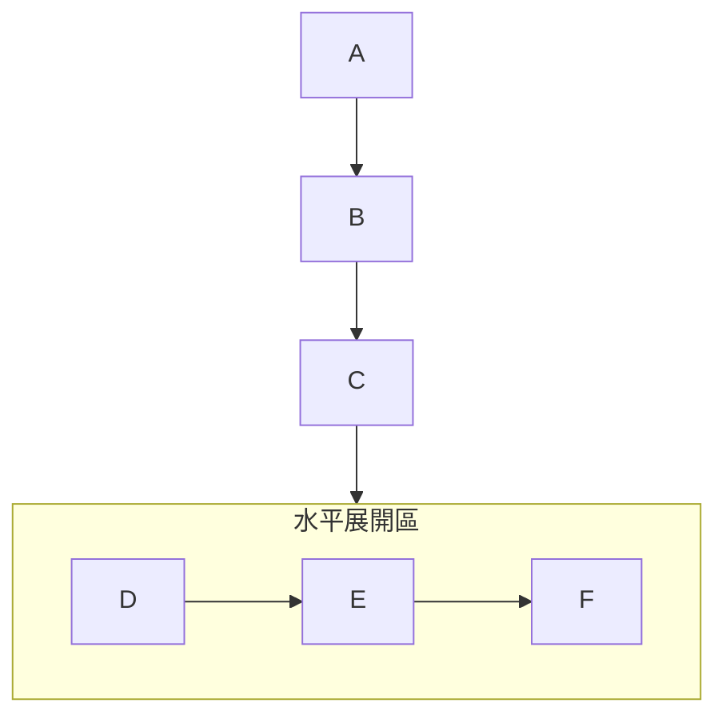

# Mermaid 優化通用原則

基於 WebPDTool 專案架構圖優化經驗整理的最佳實踐。

---

## 1. 布局選擇

### graph TB vs graph LR
```
graph TB  → 垂直流向，適合層級結構
graph LR  → 水平流向，適合流程圖
```

### direction 控制子圖布局
```mermaid
%% 在 subgraph 內使用 direction 控制獨立布局
subgraph API["API 層"]
    direction TB  %% 子圖內垂直排列
    API1["API 1"]
    API2["API 2"]
end
```

### 選擇建議
- **系統架構圖**：使用 `graph TB`（層級清晰）
- **流程圖**：使用 `graph TB` 或 `graph LR`（視流程方向）
- **序列圖**：使用 `sequenceDiagram`
- **ER 圖**：使用 `erDiagram`

---

## 2. 文字處理

### 換行技巧
```mermaid
✓ 使用 <br/> 換行
Node["第一行<br/>第二行<br/>第三行"]

✗ 避免過長單行
Node["這是一段非常長的文字如果不換行會導致節點過寬影響整體布局"]
```

### 節點寬度控制
```mermaid
%% 為節點設定固定寬度防止文字溢出
style NodeName width:150px

%% 同時設定寬度和高度
style NodeName width:150px,height:60px
```

### 簡潔標籤
```mermaid
✓ 簡潔標籤 + 圖例說明
API["API 層 (7個模組)"]

✗ 過長描述
API["應用程式介面層包含Auth/Projects/Stations/TestPlans/Tests/Measurements/Results七個模組"]
```

---

## 3. 字型控制

### 字型大小建議
```
主層級容器：18-20px
子層級模組：14-18px
說明文字：12-14px
```

### 字型設定語法
```mermaid
%% 為 subgraph 設定字型
style SubgraphName font-size:18px

%% 為單一節點設定字型
style NodeName font-size:16px
```

---

## 4. 樣式定義

### classDef 語法
```mermaid
%% 定義樣式類別
classDef className fill:#顏色,stroke:#邊框色,stroke-width:寬度,color:#文字色

%% 範例
classDef clientStyle fill:#e1f5ff,stroke:#0277bd,stroke-width:2px,color:#000
```

### 樣式應用
```mermaid
%% 單一節點應用
style NodeName fill:#fff,stroke:#000

%% 多節點應用（使用 class）
class Node1,Node2,Node3 className
```

### 常用色彩方案
```mermaid
%% 藍色系（客戶端）
fill:#e1f5ff,stroke:#0277bd

%% 綠色系（前端）
fill:#e8f5e9,stroke:#2e7d32

%% 紫色系（後端）
fill:#f3e5f5,stroke:#6a1b9a

%% 粉色系（資料庫）
fill:#fce4ec,stroke:#c2185b

%% 灰色系（外部）
fill:#f5f5f5,stroke:#616161
```

---

## 5. 連線處理

### 連線類型
```mermaid
A --> B        %% 實線箭頭
A -.-> B       %% 虛線箭頭
A ==> B        %% 粗實線箭頭
A -- B         %% 實線無箭頭
A -.- B        %% 虛線無箭頭
```

### 連線標籤
```mermaid
A -->|標籤文字| B       %% 實線帶標籤
A -.->|標籤文字| B      %% 虛線帶標籤
A ~~~|隱藏連線| B       %% 點線（不可見但影響布局）
```

### 連線原則
```mermaid
%% 主要流程使用實線
Browser -->|HTTP| Nginx

%% 外部系統使用虛線
SFCSvc -.->|WebService| SFC

%% 避免過多交叉連線
%% 使用分層結構簡化
Layer1 --> Layer2 --> Layer3
```

---

## 6. Emoji 圖示使用

### 系統架構常用 Emoji
```
🌐 客戶端/瀏覽器
🟢 前端
🚀 後端
🗄️ 資料庫
🌍 外部系統
🔐 認證/安全
📁 專案/檔案
🏠 站別/位置
📋 計劃/清單
▶️ 執行/啟動
📊 測量/數據
📈 結果/報表
⚙️ 引擎/配置
🔌 連接/儀器
📏 服務/測量
🔗 整合/連結
🏭 製造/SFC
📡 通訊/Modbus
💾 ORM/模型
📐 抽象/基礎
```

### 使用建議
```mermaid
%% Emoji + 簡潔文字
Browser["🌐 瀏覽器"]
AuthAPI["🔐 Auth API<br/>認證"]

%% 避免過多 Emoji 造成視覺干擾
%% 每個節點最多 1-2 個 Emoji
```

---

## 7. 節點合併策略

### 何時合併
```mermaid
✓ 合併：同類型多個節點
subgraph API["API 層 (7個模組)"]
    AuthAPI["🔐 Auth"]
    ProjectsAPI["📁 Projects"]
    %% ... 5+ 個類似節點
end

✗ 不合併：關鍵節點或不同類型
%% 保留獨立節點以突出重要性
FastAPI["FastAPI<br/>Python 3.11+"]
```

### 合併建議
- **3 個以下**：保持獨立
- **4-7 個**：考慮合併為 subgraph
- **8 個以上**：應該合併，並在標籤說明數量

---

## 8. 圖表類型選擇

### 架構圖
```mermaid
graph TB
%% 用途：展示系統整體架構
%% 特點：分層清晰，適合巢狀結構
```

### 流程圖
```mermaid
flowchart TD
%% 用途：展示業務流程或執行步驟
%% 特點：支援決策點、循環
```

### 序列圖
```mermaid
sequenceDiagram
%% 用途：展示元件間互動順序
%% 特點：時間軸明確
```

### ER 圖
```mermaid
erDiagram
%% 用途：展示資料庫關係
%% 特點：標準 ERD 符號
```

### 狀態圖
```mermaid
stateDiagram-v2
%% 用途：展示狀態轉換
%% 特點：狀態機模式
```

---

## 9. 寬高比最佳化

### 螢幕適配建議
```
桌面顯示器 (16:9)：
  - 使用 graph TB 或混合布局
  - 寬度優先，高度適中

筆電顯示器 (16:10)：
  - 使用 graph TB
  - 平衡寬高比例

行動裝置：
  - 使用 graph TB
  - 垂直優先
```

### 混合布局技巧


---

## 10. 測試與驗證

### 測試環境
- GitHub Markdown 渲染器
- GitLab Markdown 渲染器
- VS Code + Mermaid Preview 外掛
- Typora
- Obsidian

### 驗證清單
```markdown
- [ ] 無語法錯誤
- [ ] 所有節點文字完整顯示
- [ ] 連線清晰無交叉
- [ ] 色彩統一對比足夠
- [ ] 字型大小適中
- [ ] Emoji 正確顯示
- [ ] 寬高比適合螢幕
- [ ] 在不同環境測試通過
```

### 常見錯誤
```mermaid
%% ❌ 錯誤：使用保留字作為節點名稱
subgraph end["結束"]  %% 'end' 是保留字

%% ✅ 正確：使用非保留字
subgraph EndNode["結束"]

%% ❌ 錯誤：括號在 ERD 中衝突
decimal(15,6)

%% ✅ 正確：簡化標記
decimal
```

---

## 參考資源

- [Mermaid 官方文檔](https://mermaid.js.org/)
- [Mermaid 線上編輯器](https://mermaid.live/)
- [Mermaid 語法速查表](https://jojoz.github.io/mermaid-cheat-sheet/)
